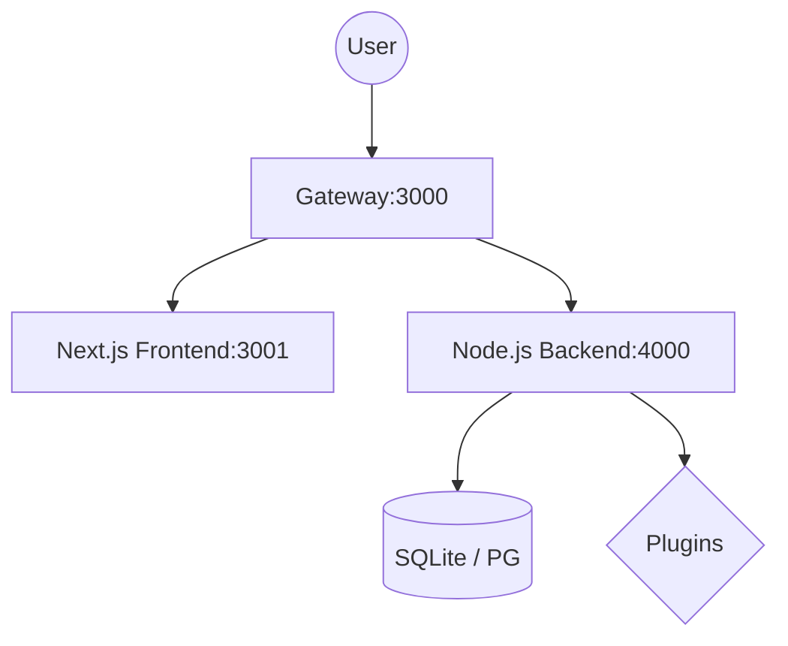

# 🚀 WordJS: The Next-Gen Developer CMS

[](https://deepwiki.com/jaimemartinez/wordjs) [](https://paypal.me/dherreraj9805)

**WordJS** is a high-performance, developer-first CMS designed to bring the familiarity of WordPress into the modern JavaScript era. Built with **Node.js**, **Next.js**, and an extensible plugin architecture, it offers a "Zero Config" experience with the power of a modern stack.

---

## ✨ Key Features

- **🚀 Performance-First:** Server Side Rendering (SSR) via Next.js for instant page loads.
- **🛡️ Advanced Security Stack:** 
    - **AST Static Scanner:** Deep code analysis (Abstract Syntax Tree) to block obfuscated threats and unauthorized API calls before execution.
    - **Runtime Environment Proxy:** Secure masking of sensitive `.env` secrets from the plugin context.
    - **Secure Gateway:** Integrated JWT authentication, circuit breaking, and strict sanitization.
- **🎨 Visual Builder:** Integrated with **Puck** for a drag-and-drop editing experience.
- **🔌 Autonomous Plugins:** Full-stack extension with **auto-managed npm dependencies**, dynamic frontend hooks, and **Mandatory Permission Authorization**.
- **⚙️ Zero Config:** Smart defaults and SQLite storage let you start in seconds, not hours.
- **🔄 Universal Storage:** Native support for **SQLite (Legacy & Native)** and **PostgreSQL**, with one-click migration.
- **📄 SEO Ready:** Best practices out of the box (Semantic HTML, Meta Tags, JSON-LD).
- **🛡️ Dynamic Roles:** Full Control over user permissions with a database-driven Role Manager.
- **⏰ Built-in Cron:** Robust task scheduling system for maintenance and plugin background jobs.
- **🌍 Internationalization (i18n):** Native multi-language support for core and plugins.
- **🧩 Shortcodes:** WordPress-style shortcode system for dynamic content rendering.
- **📦 Import/Export:** Full site backup and restoration capabilities.
- **📦 Import/Export:** Full site backup and restoration capabilities.
- **🔐 Certificate Management:** Auto-provisioning of **Let's Encrypt** SSL certificates (HTTP-01) and manual upload support directly from the Admin Panel.
- **✉️ Native Mail Server:** Full SMTP capabilities with internal routing, external delivery, and attachment handling.
- **🛡️ High Availability:**
    - **Cluster Mode:** Multiprocess architecture with circuit breaking.
    - **Self-Healing:** Automatic service recovery and database synchronization.
    - **Resilient Connectivity:** SSE with exponential backoff and 1-hour connection buffers.

---

## 🏗️ Project Architecture

WordJS uses a microservices-inspired architecture managed by a custom **Gateway**.



- **[Gateway](gateway.js):** Enterprise-grade entry point using **Cluster Mode**. Handles routing, **Circuit Breaking**, **Log Rotation**, and **Advanced Metrics**.
- **[Backend](backend/):** The core engine. Manages content, users, and the plugin ecosystem.
- **[Frontend](frontend/):** The public site and management interface.

---

## 📚 Documentation

Detailed guides are available in the [`documentation/`](documentation/) folder:

- 🏗️ **[Architecture Overview](documentation/architecture.md)**: System diagrams and component flow.
- 📡 **[Live API Docs](http://localhost:4000/api/v1/docs)**: Complete Swagger/OpenAPI reference (Admin Only).
- 🛰️ **[Gateway Guide](documentation/gateway.md)**: Reverse proxy and service registration logic.
- 🖥️ **[Frontend Guide](documentation/frontend.md)**: Next.js structure, visual editor, and Puck components.
- 🎨 **[Themes Guide](documentation/themes.md)**: CSS variables, available themes, and creating custom themes.
- 🎨 **[Themes Guide](documentation/themes.md)**: CSS variables, available themes, and creating custom themes.
- 🔌 **[Plugin Tutorial](documentation/plugins.md)**: Step-by-step guide to creating your first plugin.
- ✉️ **[Mail Server Guide](documentation/mail-server.md)**: SMTP configuration, internal routing, and API usage.
- 🗄️ **[Database Guide](documentation/database.md)**: SQLite and PostgreSQL configuration.
- 🚀 **[Deployment Guide](documentation/deployment.md)**: How to host WordJS on a production server.
- 🔐 **[Security Policy](SECURITY.md)**: Vulnerability reporting and active defenses.
- 🔔 **[Notifications System](documentation/notifications.md)**: Real-time transport architecture.

---

## 🚀 Getting Started

1. **Install Dependencies:**
   ```bash
   npm install
   ```

2. **Run in Development:**
   ```bash
   # Starts Backend, Frontend, and Gateway concurrently
   npm run dev
   ```

3. **Access the Panels:**
   - **Public Site:** `http://localhost:3000`
   - **Admin Dash:** `http://localhost:3000/admin`

---

## 🛠️ Tech Stack

- **Runtime:** Node.js
- **Frontend Framework:** Next.js (React)
- **Styling:** Vanilla CSS + Tailwind
- **Editor:** Puck
- **Communication:** REST API + JWT + WebSockets
- **Logging:** Structured JSON via Winston
- **Server:** Express.js + Cluster Mode
- **Database:** SQLite (Legacy/Native) or PostgreSQL - *Interchangeable via Migration System*

---

## 🔮 Upcoming Features (Roadmap)

We are constantly evolving WordJS. Here's what's planned:

- **☁️ Media CDN Integration:** Built-in support for S3-compatible cloud storage (AWS, DigitalOcean, etc.).
- **🌐 Multi-Site Architecture:** Manage multiple domains and sites from a single WordJS installation.
- **🧩 Global Hook Registry:** A more visual way to manage and discover Actions and Filters.

---

## 📜 License

This project is licensed under the **MIT License** - see the [LICENSE](LICENSE) file for details.

---

Developed with ❤️ by the WordJS Team.
