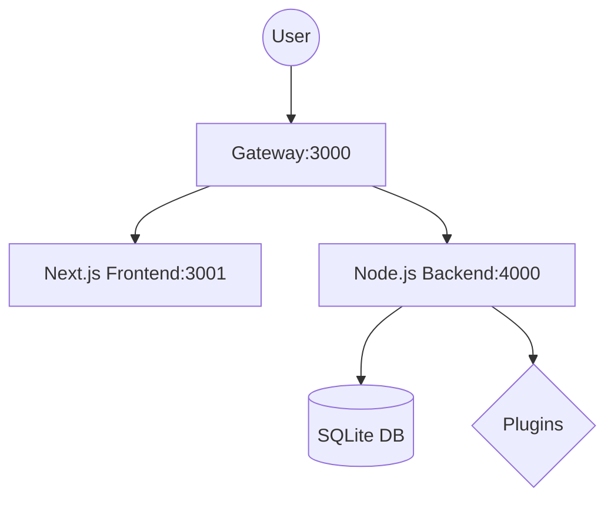

# 🚀 WordJS: The Next-Gen Developer CMS

**WordJS** is a high-performance, developer-first CMS designed to bring the familiarity of WordPress into the modern JavaScript era. Built with **Node.js**, **Next.js**, and an extensible plugin architecture, it offers a "Zero Config" experience with the power of a modern stack.

---

## ✨ Key Features

- **🚀 Performance-First:** Server Side Rendering (SSR) via Next.js for instant page loads.
- **🛡️ Secure by Design:** Built-in Gateway architecture, JWT authentication, and strict sanitization.
- **🎨 Visual Builder:** Integrated with **Puck** for a drag-and-drop editing experience.
- **🔌 Full-Stack Plugins:** Extend both the API and the Admin UI with a few lines of code.
- **⚙️ Zero Config:** Smart defaults and SQLite storage let you start in seconds, not hours.
- **📄 SEO Ready:** Best practices out of the box (Semantic HTML, Meta Tags, JSON-LD).
- **🛡️ Dynamic Roles:** Full Control over user permissions with a database-driven Role Manager.

---

## 🏗️ Project Architecture

WordJS uses a microservices-inspired architecture managed by a custom **Gateway**.



- **[Gateway](gateway.js):** The entry point. Handles routing, security secret protection, and rate limiting.
- **[Backend](backend/):** The core engine. Manages content, users, and the plugin ecosystem.
- **[Frontend](admin-next/):** The public site and management interface.

---

## 📚 Documentation

Detailed guides are available in the [`documentation/`](documentation/) folder:

- 🛰️ **[Gateway Guide](documentation/gateway.md)**: Reverse proxy and service registration logic.
- 📡 **[API Reference](documentation/api.md)**: Endpoints, authentication, and the Hook system (Actions/Filters).
- 🖥️ **[Frontend Guide](documentation/frontend.md)**: Next.js structure and visual editor integration.
- 🔌 **[Plugin Tutorial](documentation/plugins.md)**: Step-by-step guide to creating your first plugin.
- 🚀 **[Deployment Guide](documentation/deployment.md)**: How to host WordJS on a production server.

---

## 🚀 Getting Started

1. **Install Dependencies:**
   ```bash
   npm install
   ```

2. **Run in Development:**
   ```bash
   # Starts Backend, Frontend, and Gateway concurrently
   npm run dev
   ```

3. **Access the Panels:**
   - **Public Site:** `http://localhost:3000`
   - **Admin Dash:** `http://localhost:3000/admin`

---

## 🛠️ Tech Stack

- **Runtime:** Node.js
- **Frontend Framework:** Next.js (React)
- **Styling:** Vanilla CSS + Tailwind
- **Editor:** Puck
- **Communication:** REST API + JWT
- **Server:** Express.js
- **Database:** sql.js (SQLite)

---

## �️ Upcoming Features (Roadmap)

We are constantly evolving WordJS. Here's what's planned:

- **📁 Multi-Database Support:** Native integration for **PostgreSQL** and **MySQL** for enterprise-level scaling.
- **🔄 Automated Migrations:** One-click data migration between different database engines (e.g., SQLite to Postgres).
- **☁️ Media CDN Integration:** Built-in support for S3-compatible cloud storage (AWS, DigitalOcean, etc.).
- **🌐 Multi-Site Architecture:** Manage multiple domains and sites from a single WordJS installation.
- **🧩 Global Hook Registry:** A more visual way to manage and discover Actions and Filters.

---

## �📜 License

This project is licensed under the **MIT License** - see the [LICENSE](LICENSE) file for details.

---

Developed with ❤️ by the WordJS Team.
