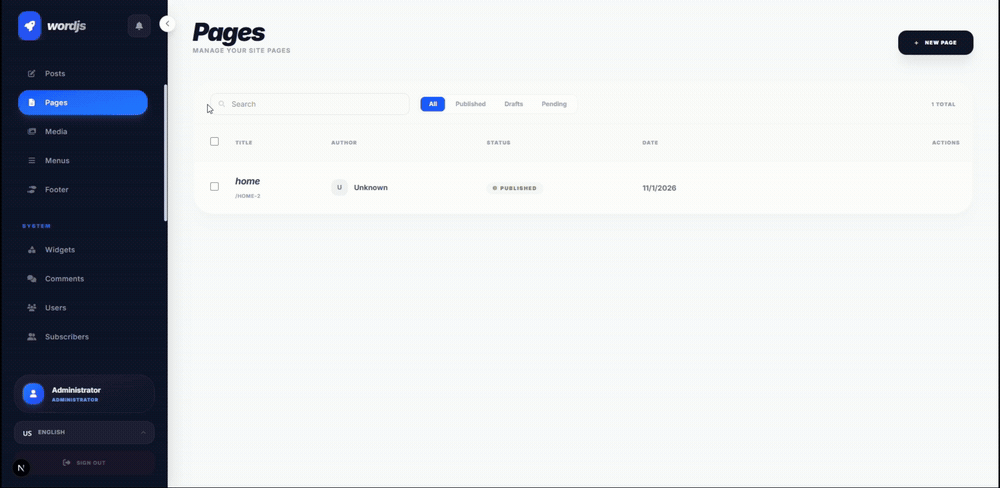
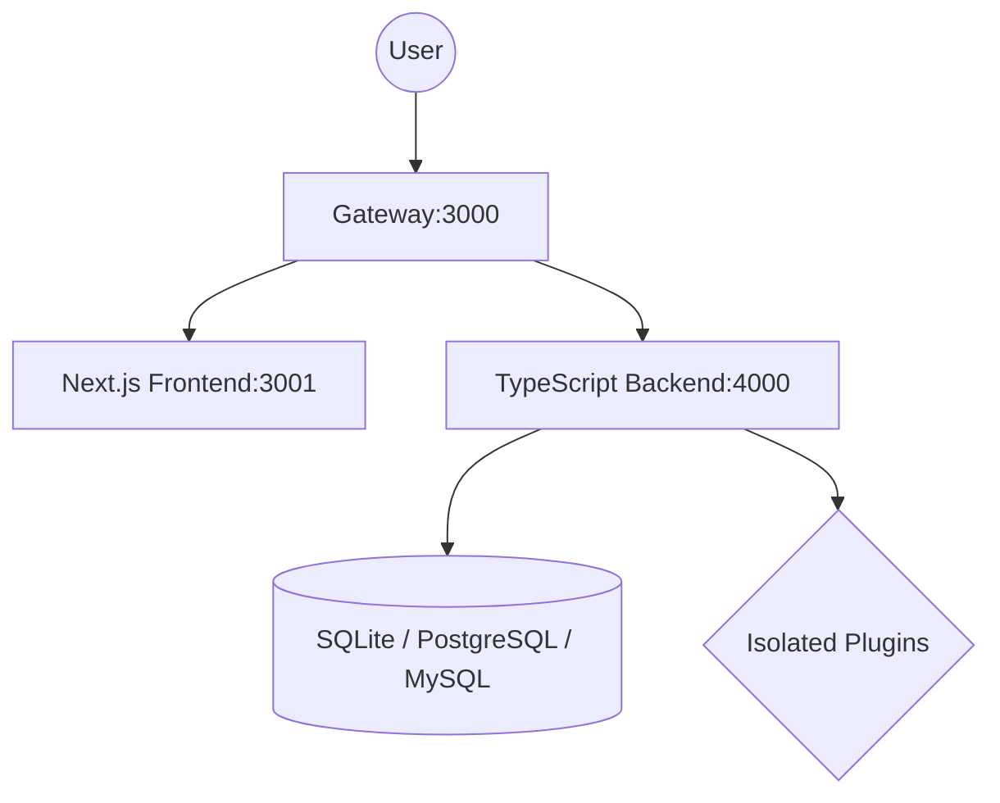
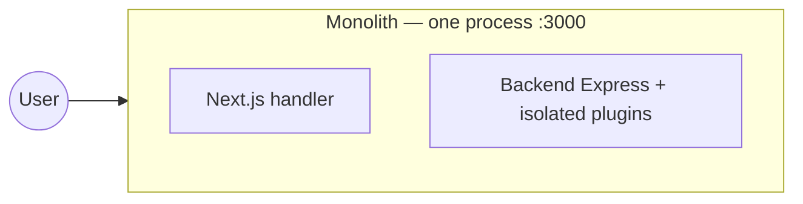

# WordJS

[](https://www.npmjs.com/package/create-wordjs)
[](https://github.com/jaimemartinez/wordjs/actions/workflows/ci.yml)
[](LICENSE)
[](https://nodejs.org)
[](SECURITY.md)
[](https://deepwiki.com/jaimemartinez/wordjs)
[](https://paypal.me/dherreraj9805)

### The CMS where a plugin can't take over your site.

Every CMS lets you extend it. **WordJS is the only one that doesn't have to trust the
extension.** Each third-party plugin runs in its **own OS-isolated process** with
**Android-style permissions**: no network, no filesystem outside its own directory, no
database beyond its own tables, and no secrets — unless an admin explicitly grants each
capability. A crashing, leaking, or malicious plugin is contained **by the kernel**; it
can't read password hashes, exfiltrate your config, or take down the host.

The rest of the package is a modern, JavaScript-native CMS with a WordPress-style extension
model (plugins, themes, hooks, shortcodes): real **SSR & SEO out of the box** (React Server
Components, `generateMetadata`, sitemap/robots/RSS), a **no-code visual editor** (Puck with
in-place rich text) in core rather than as a paid add-on, **token-driven themes** with a
live customizer, a built-in **plugin & theme marketplace** (28 first-party plugins and 12
first-party themes, one-click sha256-verified installs), a **WordPress WXR importer** for switching, and a **one-process deploy** —
a single Node process with SQLite by default, pre-compiled release ZIPs, no PHP, no MySQL
server, no build step on the server.

> **Status:** beta, pre-production, primarily solo-maintained. Recent hardening fixed several
> critical issues; an independent security audit is recommended before any internet-facing
> deployment. The honest details live in [Project status & maturity](#-project-status--maturity).

### Try it in one command

```bash
npx create-wordjs@latest my-site
```

No PHP, no MySQL, no build step — it downloads the pre-compiled release, starts a single Node
process, and opens the browser install wizard. (Prefer a manual download? Grab a pre-compiled
ZIP instead — see [Getting Started](#-getting-started).)

### See it in action

Build a page by dragging blocks onto the canvas and editing text in place — the no-code
visual editor ([Puck](https://puckeditor.com)) ships in **core**, not as a paid add-on.



---

## ⚖️ How it compares

|  | **WordJS** | WordPress | Ghost | Strapi | Payload |
|---|---|---|---|---|---|
| **Plugin isolation** | ✅ OS-process sandbox, kernel-enforced | ❌ full PHP privileges | — (integrations, no plugin runtime) | ❌ in-process | ❌ in-process |
| **Per-plugin permission grants** | ✅ Android-style, default-deny, admin UI | ❌ | — | ❌ | ❌ |
| **No-code page builder in core** | ✅ Puck, in-place editing | Blocks in core; full builders are paid | ❌ post editor only | ❌ headless | ❌ headless |
| **SEO out of the box** | ✅ SSR/RSC + metadata + sitemap/robots/RSS | ✅ via plugins (Yoast et al.) | ✅ | ❌ your frontend's job | ❌ your frontend's job |
| **Import from WordPress** | ✅ built-in WXR importer | — | ✅ official tooling | ❌ | ❌ |
| **Deploy footprint** | 1 Node process, SQLite default | PHP + MySQL | Node + MySQL | Node + DB + your frontend | Node + DB (Next-native) |
| **Stack** | TypeScript + Next.js | PHP | Node + Handlebars | Node | TypeScript + Next.js |
| **License** | MIT | GPLv2 | MIT | MIT (paid EE) | MIT (paid cloud) |
| **Ecosystem size** | ⚠️ young — built-in marketplace, 28 first-party plugins, no third-party authors yet | 60k+ plugins | large | large marketplace | growing |

The last row is the honest one: WordJS now ships a built-in plugin marketplace with one-click,
sha256-verified installs — but all 28 plugins in it are first-party, and there is no third-party
author community yet. What it has is the row at the top — the one no incumbent can retrofit,
because their entire ecosystems assume plugins run with full trust.

---

## ✨ What's actually here

**Plugin system & security (the core differentiator)**
- **OS-process plugin sandbox.** Plugins marked `"isolated": true` run in a **separate OS
  process** (`child_process.fork`) — their own heap, event loop, and memory cap, so a crash,
  OOM, or heap escape is contained to the child **by the kernel** and never takes down the host.
  They reach core **only** through a `wordjs` capability bridge that is RPC'd back to the host
  (structured-clone IPC, no live host references) and **permission-checked on the host side**
  under the plugin's context. Bridge dispatch enforces an **exact method allowlist**; privileged
  surfaces (mail provider, notification transport, route/hook registration) flow through dedicated
  IPC kinds gated by per-plugin capability grants, never a generic call. Includes **layered per-child memory caps**
  (see below), RPC timeouts with wedged-child recycling, and concurrent-call backpressure. A
  `worker_threads` transport remains as a cross-platform fallback; the same guards run either way.
  (This is real OS-process isolation, but not yet capability-minimal at the syscall level — see
  the security note below.)
- **AST static scanner.** Before activation, each plugin's `.js/.cjs/.mjs` files are parsed
  with `acorn` and walked for dangerous constructs — `eval`, `Function`, `exec`/`spawn`,
  dynamic/computed `require`, sensitive core modules, and forbidden `process` access. The
  scan is **fail-closed** (an unparseable file is a violation). It runs on **every** plugin —
  there is no scan-skip and no "trusted" exemption.
- **In-child runtime guards.** Inside the sandboxed process, `fs`, `child_process`, and the
  network modules are wrapped in permission-checking proxies that resist obfuscation (they also
  block `worker_threads`/`vm`/`module`/`inspector`, `process.binding`, native `.node` addons,
  deferred timers, and event listeners). By default the binding-backed globals
  (`fetch`/`WebSocket`/`EventSource`) and raw sockets are trapped, so a plugin gets **no outbound
  network** unless an admin grants it the `network` capability — and on Linux a plugin without that
  grant is additionally dropped into an **empty network namespace** (`--unshare-net`), so it can't
  reach the network even at the kernel level, while a network-granted plugin's egress can be confined
  to an admin-set **per-plugin host allowlist**. An `io-guard` confines fs
  reads/writes to the plugin's own dir and blocks reads of `.env`/secret files and the database
  files. Every plugin receives a **secret-scrubbed** view of config and a **table-scoped** DB
  handle, confined to its own `wjp_<slug>_` tables and refused raw SQL against core
  credential/role/option tables — and on **PostgreSQL/MySQL** the database enforces this itself, running each plugin's queries under its own low-privilege role/user GRANTed only its `wjp_<slug>_` tables. User/site data comes via the safe `wordjs.users.*` (projection
  only, never `user_pass`) and `wordjs.site.*` bridges.
- **Android-style permission model — one tier, no bypass.** Plugins *request* scoped capabilities
  in `manifest.json` (filesystem, network, database, settings, `users:read`, `email:provider`,
  `notifications:provider`, etc.) with human-readable reasons; an **admin grants each one per
  plugin** (default-deny) in `/admin/plugins`, and a bridge call works only if it is BOTH declared
  AND granted. **Every** plugin is sandboxed — first-party plugins are pre-granted their declared
  capabilities but are **not** privileged. There is no "trusted" tier; shell, native addons,
  unscoped/core-table DB, and secret options were removed for all plugins.
- **Layered per-child memory caps.** Process separation already means a child OOM can't crash
  the host on any platform. On top of that: an **opt-in preventive cgroup v2 `MemoryMax`** per
  child on systemd Linux (`systemd-run --user --scope`, no root, probe-gated; enable via
  `sandbox.useCgroupMemoryCap`); a **default-on preventive Windows Job Object** (`ProcessMemoryLimit`
  via pure-JS PowerShell P/Invoke, probe-gated; opt out via `sandbox.useJobObjectMemoryCap`); a
  **reactive host-side RSS poll** that `SIGKILL`s a child over budget (Linux `/proc`, Windows
  `tasklist`, macOS `ps`); and a loose `RLIMIT_AS` virtual backstop plus a `--max-old-space-size` JS-heap cap.
  An **opt-in per-plugin CPU quota** (`sandbox.cpuQuotaPercent` → systemd `CPUQuota`, in the same
  `--user` cgroup scope) adds a preventive CPU backstop.
- **Plugin & theme marketplace (first-party).** The admin plugins page has a **Marketplace tab** with
  one-click installs from a curated catalog of **28 first-party plugins** (contact forms,
  newsletter, events calendar, online store, bookings, donations, event tickets, FAQ, polls,
  testimonials, SEO helpers, and more). Plugin sources live in `marketplace/plugins/`, outside
  the core build; `npm run build:marketplace` packs them into a catalog (`marketplace-index.json`)
  plus one sha256'd zip per plugin under `marketplace/dist/` — a **build output that is gitignored,
  not committed**, and published by CI as **GitHub Release assets**. Installs default to the newest
  release (`releases/latest/download`), and the catalog **sources are admin-configurable** from the
  Marketplace tab (option `marketplace_sources`, via `GET`/`PUT /api/v1/marketplace/sources`): point
  WordJS at any number of HTTPS catalogs (or a local dir) and they're merged (dedup by id, per-source
  error isolation). Downloads are **sha256-verified** against the catalog and go through the **same
  hardened install pipeline** as manual zip uploads (zip-bomb budget, Zip Slip, slug validation,
  manifest + AST scan) — a marketplace plugin is sandboxed and permission-gated exactly like any
  other. All catalog plugins are first-party today; third-party submissions and review are roadmap. A
  parallel **Themes marketplace** (Admin → Themes) ships **12 first-party themes** through the same
  sha256-verified install pipeline, with its own admin-configurable sources (option
  `marketplace_theme_sources`, via `GET`/`PUT /api/v1/marketplace/themes/sources`).
- **Real server-side rendering.** The public routes (home, posts, pages, search) are async
  React Server Components that fetch on the server (`frontend/src/lib/server-api.ts`), so the
  initial HTML sent to crawlers and the first paint already contain the real title/body —
  not the empty client-only skeletons they used to ship. Each page exports `generateMetadata`
  (title template, description, canonical, OpenGraph/Twitter), missing content returns a real
  HTTP **404** (`notFound()`), and search is a no-JS GET form. Content rendering lives in
  client components fed the already-fetched data, so they SSR with content then hydrate
  carousels/comments.
- **SEO basics**: semantic HTML, meta tags, JSON-LD, per-page metadata, and gateway-served
  `sitemap.xml` / `robots.txt`.

**Authoring & content**
- **Visual builder** via [Puck](https://puckeditor.com/) — drag-and-drop page editing with a
  redesigned canvas: **in-place rich-text editing** (bold/italic/links, text color with a visual
  picker and an **eyedropper**, **font family** from your installed fonts, size, and alignment),
  a searchable block inserter with reusable **section patterns**, and a **device preview**
  (desktop/tablet/mobile) that renders the canvas in an isolated iframe at the true device width,
  so the responsive layout matches the live site exactly.
- **Hooks & filters** event system, with admin-side hook inspection.
- **Shortcodes** (WordPress-style) for dynamic content, including from plugins.
- **YouTube videos plugin** (first-party marketplace plugin): point it at a channel to get a synced video list —
  keyless via the channel's RSS feed, or via the YouTube Data API with a key — plus a Puck
  **carousel block** with filtering for embedding the videos on any page.
- **Themes** with CSS-variable theming (the default theme ships bundled; 12 first-party themes are available via the theme marketplace). The theme
  system ships a **token-driven, Bootstrap-like CSS framework** (`backend/public/css/wordjs-ui.css`):
  one shared stylesheet that auto-styles every HTML element plus opt-in components
  (`.btn`/`.card`/`.alert`/`.table`/`.nav`/a flexbox grid/…) and a utility layer, all driven by
  `--wjs-*` design tokens a theme declares in its own `style.css :root` (with built-in fallbacks).
  It loads on public pages (frontend `ThemeLoader`) and the editor preview iframe (frontend
  `PuckEditor`), always **before** the theme's own `style.css`, so the theme wins. The active theme
  drives the whole live (Next.js) site — chrome, post content, and widget areas — plus an optional
  `theme.json` `layout`, and an admin **customizer** (`/admin/themes/customize`) edits `--wjs-*`
  tokens live. A theme's optional server-side `functions.js` runs in the **same OS-isolated
  sandbox as plugins** (loaded via `loadIsolatedPlugin('theme:<slug>')`), so its hooks/shortcodes
  reach core only through the permission-checked bridge — theme code never runs in-process on the
  host. See [`documentation/themes.md`](documentation/themes.md).
- **Dynamic roles & permissions**, database-driven.
- **i18n** for core and plugins (es / en / pt).
- **Import / export** for full site backup and restore, with **retention pruning** — after
  each backup only the newest N are kept (`backup_retention`, default 7; `0` keeps all) so
  scheduled backups can't fill the disk. Backups are on-host (off-host/S3 is roadmap).
- **WordPress (WXR) importer** to migrate an existing WordPress site. Upload a `.xml` export
  in **Admin → Import** to preview entity counts (dry-run analyze) and then import: WordPress
  authors → users, categories/tags → terms, items → posts/pages (with meta, term
  relationships, and threaded comments), preserving original publish dates. It is
  **idempotent** (re-runnable; existing users/terms/posts are matched, not duplicated).
  Attachments (WXR ships only URLs, not the media binaries) and nav menus are skipped.
- **Built-in cron** for maintenance and plugin background jobs.
- **Privacy-conscious analytics**: a lightweight first-party event log with **no cookies**
  and **daily-rotated, salted IP hashing** (you own the data). Aggregated stats are shown
  in the admin panel.

**Operations**
- **Gateway** with Node `cluster` (one worker per CPU, automatic respawn on crash),
  load-balancing, periodic upstream **health checks** that evict failing targets, an
  **mTLS-secured internal control channel**, and **SSE-aware proxying** (compression
  disabled and 1-hour timeouts for event streams). It also acts as the **cluster CA**: for
  [separate-mode](documentation/separate-mode.md) deployments it mints single-use, role-bound
  **join tokens** and signs each remote node an mTLS identity over a dedicated enrollment listener.
- **TLS**: automatic **Let's Encrypt** certificates via `acme-client` (**HTTP-01** and
  **DNS-01** challenges), plus **manual certificate upload** and a self-signed fallback for
  local development. ACME **auto-renewal works in monolith mode too** — in embedded mode the
  cert-manager writes the renewed cert and hot-reloads the running HTTPS server in-process
  (via `setSecureContext`, no restart); it still needs the opt-in HTTP-01 listener
  (`acme.http01Port`, e.g. 80) reachable.
- **Prometheus metrics** at `GET /metrics` — default Node/process metrics plus a
  `wordjs_sse_clients` gauge. **Disabled (404) unless a scrape token is configured**
  (`config.metrics.token` or the `METRICS_TOKEN` env var); scrape with
  `Authorization: Bearer <token>`. Routed publicly via the gateway and in monolith mode, and
  never exposed without a token.
- **Pluggable storage**: SQLite via `better-sqlite3` (native, **default**) or `sql.js`
  (WASM, "legacy"), PostgreSQL via `pg`, and **MySQL 8+ / MariaDB** via `mysql2` — the MySQL
  driver is a SQLite→MySQL dialect-translation layer (`TEXT`→`VARCHAR`/`LONGTEXT`, `AUTO_INCREMENT`,
  `ON CONFLICT`→`ON DUPLICATE KEY`, `RETURNING`→`insertId`, ANSI_QUOTES). All drivers implement a
  common interface, with a migration system to move between them. The install wizard offers
  SQLite/PostgreSQL; MySQL is selected via `dbDriver: "mysql"` (`dbPort: 3306`) in the config.
- **Native mail server** (shipped as an optional, fully sandboxed first-party plugin,
  pre-granted the `network`/`email:provider` capabilities it needs): inbound SMTP
  (`smtp-server`), direct-MX outbound delivery (`nodemailer`), DKIM signing, and attachment
  handling.
- **Scoped API tokens** for headless/machine clients — `Authorization: Bearer wjt_<secret>` with
  per-token, per-resource scopes (e.g. `posts:write`, `media:read`); a token's effective permission
  is the token scope **intersected with** the owner's capabilities. Self-service management at
  `/admin/tokens` (`GET`/`POST`/`DELETE /api/v1/auth/tokens`); secrets are shown once and stored as
  sha256 at rest, and the `Bearer` path is CSRF-exempt.
- **Outgoing webhooks** — HMAC-signed, SSRF-safe webhooks fire on content events to admin-configured
  endpoints, managed at `/admin/webhooks`; destinations are re-validated at delivery time
  (loopback / cloud-metadata / RFC1918 rejected).
- **Transparent image optimization** — served `/uploads` images are content-negotiated to
  **AVIF/WebP** from the client's `Accept` header (same URL, cached derivatives, `Vary: Accept`,
  fail-safe to the original).

---

## 🏗️ Architecture

WordJS runs as three cooperating services behind a custom gateway.


```mermaid
graph TD
    User((User)) --> Gateway[Gateway:3000]
    Gateway --> Frontend[Next.js Frontend:3001]
    Gateway --> Backend[TypeScript Backend:4000]
    Backend --> DB[(SQLite / PostgreSQL / MySQL)]
    Backend --> Plugins{Isolated Plugins}
```

- **[Gateway](gateway/):** Clustered Node/Express reverse proxy (`gateway/src/index.js`).
  Handles routing, load-balancing, health-check eviction, log rotation, an mTLS internal
  control channel, and SSE-aware proxying.
- **[Backend](backend/):** The core engine — content, users, roles, the plugin/theme
  system, mail, certificates, and the sandbox. Written in **TypeScript**; runs as compiled
  JS in production and via `ts-node` in development.
- **[Frontend](frontend/):** The public site and the Next.js admin interface (including the
  Puck visual builder).

### Run modes (monolith, split, or separate)

The same codebase runs three ways, **switchable at any time** — the monolith and single-host
split share the same `backend/wordjs-config.json`, the same database, `uploads`/`themes`/`plugins`,
secrets, and the same public origin (`https://localhost:3000`), so there is no migration to switch
between them. Monolith and split are mutually exclusive (both bind the public port).

- **Split (default) — three processes on one host:** the gateway + backend + frontend shown above,
  started together by `npm run dev` / `npm start`. The gateway adds Node `cluster`, health-checks, and
  load-balancing — best when you want to scale services independently.
- **Monolith — one process, one port:** everything runs in a single Node process on `:3000`
  via [`monolith.js`](monolith.js) (`npm run dev:mono`, or
  `npm run build:mono && npm run start:mono`). The backend (with its isolated plugins) and the
  Next.js frontend are mounted **in-process** (no loopback proxy, no cluster, no gateway
  service-registration); the gateway's still-needed cross-cutting concerns (TLS, security
  headers, compression, SEO rewrites) are handled locally. Simplest to deploy (one process
  behind a single reverse proxy or a small VM/container).
- **Separate — the three services on different machines:** the same split, spread across a gateway
  box, a backend box, and a frontend box, joined into one cluster over **mutual TLS**. One command
  per machine: `npx create-wordjs@latest gateway --host <ip>` makes the first box the cluster CA and prints
  ready-to-paste join commands with **single-use, role-bound join tokens**; then
  `npx create-wordjs@latest join backend|frontend …` on each other box downloads the release, enrolls
  (the gateway signs the node an mTLS identity — no cert is ever hand-copied) and starts the
  service. See the [**Separate-mode guide**](documentation/separate-mode.md) for the walkthrough
  and the manual (source-checkout) procedure.


```mermaid
graph LR
    subgraph Monolith["Monolith — one process :3000"]
        Next[Next.js handler] & API[Backend Express + isolated plugins]
    end
    U((User)) --> Monolith
```

---

## 📚 Documentation

Guides live in [`documentation/`](documentation/):

- 🏗️ **[Architecture Overview](documentation/architecture.md)**
- 🛠️ **[Development & Build Guide](documentation/development.md)** — install, compiled build, strict typecheck, dev vs prod.
- 🔩 **[Core Modules Reference](documentation/core-modules.md)** — the backend core modules and their responsibilities.
- ⌨️ **[CLI & Setup](documentation/cli.md)** — the `setup` / `migrate` command-line tools.
- 🛰️ **[Gateway Guide](documentation/gateway.md)**
- 🖥️ **[Frontend Guide](documentation/frontend.md)**
- 🎨 **[Themes Guide](documentation/themes.md)**
- 🔌 **[Plugin Tutorial](documentation/plugins.md)** — build an isolated plugin against the `wordjs` bridge.
- 🧩 **[Plugins Reference](documentation/plugins-reference.md)** — the bundled plugins and their capabilities.
- 🧱 **[Plugin Isolation](documentation/plugin-isolation-proposal.md)** — the OS-process sandbox + per-plugin capability grants (implemented).
- ✉️ **[Mail Server Guide](documentation/mail-server.md)**
- 🗄️ **[Database Guide](documentation/database.md)**
- 🗃️ **[Plugin Database Access](documentation/plugin-database.md)** — the table-scoped `wjp_<slug>_` plugin DB handle.
- 📥 **[Migrating from WordPress](documentation/wordpress-import.md)** — import a WordPress WXR export (authors, terms, posts/pages, comments).
- 🚀 **[Deployment Guide](documentation/deployment.md)** — incl. **Releases & distribution** (downloadable pre-compiled bundles).
- 🧩 **[Separate Mode](documentation/separate-mode.md)** — run the gateway, backend, and frontend on **different machines**, joined over mTLS via cluster join tokens (`cluster init` / `cluster token` / `node-join`).
- 🌐 **[Multi-Node Operations](documentation/multi-node.md)** — dist-lock leases, Redis coherence, and what's deferred.
- 🔐 **[Security Policy](SECURITY.md)** — vulnerability reporting and active defenses.
- 🛡️ **[Security Architecture](documentation/security.md)** — deeper defenses reference (sandbox, capability grants, CSRF, JWT revocation).
- 🔔 **[Notifications System](documentation/notifications.md)**
- 🧭 **[Product Positioning](POSITIONING.md)** — where WordJS is headed and why.
- 📡 **[REST API Reference](documentation/api.md)** — endpoint-by-endpoint REST docs; also live Swagger/OpenAPI at `http://localhost:4000/api/v1/docs` (admin only).

---

## 🚀 Getting Started

> Requires Node.js **>= 20.9** (Node 20 or 22 LTS recommended — Next.js 16 and the native modules need it; Node 18 fails with `EBADENGINE`/native-binding errors). WordJS can run as **three services** (gateway, backend, frontend) on
> one host, as a **single-process monolith**, or with the three services on **separate machines**
> joined by cluster join tokens — see [Run modes](#run-modes-monolith-split-or-separate) and the
> [Separate-mode guide](documentation/separate-mode.md). The scripts below start everything
> together on a single host.

### Fastest — one command

```bash
npx create-wordjs@latest my-site
```

Downloads the latest pre-compiled release, installs runtime dependencies, starts the
single-process server, and opens the install wizard in your browser with the security
token pre-filled. (Prefer to download the bundle yourself? Use Option A below.)

### Option A — download a pre-compiled release (no build step)

The fastest way to run WordJS. The bundle is **pre-compiled** (frontend `.next`, backend
`dist/`, and plugins are already built; no secrets are shipped — they're generated locally).

1. Download `wordjs-<version>.zip` from the
   [**Releases**](https://github.com/jaimemartinez/wordjs/releases) page and unzip it.
2. **Install runtime dependencies only** (no compilation):
   ```bash
   npm run release:install
   ```
3. **Start it:**
   ```bash
   npm run start:mono   # one process, one port (default https://localhost:3000)
   # or: npm start      # the 3-service split
   ```
4. Finish in the browser **install wizard**: pick SQLite or PostgreSQL and create your admin.

> The monolith binds `0.0.0.0` on the public port; for LAN/remote access set the site
> host/`siteUrl` to the IP/domain you'll use (the backend's Site-URL guard rejects host
> mismatches). To **build** a release bundle yourself from source, run `npm run bundle-release`
> (root `scripts/make-release.js`); pushing a `v*` git tag does this automatically and
> publishes a GitHub Release.

### Option B — run from source

1. **Install dependencies** (root + sub-packages):
   ```bash
   npm run install:all
   ```

2. **Run in development:**
   ```bash
   npm run dev        # split: gateway + backend + frontend
   # or, everything in one process on one port:
   npm run dev:mono   # monolith
   ```

   For production, use `npm start` (split) or `npm run build:mono && npm run start:mono`
   (monolith).

3. **Access the panels:**
   - **Public site:** `http://localhost:3000`
   - **Admin dashboard:** `http://localhost:3000/admin`

> First-run setup (database choice, admin user) is handled by the setup CLI:
> `npm run setup`. See the [deployment guide](documentation/deployment.md) before exposing
> WordJS publicly.

### Backend scripts

In production the backend is **compiled** (`tsc` → `dist/`) and run as plain JS — there is
no `ts-node` at runtime. In development it runs in-place via `ts-node`. From `backend/`:

| Script              | Purpose                                                            |
| :------------------ | :---------------------------------------------------------------- |
| `npm run build`     | Compile to `dist/` with the strict config (`tsconfig.build.json`).|
| `npm start`         | Production start (`server.js` supervisor runs `dist/index.js` if built, else ts-node). |
| `npm run dev`       | Watch-mode dev server (`node --watch -r ts-node/register`).       |
| `npm run typecheck` | Strict type-check (`tsc --noEmit`). Enforced in CI.               |
| `npm test`          | Test suite (`node --test` via ts-node).                           |
| `npm run lint`      | ESLint (flat config).                                             |
| `npm run format`    | Prettier.                                                         |

> The schema is created/verified automatically at boot (`initializeDatabase`); first-run
> data seeding is handled by the setup CLI (`npm run setup` at the repo root), not a backend
> script. To apply pending **schema** migrations without starting the server (e.g. in a deploy
> pipeline), run the root `npm run migrate` (`setup/index.js --migrate` → `backend/scripts/migrate.js`);
> it's **idempotent** (the same migrations also run at boot). Switching the DB *driver* itself
> (copying data between SQLite, PostgreSQL, and MySQL) is a **separate** operation in the admin
> panel (Admin → Database), not `npm run migrate`.

> `strict` is **on** (`strictNullChecks`, `strictFunctionTypes`, etc. are enforced) and
> `noImplicitAny` is now **enforced** (all implicit-any sites annotated — real types where
> determinable, explicit `any` only at dynamic boundaries). The one sub-flag deliberately
> **off** is `useUnknownInCatchVariables` (catch bindings stay `any`). Plugins under
> `backend/plugins/*` stay **JavaScript** on purpose — the AST scanner and dynamic `require`
> assume `.js`.

A GitHub Actions workflow (`.github/workflows/ci.yml`, on **Node 22**) runs the backend strict
type-check, the compiled build, a dependency **license gate** (blocks AGPL/SSPL), the unit
tests, and **integration tests against real `postgres:16` + `redis:7` service containers**
(`npm run test:integration` — multi-node dist-lock lease CAS, Redis pub/sub coherence, and the
health/metrics endpoints); the gateway tests; and the frontend lint, type-check, **vitest unit
tests** (`npm run test`, e.g. the XSS sanitizer), and build.

---

## 🧭 Project status & maturity

WordJS is an **ambitious, primarily solo-maintained project** and is **pre-production**.
Treat it as **beta**:

- It recently underwent **security hardening** that fixed several critical issues
  (a CSRF bypass, committed secrets, and XSS sinks). An **independent security audit is
  strongly recommended before any production or internet-facing deployment.** The residual
  risks are documented plainly in [SECURITY.md](SECURITY.md) and [POSITIONING.md](POSITIONING.md).
- The backend **compiles to `dist/` for production** (no `ts-node` at runtime) with a
  **strict type-check enforced in CI** (details under [Backend scripts](#backend-scripts)).
- The ecosystem is **entirely first-party**. A built-in **plugin & theme marketplace** now ships
  (28 first-party plugins and 12 first-party themes with sha256-verified one-click installs),
  alongside the bundled plugins and the default theme — but there is **no third-party plugin
  community or public submission/review pipeline yet**.

Use it to build, learn, and experiment. Do your own review before trusting it with
real data or real users.

---

## 🛠️ Tech Stack

- **Runtime:** Node.js (>= 20.9; Node 20/22 LTS recommended)
- **Backend:** TypeScript — compiled with `tsc` for production, `ts-node` for dev
- **Frontend:** Next.js (React 19)
- **Styling:** Vanilla CSS + Tailwind
- **Editor:** Puck
- **Communication:** REST + JWT + scoped API tokens + WebSockets/SSE
- **Logging:** Structured JSON via Winston (daily-rotated)
- **Gateway:** Express + Node `cluster`, http-proxy, mTLS internal channel
- **Sandbox:** `child_process` OS-process isolation (`worker_threads` fallback) + `acorn` AST scanning + runtime require proxies + layered memory caps (cgroup/Windows-Job-Object/RSS-poll/RLIMIT_AS)
- **TLS:** `acme-client` (Let's Encrypt HTTP-01 / DNS-01)
- **Mail:** `smtp-server`, `nodemailer`, `mailparser`, DKIM (isolated plugin)
- **Database:** SQLite (`better-sqlite3` native / `sql.js` WASM), PostgreSQL (`pg`), or
  MySQL 8+ / MariaDB (`mysql2`), interchangeable via the migration system
- **Tooling:** ESLint + Prettier, `node:test`, GitHub Actions CI

---

## 🔒 Security

WordJS recently completed a round of security hardening that addressed several **critical**
findings (a CSRF bypass, committed secrets, and XSS sinks), and adds defense-in-depth around
plugins (OS-process isolation, AST scanning, runtime require proxies, secret scrubbing,
SQL-scope guards, gateway mTLS, and constant-time secret comparison).

That said, this is a young project under active change. **Before deploying to production or
exposing it to the internet:**
- have it **independently security-audited**,
- **rotate every secret** and set a strong `gatewaySecret` (the gateway refuses management
  endpoints while the default is in place),
- review the [Security Policy](SECURITY.md) for reporting and current defenses.

The plugin sandbox runs **every** plugin in a **separate OS process** with
defense-in-depth capability guards — a kernel-enforced boundary that contains a child crash,
OOM, or heap escape to that one process.

**What's enforced, and where** (be precise — it's the difference between a defensible claim and an overclaim):

- **Process isolation + per-child memory cap** — always on, all platforms.
- **AST static scan at install** (acorn, fail-closed) — always on. It's pattern-based: one layer that raises the cost of obfuscation, **not** a proof.
- **Capability bridge + DB/secret scoping** — always on. A plugin reaches core only through permission-checked RPC; its storage is its own `wjp_<slug>_` tables; core `users`/`options`/`sessions` and secrets are unreachable. On **PostgreSQL/MySQL** each plugin's queries additionally run under its **own low-privilege DB role/user** GRANTed only its `wjp_<slug>_` tables (Postgres `NOLOGIN` role via `SET ROLE`; MySQL login user), so the **database itself** denies cross-plugin/core access even if the SQL text-guard is bypassed (default-on where the pool user can provision; graceful fallback to the text-guard on SQLite or without provisioning rights).
- **Egress guard** (only when `network` is granted) — confines outbound to public IPs; blocks loopback, cloud-metadata (`169.254.169.254`), RFC1918/CGNAT/ULA, validated against the **resolved** IP at connect time (anti-DNS-rebinding). An admin can further restrict a network-granted plugin to a **per-plugin host allowlist** (empty = all public hosts; a non-empty list is default-deny except the listed hosts and their subdomains, matched at a label boundary).
- **Kernel hardening** (unprivileged uid, dropped caps, `seccomp` denylist, PID/IPC/UTS namespaces, read-only fs — plus an **empty network namespace** (`--unshare-net`) for plugins **without** the `network` grant, so they can't reach the metadata endpoint / loopback / internet at the kernel level) — **Linux, default-on (opt out via `sandbox.useKernelHardening=false`), probe-gated** — it falls back to plain process isolation where `bwrap` / unprivileged user-namespaces are unavailable (the net-namespace layer is separately probe-gated and opt-out via `sandbox.unshareNetwork=false`). Windows gets a Job Object memory cap; macOS relies on process isolation + the bridge.

There is **no independent third-party audit** yet — internal red-team passes only. Don't treat the sandbox as "unbreakable"; treat it as designed to fail closed.

On Linux, a **default-on (opt-out)** layer
(`config.sandbox.useKernelHardening`, via [bubblewrap](https://github.com/containers/bubblewrap))
additionally runs each plugin child as an **unprivileged uid with all capabilities dropped,
`no-new-privs`, PID/IPC/UTS namespaces, and a read-only filesystem** (probe-validated per host,
default-on — opt out with `sandbox.useKernelHardening=false` — a no-op on Windows/macOS), **plus a `seccomp` syscall denylist** (`EPERM` on
`ptrace`/`mount`/`kexec`/`keyctl`/`userfaultfd`/… — syscalls a Node app/plugin never issues). A plugin
**without** the `network` grant is additionally dropped into an **empty network namespace**
(`--unshare-net`, separately probe-gated; opt out via `sandbox.unshareNetwork=false`), so it cannot reach
the cloud-metadata endpoint, host loopback, or the internet **at the kernel level** — not merely through
the in-process egress guard; a network-*granted* plugin keeps its egress (bounded by the egress guard and
any per-plugin host allowlist). The
read-only-filesystem confinement covers what `Landlock` would add, so the Landlock LSM itself isn't
used (it would need a native dependency). (The uid-drop trades away privileged-port binding — a
plugin needing a port `<1024` won't bind it under hardening.) A fail-closed mode
(`config.sandbox.requireHardening`, opt-in, default off) makes an isolated plugin **refuse to launch**
unless kernel hardening is verified **active** — instead of silently degrading to the JS-guards-only
fork — and the live hardening state (`active`/`degraded`/`unsupported`) is reported on admin
`GET /health/details`. Further hardening is tracked in
[POSITIONING.md](POSITIONING.md). Found a vulnerability? Please follow the disclosure process in
[SECURITY.md](SECURITY.md).

**Account authentication.** Beyond session JWTs, WordJS ships **TOTP two-factor auth** — enroll and
verify with backup codes (`/auth/mfa/setup` → `/auth/mfa/enable`, verified at login via
`POST /auth/mfa`), self-service at `/admin/account` — plus an **admin-enforced MFA-by-role policy**
(`GET`/`PUT /auth/mfa/policy`) with a global compliance gate that can require two-factor for chosen roles.

---

## 🔮 Roadmap

Planned, **not yet implemented**:

- **🧩 Third-party marketplace submissions** — the built-in marketplace ships today with 28
  first-party plugins (and 12 first-party themes); opening it to community authors, with a review pipeline where
  "sandboxed & reviewed" is a verifiable trust badge, is the next step
  (see [POSITIONING.md](POSITIONING.md)).
- **☁️ Media CDN integration** — S3-compatible object storage.
- **🌐 Multi-site** — manage multiple domains/sites from one install.
- **🛡️ Kernel-level plugin hardening** — OS-process isolation ships, and a **default-on (opt-out)** Linux
  layer (bubblewrap) drops uid + capabilities and adds `no-new-privs` / namespaces / read-only-fs
  / a **`seccomp` syscall denylist**, plus a **preventive Windows memory cap** (Job Object via
  pure-JS PowerShell P/Invoke, default-on + probe-gated).

**In progress / deferred migrations** (tracked as open PRs):

- **Express 5** for the backend and gateway (currently on Express 4).
- **TypeScript 6** for the frontend (currently on TypeScript 5).

---

## 📜 License

MIT — see [LICENSE](LICENSE). Third-party dependency notices are in
[THIRD-PARTY-NOTICES.md](THIRD-PARTY-NOTICES.md).

---

Built with care by a small, independent project. Contributions, bug reports, and security
disclosures are welcome.
