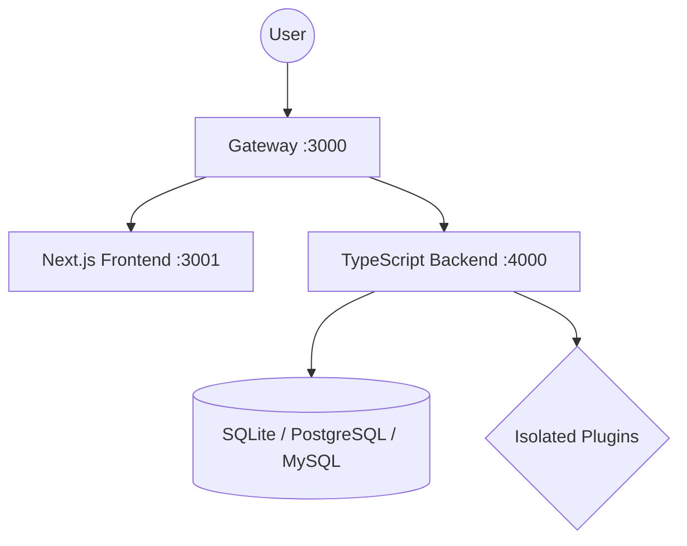

<div align="center">


<br/>

[](https://www.npmjs.com/package/create-wordjs)
[](https://github.com/jaimemartinez/wordjs/actions/workflows/ci.yml)
[](LICENSE)
[](https://nodejs.org)
[](SECURITY.md)
[](https://deepwiki.com/jaimemartinez/wordjs)

### Build a website with drag-and-drop. Add plugins without trusting them.

**Try it in one command:**

```bash
npx create-wordjs@latest my-site
```

No PHP, no MySQL, no build step — it downloads a ready-to-run bundle, starts a single process, and prints a one-time setup-wizard URL for you to open in your browser.

</div>

---

## 🧐 What is WordJS?

WordJS is free, open-source software for **building and running a website** — a blog, a shop, a company site, a portfolio. If you've heard of WordPress, think *"WordPress, rebuilt for today"*: you get a visual, **drag-and-drop page builder**, ready-made **themes** and **plugins**, and search-engine-friendly pages out of the box.

The difference is what happens when you install a plugin.

> **On most website software, every add-on you install gets the keys to everything** — your database, your passwords, your files. One bad or hacked plugin can quietly wreck the whole site. It's the single most common way websites get breached.

WordJS is built so that **can't happen.**

## 🔐 The big idea, in plain English

Think about apps on your phone. A flashlight app can't read your bank messages unless you *let* it — each app is boxed off and has to **ask permission** for anything sensitive.

**WordJS does that for website plugins.** Every plugin runs in its own locked box (a separate, operating-system-enforced process) and starts with **nothing** — no access to your files, your database, your visitors' data, or the internet. It only gets a capability when **you, the admin, grant it** — and you see exactly what each plugin is asking for.

So a plugin that turns out to be buggy, greedy, or outright malicious **stays in its box**. It can't read your passwords, steal your config, or take the site down. That safety is enforced by the operating system itself — not by trusting the plugin to behave.

*Every other major CMS runs plugins with full trust. This is the one thing they can't copy without breaking their entire ecosystem — and it's what WordJS is built around.*

<div align="center">



</div>

<div align="center">


*Building a page by dragging blocks and editing text right on the canvas — the visual editor ships in the core, not as a paid add-on.*

</div>

---

## ⚖️ How it compares

|  | **WordJS** | WordPress | Ghost | Strapi | Payload |
|---|:--:|:--:|:--:|:--:|:--:|
| **Plugins can't compromise the site** | ✅ OS-enforced sandbox | ❌ full trust | — no plugin runtime | ❌ in-process | ❌ in-process |
| **You approve what each plugin can do** | ✅ per-plugin, default-deny | ❌ | — | ❌ | ❌ |
| **Drag-and-drop page builder in core** | ✅ built in | partial (paid builders) | ❌ | ❌ headless | ❌ headless |
| **SEO-ready out of the box** | ✅ SSR + metadata + sitemap | ✅ via plugins | ✅ | ❌ your job | ❌ your job |
| **Import your WordPress site** | ✅ built-in importer | — | ✅ | ❌ | ❌ |
| **What it takes to run** | 1 process, SQLite | PHP + MySQL | Node + MySQL | Node + DB + frontend | Node + DB |
| **License** | MIT | GPLv2 | MIT | MIT (paid tier) | MIT (paid cloud) |
| **Ecosystem maturity** | ⚠️ young, first-party only | 60k+ plugins | large | large | growing |

The honest row is the last one: WordJS is young, and every plugin and theme it ships today is still first-party. The on-ramp for outside authors now exists — a public review policy ([`marketplace/REVIEW.md`](marketplace/REVIEW.md)), submission by pull request, automated checks in CI plus a human checklist, and a **Reviewed** badge only the official catalog can grant — but nobody has walked up it yet. What it already has is the row at the top.

---

## ✨ What's inside

<table>
<tr><td width="33%" valign="top">

**🎨 Build**
- Drag-and-drop visual editor (**Verso**, built in-house) with **39 blocks** & edit-in-place text
- **Token-driven themes** + a live customizer
- **31 plugins** in the marketplace, one-click install; **4 bundled themes**
- Real **SEO**: server-rendered pages, category/tag/author/date **archives**, sitemap index, RSS/Atom/JSON feeds, social cards
- Media library with automatic **AVIF/WebP** optimization

</td><td width="33%" valign="top">

**🧩 Extend — safely**
- Every plugin in its **own OS process**
- **Ask-permission** capabilities, default-deny
- Install-time code scanner + one-click **sha256-verified** marketplace
- WordPress-style **hooks, filters & shortcodes**
- **Import from WordPress** (posts, pages, comments, dates, **media and menus**)

</td><td width="33%" valign="top">

**⚙️ Run**
- **One process** to deploy, SQLite by default
- Or split / multi-machine over secure mTLS
- SQLite · PostgreSQL · MySQL/MariaDB
- Automatic **HTTPS** (Let's Encrypt)
- **Docker image** + one-click compose / Helm templates
- **2FA**, API tokens, webhooks, structured logs & `/metrics`

</td></tr>
</table>

<details>
<summary><b>See the full feature list</b></summary>

<br/>

**Plugin system & security (the core differentiator)**
- **OS-process plugin sandbox.** Every plugin runs in a **separate operating-system process** (`child_process.fork`) — its own memory and event loop — so a crash, memory blow-up, or exploit is contained **by the kernel** and never takes down the host. Plugins reach the core only through a permission-checked `wordjs` bridge (structured-clone RPC, no live host references, an exact method allow-list).
- **Install-time code scanner.** Before a plugin can activate, its JavaScript is parsed and walked for dangerous constructs (`eval`, `exec`/`spawn`, dynamic `require`, sensitive modules, forbidden `process` access). It's **fail-closed** (an unparseable file is rejected) and runs on **every** plugin — no exemptions. The dependency tree a plugin ships is scanned at the same gate, bounded to 4,000 files, 1 MB per file and 32 levels deep; hitting a bound is itself reported as a finding, and a symlink resolving outside the plugin directory is never followed and reported instead.
- **Ask-permission model (default-deny).** A plugin's manifest *requests* scoped capabilities (`database`, `filesystem`, `settings`, `users:read`, `email:provider`, `notifications:provider`, `network`, …); an **admin grants each one per plugin**. A call works only if the capability is BOTH declared AND granted. Activation shows the admin exactly what the plugin requests and grants that declared set — only when the plugin has no grant record yet, so a later per-permission revoke survives a re-activation. First-party plugins get no extra privilege — same sandbox, same rules.
- **Native kernel confinement on every supported platform (default-on).** Each plugin child is also wrapped by the operating system's own sandbox: **Landlock + seccomp-bpf** on Linux (with `no-new-privs`), a zero-capability **AppContainer** on Windows, **Seatbelt** on macOS. Filesystem authority is scoped to the plugin's own zones, and a plugin **without** the `network` grant can't reach the network at all — the kernel refuses it below JavaScript, so it can't touch the internet or your internal services. Each mechanism is **probe-gated** (a confined child is spawned beside an unconfined control and must actually be refused what it must be refused), and production is **fail-closed**: if the probe can't certify the host, the isolated plugin doesn't run unless the operator sets `sandbox.requireHardening:false`. The live mechanism and its state are reported on admin `GET /health/details`.
- **Per-plugin data isolation.** Each plugin gets only its own `wjp_<slug>_` database tables and a secret-scrubbed view of config — core `users`/`options`/`sessions` and secrets are unreachable. On **PostgreSQL/MySQL** the database itself enforces this via a per-plugin low-privilege role/user.
- **Plugin & theme marketplace.** A curated catalog of **31 first-party plugins** with one-click, **sha256-verified** installs through the same hardened, sandboxed pipeline as manual uploads. Themes ride the same mechanism on an independent catalog and their own admin tab, but that catalog was retired and currently builds empty — the themes you get are the four bundled in `backend/themes/`. Sources are admin-configurable (point it at any HTTPS catalog), and the **Reviewed** badge is honoured only for entries the official catalog serves — a review claim from any other source is shown as unreviewed. All catalog items are first-party today; third-party submissions are open under the public review policy ([`marketplace/REVIEW.md`](marketplace/REVIEW.md)), and nobody outside the project has submitted one yet.

**Authoring & content**
- **Visual builder** (**Verso**, built in-house — see *The editor* below) — drag-and-drop editing, **in-place rich text** (bold, italic, links with an open-in-new-tab toggle, bullet and numbered lists, clear formatting), a per-block **Appearance** panel (background colour/gradient/image/glass, border, shadow, typography, hover effects — with tablet/mobile overrides on the box and type metrics: padding, margins, max-width, min-height, font-size, line-height, letter-spacing, alignment and radius; colours, backgrounds, shadows and motion are deliberately one look per block), a searchable block inserter with reusable section patterns, and a **device preview** that sizes the canvas to the real device width (desktop 1280 / tablet 768 / mobile 375), so the site's actual CSS breakpoints fire.
- **Real server-side rendering** — public pages are React Server Components, so crawlers and first paint get the real content, per-page metadata (`generateMetadata`), OpenGraph/Twitter cards, JSON-LD, real `404`s, and a no-JS search form.
- **SEO, archives and feeds** — semantic HTML; public `/category/`, `/tag/`, `/author/`, date and custom-taxonomy archives, paginated by path and rendered through the theme's `archive.html`; a `sitemap.xml` that becomes a `<sitemapindex>` with chunked children above 1,000 URLs (`SITEMAP_MAX_URLS` in `backend/src/core/feeds.ts`); `robots.txt`; and RSS, Atom, JSON Feed, per-category / per-tag / per-author and comments feeds — all served at their public root URLs in every deployment mode.
- **Themes** — a shared, token-driven CSS framework (`--wjs-*` design tokens) that auto-styles pages, plus a live **customizer** at `/admin/themes/customize`. A theme's optional server-side `functions.js` runs in the **same sandbox** as plugins.
- **Hooks, filters & shortcodes** (WordPress-style), **dynamic roles & permissions** (database-driven), and **UI in español / english / português**.
- **WordPress (WXR) importer** — upload a `.xml` export to bring over authors, categories/tags, posts/pages (with meta, term relationships, and threaded comments), preserving publish dates. **Attachments are downloaded** through the same SSRF guard as webhooks (50 MB per file and 1 GB per run by default, resumable, failures reported per item) and **menus come across with hierarchy**, targets and locations; content and editor-tree URLs are rewritten to the new library. Idempotent and re-runnable.
- **Backups** — full-site export/restore with retention pruning, plus **privacy-first analytics** (no cookies, daily-rotated salted IP hashing) and a **built-in cron**.

**Operations**
- **Gateway** — a clustered reverse proxy (one worker per CPU core, capped at 16 — or 4 in development — with automatic respawn of dead workers), health-check eviction, an mTLS internal control channel, and SSE-aware proxying. It also acts as the cluster CA for multi-machine deployments.
- **Automatic TLS** — Let's Encrypt via HTTP-01 or DNS-01, manual upload, or a self-signed dev fallback; renewal works in single-process mode too.
- **Databases** — SQLite (default), PostgreSQL, or MySQL 8+/MariaDB, all behind one interface with a migration system to move between them.
- **Headless-friendly** — scoped API tokens (`Authorization: Bearer wjt_…`, per-resource scopes), HMAC-signed SSRF-safe webhooks, and token-gated Prometheus metrics.
- **Observable** — structured pino logging with request correlation ids and credential scrubbing, and a `/metrics` endpoint carrying request rate, latency histogram, error rate, DB pool and sandbox state. See [Observability](documentation/observability.md).
- **Native mail server** — an optional, fully sandboxed first-party plugin: inbound SMTP, direct-MX delivery, and DKIM signing.

</details>

---

## ✍️ The editor — Verso

WordJS ships its own visual block editor, Verso (`frontend/src/components/verso/`,
`frontend/src/lib/verso/`): drag-and-drop, edit-in-place text, undo/redo, a command palette and a
properties panel — all built on an in-house core with no third-party dependency for the editor
state, the drag-and-drop resolver or the rich-text engine.

**Architecture in 10 lines:** the document lives as a normalized tree (id→node map) mutated
exclusively by commands inside transactions, with history kept as inverse patches
(`lib/verso/store.ts`). The canvas is an iframe with its own document, into which the React tree is
teleported through a portal (`components/verso/canvas/FrameController.tsx`) — no stylesheet mixing
with the parent. The selection/drag/action-bar layer always lives in the parent document, measured
by a purpose-built `GeometryStore` (`components/verso/overlay/`), never inside the iframe. The
drop-target resolver (`lib/verso/dnd/resolve.ts`) is a pure function with no dependency on any DnD
library. Rich text is edited by an in-house engine over `contenteditable`
(`lib/verso/inline-engine/`), with no Tiptap and no ProseMirror. Blocks — core ones and marketplace
plugin ones alike — are declared against an in-house field contract (`lib/verso/registry.ts`)
inspired, for compatibility, by the field shape Puck popularized — see the credit below.

**Document format:** content is persisted as `{ content: [...], root: {...} }` under the post-meta key
`_puck_data` — the same format *and the same key* the WordJS block editor has used from the start. The
key kept its historical name on purpose: it is a value already written into every existing install, and
renaming it would buy a tidier string at the price of a data migration on everyone's content.

**Plugin blocks:** a plugin declares its block with `frontend.versoComponents` in `manifest.json` (or
by dropping it at `client/verso/<Pascal>Verso.tsx`) and exports `versoComponentDef` + a default render
component, or a `versoComponents` map for several blocks. The pre-rename spellings —
`frontend.puckComponents`, `client/puck/<Pascal>Puck.tsx`, `puckComponentDef` / `puckComponents` — are
still resolved, and will stay resolved: a plugin published before the rename keeps loading untouched,
with a deprecation line in the build log and nothing else. Full walkthrough in the
[plugin guide](documentation/plugins.md), §13.

**Courtesy credit:** the first versions of the WordJS editor were built on a vendored fork of
[Puck](https://github.com/measuredco/puck) (`@measured/puck`, MIT). Verso is a complete, independent
rewrite — it shares no code, no internal data structures and no dependencies with Puck — but the
persisted document format and the shape of the block field contract were deliberately designed to
stay compatible with that heritage, out of respect for the project that gave the idea its form. This
mention is a courtesy, not an obligation of the MIT license (WordJS neither redistributes nor
derives Puck code in the current editor).

---

## 🚀 Deploy your way

The **same codebase** runs three ways — switch anytime, no data migration:

| Mode | What it is | Best for |
|---|---|---|
| 🧱 **Monolith** | Everything in **one process, one port** | The simplest deploy — a small VM or container |
| 🔀 **Split** *(default)* | Gateway + backend + frontend on one host | Scaling services independently |
| 🌐 **Separate** | The three services on **different machines**, joined over mTLS | Larger, distributed setups |

In a container instead: the repository ships a Dockerfile that CI **builds, boots, health-checks and installs through the setup wizard** on every run (the `docker-image` job in `.github/workflows/ci.yml`), plus ready-to-run templates under [`deploy/`](deploy/) — a single-container [`compose`](deploy/compose/) stack and a monolith [Helm chart](deploy/helm/wordjs/).

```bash
# The whole thing, one process:
npx create-wordjs@latest my-site          # then open the printed wizard URL

# Or, from a source checkout:
npm run install:all
npm run dev:mono      # monolith on http(s)://localhost:3000 — HTTPS once gateway/gateway-config.json enables TLS
npm run dev           # or the 3-service split
```

<details>
<summary><b>Architecture & run-mode details</b></summary>

<br/>


```mermaid
graph TD
    User((User)) --> Gateway[Gateway :3000]
    Gateway --> Frontend[Next.js Frontend :3001]
    Gateway --> Backend[TypeScript Backend :4000]
    Backend --> DB[(SQLite / PostgreSQL / MySQL)]
    Backend --> Plugins{Isolated Plugins}
```

- **[Gateway](gateway/)** — clustered Node/Express reverse proxy: routing, load-balancing, health-check eviction, mTLS internal channel, SSE-aware proxying, and the cluster CA.
- **[Backend](backend/)** — the core engine (content, users, roles, the plugin/theme system, mail, certificates, and the sandbox). TypeScript, compiled to JS for production.
- **[Frontend](frontend/)** — the public site and the Next.js admin, including the Verso visual builder.

**Monolith** runs the backend (with its isolated plugins) and the Next.js frontend **in one process** on `:3000` — no gateway proxy, no cluster — while still handling TLS, security headers, compression, and SEO rewrites locally. **Split** runs them as three cooperating processes behind the gateway. **Separate** spreads those three across machines: `create-wordjs gateway --host <ip>` makes the first box the cluster CA and prints ready-to-paste join commands with single-use, role-bound tokens; each other box enrolls over mutual TLS with no cert hand-copying.

See the [Separate-mode guide](documentation/separate-mode.md) for the walkthrough.

</details>

---

## 📚 Documentation

| | | |
|---|---|---|
| 🏗️ [Architecture](documentation/architecture.md) | 🛠️ [Development & Build](documentation/development.md) | ⌨️ [CLI & Setup](documentation/cli.md) |
| 🔌 [Plugin Tutorial](documentation/plugins.md) | 🧩 [Plugins Reference](documentation/plugins-reference.md) | 🧱 [Plugin Isolation](documentation/plugin-isolation-proposal.md) |
| 🎨 [Themes](documentation/themes.md) | 🖥️ [Frontend](documentation/frontend.md) | 🛰️ [Gateway](documentation/gateway.md) |
| 🗄️ [Database](documentation/database.md) | 🗃️ [Plugin Database Access](documentation/plugin-database.md) | ✉️ [Mail Server](documentation/mail-server.md) |
| 🚀 [Deployment](documentation/deployment.md) | 🧩 [Separate Mode](documentation/separate-mode.md) | 🌐 [Multi-Node Ops](documentation/multi-node.md) |
| 📥 [Import from WordPress](documentation/wordpress-import.md) | 🔔 [Notifications](documentation/notifications.md) | 📡 [REST API](documentation/api.md) |
| 🔐 [Security Policy](SECURITY.md) | 🛡️ [Security Architecture](documentation/security.md) | 🧭 [Product Positioning](POSITIONING.md) |
| 📈 [Observability](documentation/observability.md) | 🧾 [Plugin Review Policy](marketplace/REVIEW.md) | |

> Live API reference (Swagger/OpenAPI) is served at `http://localhost:4000/api/v1/docs` (admin only).

---

## 🧭 Project status

> **Beta · pre-production · primarily solo-maintained.**
>
> WordJS recently completed rounds of **security hardening** (fixing a CSRF bypass, committed secrets, and XSS sinks, among others). The plugin sandbox has had multiple internal red-team passes — but there is **no independent third-party audit yet**. An external audit is strongly recommended before any production or internet-facing deployment, and the residual risks are documented plainly in [SECURITY.md](SECURITY.md) and [POSITIONING.md](POSITIONING.md).
>
> The whole ecosystem is **first-party**: the marketplace ships 31 plugins (the theme catalog was retired and builds empty; four themes come bundled). The public review pipeline now exists — policy, submission by pull request, automated checks in CI, a tracked decision ledger and a **Reviewed** badge ([`marketplace/REVIEW.md`](marketplace/REVIEW.md)) — but no third-party author community has formed around it yet. **Use it to build, learn, and experiment — do your own review before trusting it with real data or real users.**

---

## 🔒 Security

The plugin sandbox is designed to **fail closed**, with defense-in-depth layers (see [What's inside](#-whats-inside) and [Security Architecture](documentation/security.md)). Beyond plugins, WordJS ships **TOTP two-factor auth** with an admin-enforced MFA-by-role policy, JWT revocation, per-(IP + account) login throttling, constant-time secret comparison, origin-pinned CSRF protection combined with a double-submit token (every cookie-authenticated write must carry an `X-CSRF-Token` header equal to the `wjs_csrf` cookie issued at sign-in; Bearer callers, a session cookie that no longer verifies, and the two sign-in steps `POST /auth/login` and `POST /auth/mfa` stay outside the token gate), and SSRF-safe outgoing webhooks.

Before exposing WordJS to the internet: have it **independently audited**, **rotate every secret**, and set a strong `gatewaySecret` (the gateway refuses management endpoints while the default is in place). Found a vulnerability? Please follow the disclosure process in [SECURITY.md](SECURITY.md).

<details>
<summary><b>Tech stack</b></summary>

<br/>

- **Runtime:** Node.js (≥ 20.9; Node 20/22 LTS recommended)
- **Backend:** TypeScript — compiled with `tsc` for production, `ts-node` for dev
- **Frontend:** Next.js (React 19)
- **Editor:** Verso — in-house; its editor state, drag-and-drop resolver and rich-text engine carry no third-party dependency · **Styling:** vanilla CSS + Tailwind
- **Communication:** REST + JWT + scoped API tokens + WebSockets/SSE
- **Gateway:** Express + Node `cluster`, http-proxy, mTLS internal channel
- **Sandbox:** `child_process` OS-process isolation + native kernel confinement (Landlock/seccomp-bpf, AppContainer, Seatbelt) + `acorn` code scanning + runtime require proxies + layered memory caps (cgroup / Windows Job Object / RSS-poll) + a reactive per-plugin CPU watchdog (`sandbox.cpuBurstSeconds`, default 60 s at ≥ 95% of one core)
- **TLS:** `acme-client` (Let's Encrypt HTTP-01 / DNS-01)
- **Database:** SQLite (`better-sqlite3` / `sql.js`), PostgreSQL (`pg`), or MySQL/MariaDB (`mysql2`)
- **Tooling:** ESLint + Prettier, `node:test`, GitHub Actions CI

</details>

<details>
<summary><b>Run from source & backend scripts</b></summary>

<br/>

```bash
npm run install:all       # install root + sub-packages
npm run dev               # split: gateway + backend + frontend
npm run dev:mono          # or everything in one process, one port
```

Public site on port `3000`, admin at `/admin`. Both modes read `gateway/gateway-config.json` (not in git; written by `npm run setup`, the `create-wordjs` installer, or the gateway on its first boot). `dev:mono` serves `https://localhost:3000` with a self-signed certificate (`gateway/ssl-auto.*`, shared with the gateway) when that file sets `ssl: true`, `ssl.enabled`, or `sslAuto`, or when `gateway/ssl-auto.{key,crt}` already exist; on a fresh checkout without it the monolith falls back to plain `http://localhost:3000`. `WORDJS_HTTP=1` forces plain HTTP. The split gateway likewise switches to HTTPS once setup writes `ssl.enabled`. First-run setup (database + admin user) runs in the browser install wizard. `npm run setup` (`node setup/index.js --install`) is a separate, optional step for the split cluster: it generates the mTLS cluster PKI and writes the initial `backend/wordjs-config.json` / `gateway/gateway-config.json` (random `gatewaySecret`/`jwtSecret`, ports, `ssl.enabled: true`) — it does not create a database or an admin user.

In production the backend is **compiled** (`tsc` → `dist/`) and run as plain JS. From `backend/`:

| Script | Purpose |
| :-- | :-- |
| `npm run build` | Compile to `dist/` (strict config) |
| `npm run typecheck` | Strict type-check (`tsc --noEmit`), enforced in CI |
| `npm test` | Test suite (`node --test`) |
| `npm run lint` / `format` | ESLint / Prettier |

CI (`.github/workflows/ci.yml`, Node 22) runs the strict type-check, the compiled build, a dependency license gate, an `npm audit` gate that blocks high/critical production advisories in `backend`, `gateway`, `frontend` and `packages/create-wordjs`, the unit suite with `WORDJS_CI_DB=1` so the driver-conformance tests hard-fail (rather than skip) unless they really ran against the `postgres:16` and `mysql:8` service containers, integration tests against real `postgres:16` + `redis:7` containers, a separate two-process multi-node coherence job on shared Postgres + Redis, a **coverage ratchet** (c8 for the backend, vitest coverage for the frontend) that fails a run dropping below the committed floor, a job that **builds the Docker image, boots it and completes the installer inside the container**, and the frontend lint/type-check/tests/build. A separate scheduled workflow (`.github/workflows/dependency-audit.yml`) re-runs that audit across all six workspaces — root and `setup` included — every day at 04:41 UTC and opens or updates an issue when one of them fails.

</details>

---

## 🔮 Roadmap

- **🧩 Third-party marketplace** — the on-ramp is built and only the authors are missing: the review policy is public ([`marketplace/REVIEW.md`](marketplace/REVIEW.md)), decisions are recorded in a tracked ledger (`marketplace/reviews.json`), every catalog entry publishes `review.status` (`first-party` / `reviewed` / `unreviewed`), and the badge is shown for `reviewed`. The gate is real: `npm run verify:marketplace` fails if an entry claims a review with no ledger record, if a reviewed plugin's permissions have changed since the review that granted the badge, or if a first-party plugin marks *itself* reviewed. What remains is the community — all 31 catalog plugins are first-party today.
- **☁️ Media CDN** — S3-compatible object storage.
- **🌐 Multi-site** — manage multiple domains from one install.
- **🛡️ More kernel hardening** — building on the default-on Landlock/AppContainer/Seatbelt layer; preventive memory caps outside systemd Linux and Windows are the open gap.

---

## 📜 License

MIT — see [LICENSE](LICENSE). Third-party dependency notices are in [THIRD-PARTY-NOTICES.md](THIRD-PARTY-NOTICES.md).

<div align="center">
<br/>
Built with care by a small, independent project. Contributions, bug reports, and security disclosures are welcome.
<br/><br/>
<a href="https://paypal.me/dherreraj9805"></a>
</div>
