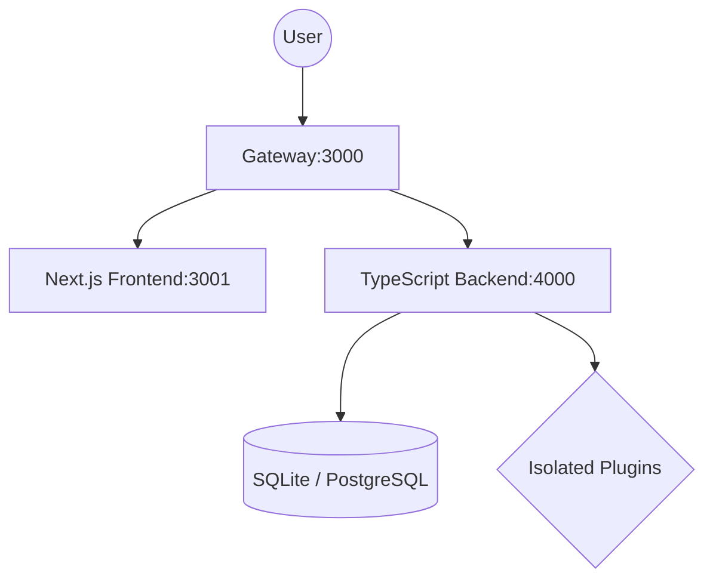

# WordJS

[](https://deepwiki.com/jaimemartinez/wordjs) [](https://paypal.me/dherreraj9805)

**WordJS** is a developer-first, JavaScript-native CMS that brings a WordPress-style
extension model (plugins, themes, hooks, shortcodes) to a modern stack: a **TypeScript**
backend, a **Next.js** frontend, and a small custom gateway. Its defining feature is a
**worker-thread plugin sandbox** that runs third-party plugins in isolated V8 isolates,
reachable only through a permission-checked capability bridge.

> ### ⚠️ Project status / maturity
>
> WordJS is an **ambitious, primarily solo-maintained project** and is **pre-production**.
> Treat it as **beta**:
> - It recently underwent **security hardening** that fixed several critical issues
>   (a CSRF bypass, committed secrets, and XSS sinks). An **independent security audit is
>   strongly recommended before any production or internet-facing deployment.**
> - It ships some **pre-release / experimental dependencies** — notably
>   `embedded-postgres` (beta).
> - The backend **compiles to `dist/` for production** (no `ts-node` at runtime) with a
>   **strict** type-check enforced in CI. A couple of strict sub-flags (`noImplicitAny`)
>   are still being rolled out file-by-file.
> - There is **no plugin marketplace or community ecosystem yet**. The repo ships a
>   handful of first-party/example plugins and themes.
>
> Use it to build, learn, and experiment. Do your own review before trusting it with
> real data or real users.

---

## ✨ What's actually here

**Plugin system & security (the core differentiator)**
- **Worker-thread plugin sandbox.** Plugins marked `"isolated": true` run in a separate
  V8 isolate (`worker_threads`). They never touch the host heap (secrets, DB handle, other
  plugins) directly — they reach core **only** through a `wordjs` capability bridge that is
  RPC'd back to the host and executed under the plugin's permission context. Includes
  per-isolate memory caps, RPC timeouts, and concurrent-call backpressure. (This is a
  worker/heap boundary, **not** OS-level isolation — see the security note below.)
- **AST static scanner.** Before activation, each plugin's `.js/.cjs/.mjs` files are parsed
  with `acorn` and walked for dangerous constructs — `eval`, `Function`, `exec`/`spawn`,
  dynamic/computed `require`, sensitive core modules, and forbidden `process` access. The
  scan is **fail-closed** (an unparseable file is a violation). Declaring `system:admin` in
  your own manifest does **not** skip the scan; only plugins an operator explicitly trusts
  (`trustedSystemPlugins`, or the admin trust toggle) are exempt.
- **Runtime secure-require.** `fs`, `child_process`, and the network modules are wrapped in
  permission-checking proxies that resist obfuscation (they also guard `Module._load`,
  `process.binding`, native `.node` addons, deferred timers, and event listeners). For
  untrusted plugins the binding-backed globals (`fetch`/`WebSocket`/`EventSource`) are
  trapped, so they get **no outbound network**. Plugins receive a **secret-scrubbed** view
  of config and a **table-scoped** DB handle that refuses raw SQL against core
  credential/role/option tables.
- **Mandatory permission model.** Plugins declare scoped permissions in `manifest.json`
  (filesystem, network, database, settings, etc.) with human-readable reasons; the sandbox
  enforces them at runtime. Trust is **server-side and never self-declarable**.

**Authoring & content**
- **Visual builder** via [Puck](https://puckeditor.com/) (drag-and-drop page editing).
- **Hooks & filters** event system, with admin-side hook inspection.
- **Shortcodes** (WordPress-style) for dynamic content, including from plugins.
- **Themes** with CSS-variable theming (9 themes ship in-repo).
- **Dynamic roles & permissions**, database-driven.
- **i18n** for core and plugins (es / en / pt).
- **Import / export** for full site backup and restore.
- **Built-in cron** for maintenance and plugin background jobs.
- **Privacy-conscious analytics**: a lightweight first-party event log with **no cookies**
  and **daily-rotated, salted IP hashing** (you own the data). Aggregated stats are shown
  in the admin panel.
- **SEO basics**: semantic HTML, meta tags, JSON-LD, and gateway-served `sitemap.xml` /
  `robots.txt`.

**Operations**
- **Gateway** with Node `cluster` (one worker per CPU, automatic respawn on crash),
  load-balancing, periodic upstream **health checks** that evict failing targets, an
  **mTLS-secured internal control channel**, and **SSE-aware proxying** (compression
  disabled and 1-hour timeouts for event streams).
- **TLS**: automatic **Let's Encrypt** certificates via `acme-client` (**HTTP-01** and
  **DNS-01** challenges), plus **manual certificate upload** and a self-signed fallback for
  local development.
- **Pluggable storage**: SQLite via `sql.js` (WASM, "legacy") or `better-sqlite3` (native),
  and PostgreSQL via `pg` / `embedded-postgres` (beta), with a migration system to move
  between them.
- **Native mail server** (shipped as an optional, isolated, operator-trusted plugin):
  inbound SMTP (`smtp-server`), direct-MX outbound delivery (`nodemailer`), DKIM signing,
  and attachment handling.

---

## 🏗️ Architecture

WordJS runs as three cooperating services behind a custom gateway.


```mermaid
graph TD
    User((User)) --> Gateway[Gateway:3000]
    Gateway --> Frontend[Next.js Frontend:3001]
    Gateway --> Backend[TypeScript Backend:4000]
    Backend --> DB[(SQLite / PostgreSQL)]
    Backend --> Plugins{Isolated Plugins}
```

- **[Gateway](gateway/):** Clustered Node/Express reverse proxy (`gateway/src/index.js`).
  Handles routing, load-balancing, health-check eviction, log rotation, an mTLS internal
  control channel, and SSE-aware proxying.
- **[Backend](backend/):** The core engine — content, users, roles, the plugin/theme
  system, mail, certificates, and the sandbox. Written in **TypeScript**; runs as compiled
  JS in production and via `ts-node` in development.
- **[Frontend](frontend/):** The public site and the Next.js admin interface (including the
  Puck visual builder).

---

## 📚 Documentation

Guides live in [`documentation/`](documentation/):

- 🏗️ **[Architecture Overview](documentation/architecture.md)**
- 🛠️ **[Development & Build Guide](documentation/development.md)** — install, compiled build, strict typecheck, dev vs prod.
- 🛰️ **[Gateway Guide](documentation/gateway.md)**
- 🖥️ **[Frontend Guide](documentation/frontend.md)**
- 🎨 **[Themes Guide](documentation/themes.md)**
- 🔌 **[Plugin Tutorial](documentation/plugins.md)** — build an isolated plugin against the `wordjs` bridge.
- 🧩 **[Plugins Reference](documentation/plugins-reference.md)** — the bundled plugins and their trust tiers.
- 🧱 **[Plugin Isolation](documentation/plugin-isolation-proposal.md)** — the worker sandbox + trust model (implemented).
- ✉️ **[Mail Server Guide](documentation/mail-server.md)**
- 🗄️ **[Database Guide](documentation/database.md)**
- 🚀 **[Deployment Guide](documentation/deployment.md)**
- 🔐 **[Security Policy](SECURITY.md)** — vulnerability reporting and active defenses.
- 🛡️ **[Security Architecture](documentation/security.md)** — deeper defenses reference (sandbox, trust model, CSRF, JWT revocation).
- 🔔 **[Notifications System](documentation/notifications.md)**
- 🧭 **[Product Positioning](POSITIONING.md)** — where WordJS is headed and why.
- 📡 **API reference**: Swagger/OpenAPI at `http://localhost:4000/api/v1/docs` (admin only).

---

## 🚀 Getting Started

> Requires Node.js (>= 18). WordJS runs three services (gateway, backend, frontend); the
> dev scripts start them together.

1. **Install dependencies** (root + sub-packages):
   ```bash
   npm run install:all
   ```

2. **Run in development:**
   ```bash
   npm run dev
   ```

3. **Access the panels:**
   - **Public site:** `http://localhost:3000`
   - **Admin dashboard:** `http://localhost:3000/admin`

> First-run setup (database choice, admin user) is handled by the setup CLI:
> `npm run setup`. See the [deployment guide](documentation/deployment.md) before exposing
> WordJS publicly.

### Backend scripts

In production the backend is **compiled** (`tsc` → `dist/`) and run as plain JS — there is
no `ts-node` at runtime. In development it runs in-place via `ts-node`. From `backend/`:

| Script              | Purpose                                                            |
| :------------------ | :---------------------------------------------------------------- |
| `npm run build`     | Compile to `dist/` with the strict config (`tsconfig.build.json`).|
| `npm start`         | Production start (`server.js` supervisor runs `dist/index.js` if built, else ts-node). |
| `npm run dev`       | Watch-mode dev server (`node --watch -r ts-node/register`).       |
| `npm run typecheck` | Strict type-check (`tsc --noEmit`). Enforced in CI.               |
| `npm test`          | Test suite (`node --test` via ts-node).                           |
| `npm run lint`      | ESLint (flat config).                                             |
| `npm run format`    | Prettier.                                                         |

> The schema is created/verified automatically at boot (`initializeDatabase`); first-run
> data seeding is handled by the setup CLI (`npm run setup` at the repo root), not a backend
> script. Driver migration is the root `npm run migrate` (`setup/index.js --migrate`).

> `strict` is **on**. Two sub-flags are deliberately staged: `noImplicitAny` (the remaining
> implicit-any parameters, being annotated with real types incrementally) and
> `useUnknownInCatchVariables`. Plugins under `backend/plugins/*` stay **JavaScript** on
> purpose — the AST scanner and dynamic `require` assume `.js`.

A GitHub Actions workflow (`.github/workflows/ci.yml`) runs the backend strict type-check,
the compiled build, a dependency **license gate** (blocks AGPL/SSPL), and tests; the gateway
tests; and the frontend lint + build.

---

## 🛠️ Tech Stack

- **Runtime:** Node.js (>= 18)
- **Backend:** TypeScript — compiled with `tsc` for production, `ts-node` for dev
- **Frontend:** Next.js (React 19)
- **Styling:** Vanilla CSS + Tailwind
- **Editor:** Puck
- **Communication:** REST + JWT + WebSockets/SSE
- **Logging:** Structured JSON via Winston (daily-rotated)
- **Gateway:** Express + Node `cluster`, http-proxy, mTLS internal channel
- **Sandbox:** `worker_threads` isolates + `acorn` AST scanning + runtime require proxies
- **TLS:** `acme-client` (Let's Encrypt HTTP-01 / DNS-01)
- **Mail:** `smtp-server`, `nodemailer`, `mailparser`, DKIM (isolated plugin)
- **Database:** SQLite (`sql.js` WASM / `better-sqlite3`) or PostgreSQL (`pg` /
  `embedded-postgres` *beta*), interchangeable via the migration system
- **Tooling:** ESLint + Prettier, `node:test`, GitHub Actions CI

---

## 🔒 Security

WordJS recently completed a round of security hardening that addressed several **critical**
findings (a CSRF bypass, committed secrets, and XSS sinks), and adds defense-in-depth around
plugins (worker isolation, AST scanning, runtime require proxies, secret scrubbing,
SQL-scope guards, gateway mTLS, and constant-time secret comparison).

That said, this is a young project under active change. **Before deploying to production or
exposing it to the internet:**
- have it **independently security-audited**,
- **rotate every secret** and set a strong `gatewaySecret` (the gateway refuses management
  endpoints while the default is in place),
- review the [Security Policy](SECURITY.md) for reporting and current defenses.

The plugin sandbox is a **worker/heap boundary with runtime guards**, not OS-level
isolation; a path to stronger (`isolated-vm` / child-process + OS sandbox) isolation is
tracked in [POSITIONING.md](POSITIONING.md). Found a vulnerability? Please follow the
disclosure process in [SECURITY.md](SECURITY.md).

---

## 🔮 Roadmap

Planned, **not yet implemented**:

- **🧩 Curated plugin marketplace** — an installable ecosystem where "sandboxed & reviewed"
  is a verifiable trust badge (see [POSITIONING.md](POSITIONING.md)).
- **☁️ Media CDN integration** — S3-compatible object storage.
- **🌐 Multi-site** — manage multiple domains/sites from one install.
- **🛡️ OS-level plugin isolation** — `isolated-vm` / sandboxed child processes for the
  hosted tier.

---

## 📜 License

MIT — see [LICENSE](LICENSE). Third-party dependency notices are in
[THIRD-PARTY-NOTICES.md](THIRD-PARTY-NOTICES.md).

---

Built with care by a small, independent project. Contributions, bug reports, and security
disclosures are welcome.
