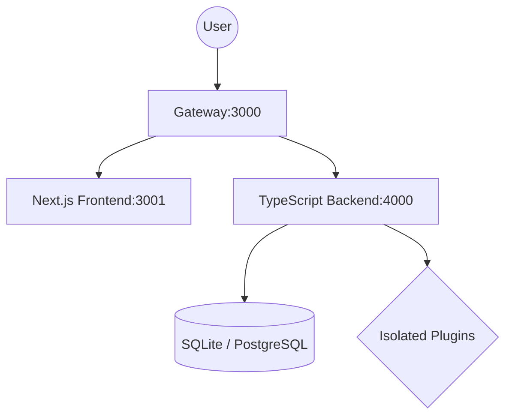
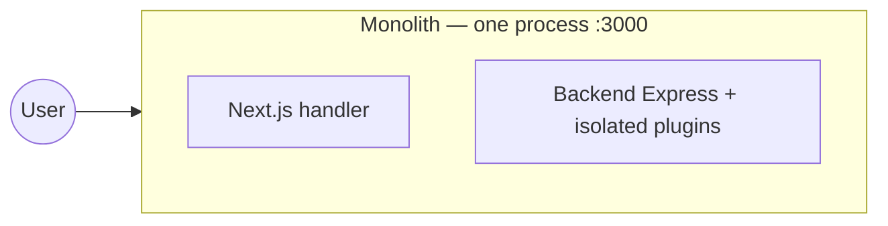

# WordJS

[](https://deepwiki.com/jaimemartinez/wordjs) [](https://paypal.me/dherreraj9805)

**WordJS** is a developer-first, JavaScript-native CMS that brings a WordPress-style
extension model (plugins, themes, hooks, shortcodes) to a modern stack: a **TypeScript**
backend, a **Next.js** frontend, and a small custom gateway. Its defining feature is an
**OS-process plugin sandbox** that runs each third-party plugin in its own isolated operating-system
process, reachable only through a permission-checked capability bridge.

> ### ⚠️ Project status / maturity
>
> WordJS is an **ambitious, primarily solo-maintained project** and is **pre-production**.
> Treat it as **beta**:
> - It recently underwent **security hardening** that fixed several critical issues
>   (a CSRF bypass, committed secrets, and XSS sinks). An **independent security audit is
>   strongly recommended before any production or internet-facing deployment.**
> - The backend **compiles to `dist/` for production** (no `ts-node` at runtime) with a
>   **strict** type-check enforced in CI. The strict core (`strictNullChecks`, etc.) is
>   on, but two sub-flags — `noImplicitAny` and `useUnknownInCatchVariables` — are
>   deliberately **off**: enabling `noImplicitAny` today still surfaces **~1,220
>   implicit-any sites** that need real type annotations. This is ongoing, not nearly done.
> - There is **no plugin marketplace or community ecosystem yet**. The repo ships a
>   handful of first-party/example plugins and themes.
>
> Use it to build, learn, and experiment. Do your own review before trusting it with
> real data or real users.

---

## ✨ What's actually here

**Plugin system & security (the core differentiator)**
- **OS-process plugin sandbox.** Plugins marked `"isolated": true` run in a **separate OS
  process** (`child_process.fork`) — their own heap, event loop, and memory cap, so a crash,
  OOM, or heap escape is contained to the child **by the kernel** and never takes down the host.
  They reach core **only** through a `wordjs` capability bridge that is RPC'd back to the host
  (structured-clone IPC, no live host references) and **permission-checked on the host side**
  under the plugin's context. Bridge dispatch enforces an **exact method allowlist**; privileged
  surfaces (mail provider, notification transport, route/hook registration) flow through dedicated
  IPC kinds gated by per-plugin capability grants, never a generic call. Includes **layered per-child memory caps**
  (see below), RPC timeouts with wedged-child recycling, and concurrent-call backpressure. A
  `worker_threads` transport remains as a cross-platform fallback; the same guards run either way.
  (This is real OS-process isolation, but not yet capability-minimal at the syscall level — see
  the security note below.)
- **AST static scanner.** Before activation, each plugin's `.js/.cjs/.mjs` files are parsed
  with `acorn` and walked for dangerous constructs — `eval`, `Function`, `exec`/`spawn`,
  dynamic/computed `require`, sensitive core modules, and forbidden `process` access. The
  scan is **fail-closed** (an unparseable file is a violation). It runs on **every** plugin —
  there is no scan-skip and no "trusted" exemption.
- **In-child runtime guards.** Inside the sandboxed process, `fs`, `child_process`, and the
  network modules are wrapped in permission-checking proxies that resist obfuscation (they also
  block `worker_threads`/`vm`/`module`/`inspector`, `process.binding`, native `.node` addons,
  deferred timers, and event listeners). By default the binding-backed globals
  (`fetch`/`WebSocket`/`EventSource`) and raw sockets are trapped, so a plugin gets **no outbound
  network** unless an admin grants it the `network` capability. An `io-guard` confines fs
  reads/writes to the plugin's own dir and blocks reads of `.env`/secret files and the database
  files. Every plugin receives a **secret-scrubbed** view of config and a **table-scoped** DB
  handle, confined to its own `wjp_<slug>_` tables and refused raw SQL against core
  credential/role/option tables. User/site data comes via the safe `wordjs.users.*` (projection
  only, never `user_pass`) and `wordjs.site.*` bridges.
- **Android-style permission model — one tier, no bypass.** Plugins *request* scoped capabilities
  in `manifest.json` (filesystem, network, database, settings, `users:read`, `email:provider`,
  `notifications:provider`, etc.) with human-readable reasons; an **admin grants each one per
  plugin** (default-deny) in `/admin/plugins`, and a bridge call works only if it is BOTH declared
  AND granted. **Every** plugin is sandboxed — first-party plugins are pre-granted their declared
  capabilities but are **not** privileged. There is no "trusted" tier; shell, native addons,
  unscoped/core-table DB, and secret options were removed for all plugins.
- **Layered per-child memory caps.** Process separation already means a child OOM can't crash
  the host on any platform. On top of that: an **opt-in preventive cgroup v2 `MemoryMax`** per
  child on systemd Linux (`systemd-run --user --scope`, no root, probe-gated; enable via
  `sandbox.useCgroupMemoryCap`); a **reactive host-side RSS poll** that `SIGKILL`s a child over
  budget (Linux `/proc`, Windows `tasklist`, macOS `ps`); and a loose `RLIMIT_AS` virtual
  backstop plus a `--max-old-space-size` JS-heap cap.
- **Real server-side rendering.** The public routes (home, posts, pages, search) are async
  React Server Components that fetch on the server (`frontend/src/lib/server-api.ts`), so the
  initial HTML sent to crawlers and the first paint already contain the real title/body —
  not the empty client-only skeletons they used to ship. Each page exports `generateMetadata`
  (title template, description, canonical, OpenGraph/Twitter), missing content returns a real
  HTTP **404** (`notFound()`), and search is a no-JS GET form. Content rendering lives in
  client components fed the already-fetched data, so they SSR with content then hydrate
  carousels/comments.
- **SEO basics**: semantic HTML, meta tags, JSON-LD, per-page metadata, and gateway-served
  `sitemap.xml` / `robots.txt`.

**Authoring & content**
- **Visual builder** via [Puck](https://puckeditor.com/) — drag-and-drop page editing with a
  redesigned canvas: **in-place rich-text editing** (bold/italic/links, text color with a visual
  picker and an **eyedropper**, **font family** from your installed fonts, size, and alignment),
  a searchable block inserter with reusable **section patterns**, and a **device preview**
  (desktop/tablet/mobile) that renders the canvas in an isolated iframe at the true device width,
  so the responsive layout matches the live site exactly.
- **Hooks & filters** event system, with admin-side hook inspection.
- **Shortcodes** (WordPress-style) for dynamic content, including from plugins.
- **Themes** with CSS-variable theming (14 first-party themes ship in-repo).
- **Dynamic roles & permissions**, database-driven.
- **i18n** for core and plugins (es / en / pt).
- **Import / export** for full site backup and restore, with **retention pruning** — after
  each backup only the newest N are kept (`backup_retention`, default 7; `0` keeps all) so
  scheduled backups can't fill the disk. Backups are on-host (off-host/S3 is roadmap).
- **WordPress (WXR) importer** to migrate an existing WordPress site. Upload a `.xml` export
  in **Admin → Import** to preview entity counts (dry-run analyze) and then import: WordPress
  authors → users, categories/tags → terms, items → posts/pages (with meta, term
  relationships, and threaded comments), preserving original publish dates. It is
  **idempotent** (re-runnable; existing users/terms/posts are matched, not duplicated).
  Attachments (WXR ships only URLs, not the media binaries) and nav menus are skipped.
- **Built-in cron** for maintenance and plugin background jobs.
- **Privacy-conscious analytics**: a lightweight first-party event log with **no cookies**
  and **daily-rotated, salted IP hashing** (you own the data). Aggregated stats are shown
  in the admin panel.

**Operations**
- **Gateway** with Node `cluster` (one worker per CPU, automatic respawn on crash),
  load-balancing, periodic upstream **health checks** that evict failing targets, an
  **mTLS-secured internal control channel**, and **SSE-aware proxying** (compression
  disabled and 1-hour timeouts for event streams).
- **TLS**: automatic **Let's Encrypt** certificates via `acme-client` (**HTTP-01** and
  **DNS-01** challenges), plus **manual certificate upload** and a self-signed fallback for
  local development. ACME **auto-renewal works in monolith mode too** — in embedded mode the
  cert-manager writes the renewed cert and hot-reloads the running HTTPS server in-process
  (via `setSecureContext`, no restart); it still needs the opt-in HTTP-01 listener
  (`acme.http01Port`, e.g. 80) reachable.
- **Prometheus metrics** at `GET /metrics` — default Node/process metrics plus a
  `wordjs_sse_clients` gauge. **Disabled (404) unless a scrape token is configured**
  (`config.metrics.token` or the `METRICS_TOKEN` env var); scrape with
  `Authorization: Bearer <token>`. Routed publicly via the gateway and in monolith mode, and
  never exposed without a token.
- **Pluggable storage**: SQLite via `sql.js` (WASM, "legacy") or `better-sqlite3` (native),
  and PostgreSQL via `pg`, with a migration system to move
  between them.
- **Native mail server** (shipped as an optional, fully sandboxed first-party plugin,
  pre-granted the `network`/`email:provider` capabilities it needs): inbound SMTP
  (`smtp-server`), direct-MX outbound delivery (`nodemailer`), DKIM signing, and attachment
  handling.

---

## 🏗️ Architecture

WordJS runs as three cooperating services behind a custom gateway.


```mermaid
graph TD
    User((User)) --> Gateway[Gateway:3000]
    Gateway --> Frontend[Next.js Frontend:3001]
    Gateway --> Backend[TypeScript Backend:4000]
    Backend --> DB[(SQLite / PostgreSQL)]
    Backend --> Plugins{Isolated Plugins}
```

- **[Gateway](gateway/):** Clustered Node/Express reverse proxy (`gateway/src/index.js`).
  Handles routing, load-balancing, health-check eviction, log rotation, an mTLS internal
  control channel, and SSE-aware proxying.
- **[Backend](backend/):** The core engine — content, users, roles, the plugin/theme
  system, mail, certificates, and the sandbox. Written in **TypeScript**; runs as compiled
  JS in production and via `ts-node` in development.
- **[Frontend](frontend/):** The public site and the Next.js admin interface (including the
  Puck visual builder).

### Run modes (split or monolith)

The same codebase runs two ways, **switchable at any time** — both modes share the same
`backend/wordjs-config.json`, the same database, `uploads`/`themes`/`plugins`, secrets, and
the same public origin (`https://localhost:3000`), so there is no migration to switch. They
are mutually exclusive (both bind the public port).

- **Split (default) — three processes:** the gateway + backend + frontend shown above, started
  together by `npm run dev` / `npm start`. The gateway adds Node `cluster`, health-checks, and
  load-balancing — best when you want to scale services independently.
- **Monolith — one process, one port:** everything runs in a single Node process on `:3000`
  via [`monolith.js`](monolith.js) (`npm run dev:mono`, or
  `npm run build:mono && npm run start:mono`). The backend (with its isolated plugins) and the
  Next.js frontend are mounted **in-process** (no loopback proxy, no cluster, no gateway
  service-registration); the gateway's still-needed cross-cutting concerns (TLS, security
  headers, compression, SEO rewrites) are handled locally. Simplest to deploy (one process
  behind a single reverse proxy or a small VM/container).


```mermaid
graph LR
    subgraph Monolith["Monolith — one process :3000"]
        Next[Next.js handler] & API[Backend Express + isolated plugins]
    end
    U((User)) --> Monolith
```

---

## 📚 Documentation

Guides live in [`documentation/`](documentation/):

- 🏗️ **[Architecture Overview](documentation/architecture.md)**
- 🛠️ **[Development & Build Guide](documentation/development.md)** — install, compiled build, strict typecheck, dev vs prod.
- 🔩 **[Core Modules Reference](documentation/core-modules.md)** — the backend core modules and their responsibilities.
- ⌨️ **[CLI & Setup](documentation/cli.md)** — the `setup` / `migrate` command-line tools.
- 🛰️ **[Gateway Guide](documentation/gateway.md)**
- 🖥️ **[Frontend Guide](documentation/frontend.md)**
- 🎨 **[Themes Guide](documentation/themes.md)**
- 🔌 **[Plugin Tutorial](documentation/plugins.md)** — build an isolated plugin against the `wordjs` bridge.
- 🧩 **[Plugins Reference](documentation/plugins-reference.md)** — the bundled plugins and their capabilities.
- 🧱 **[Plugin Isolation](documentation/plugin-isolation-proposal.md)** — the OS-process sandbox + per-plugin capability grants (implemented).
- ✉️ **[Mail Server Guide](documentation/mail-server.md)**
- 🗄️ **[Database Guide](documentation/database.md)**
- 🗃️ **[Plugin Database Access](documentation/plugin-database.md)** — the table-scoped `wjp_<slug>_` plugin DB handle.
- 📥 **[Migrating from WordPress](documentation/wordpress-import.md)** — import a WordPress WXR export (authors, terms, posts/pages, comments).
- 🚀 **[Deployment Guide](documentation/deployment.md)** — incl. **Releases & distribution** (downloadable pre-compiled bundles).
- 🌐 **[Multi-Node Operations](documentation/multi-node.md)** — dist-lock leases, Redis coherence, and what's deferred.
- 🔐 **[Security Policy](SECURITY.md)** — vulnerability reporting and active defenses.
- 🛡️ **[Security Architecture](documentation/security.md)** — deeper defenses reference (sandbox, capability grants, CSRF, JWT revocation).
- 🔔 **[Notifications System](documentation/notifications.md)**
- 🧭 **[Product Positioning](POSITIONING.md)** — where WordJS is headed and why.
- 📡 **[REST API Reference](documentation/api.md)** — endpoint-by-endpoint REST docs; also live Swagger/OpenAPI at `http://localhost:4000/api/v1/docs` (admin only).

---

## 🚀 Getting Started

> Requires Node.js (>= 18). WordJS can run as **three services** (gateway, backend, frontend)
> or as a **single-process monolith** — see [Run modes](#run-modes-split-or-monolith). The
> scripts below start everything together either way.

### Option A — download a pre-compiled release (no build step)

The fastest way to run WordJS. The bundle is **pre-compiled** (frontend `.next`, backend
`dist/`, and plugins are already built; no secrets are shipped — they're generated locally).

1. Download `wordjs-<version>.zip` from the
   [**Releases**](https://github.com/jaimemartinez/wordjs/releases) page and unzip it.
2. **Install runtime dependencies only** (no compilation):
   ```bash
   npm run release:install
   ```
3. **Start it:**
   ```bash
   npm run start:mono   # one process, one port (default https://localhost:3000)
   # or: npm start      # the 3-service split
   ```
4. Finish in the browser **install wizard**: pick SQLite or PostgreSQL and create your admin.

> The monolith binds `0.0.0.0` on the public port; for LAN/remote access set the site
> host/`siteUrl` to the IP/domain you'll use (the backend's Site-URL guard rejects host
> mismatches). To **build** a release bundle yourself from source, run `npm run bundle-release`
> (root `scripts/make-release.js`); pushing a `v*` git tag does this automatically and
> publishes a GitHub Release.

### Option B — run from source

1. **Install dependencies** (root + sub-packages):
   ```bash
   npm run install:all
   ```

2. **Run in development:**
   ```bash
   npm run dev        # split: gateway + backend + frontend
   # or, everything in one process on one port:
   npm run dev:mono   # monolith
   ```

   For production, use `npm start` (split) or `npm run build:mono && npm run start:mono`
   (monolith).

3. **Access the panels:**
   - **Public site:** `http://localhost:3000`
   - **Admin dashboard:** `http://localhost:3000/admin`

> First-run setup (database choice, admin user) is handled by the setup CLI:
> `npm run setup`. See the [deployment guide](documentation/deployment.md) before exposing
> WordJS publicly.

### Backend scripts

In production the backend is **compiled** (`tsc` → `dist/`) and run as plain JS — there is
no `ts-node` at runtime. In development it runs in-place via `ts-node`. From `backend/`:

| Script              | Purpose                                                            |
| :------------------ | :---------------------------------------------------------------- |
| `npm run build`     | Compile to `dist/` with the strict config (`tsconfig.build.json`).|
| `npm start`         | Production start (`server.js` supervisor runs `dist/index.js` if built, else ts-node). |
| `npm run dev`       | Watch-mode dev server (`node --watch -r ts-node/register`).       |
| `npm run typecheck` | Strict type-check (`tsc --noEmit`). Enforced in CI.               |
| `npm test`          | Test suite (`node --test` via ts-node).                           |
| `npm run lint`      | ESLint (flat config).                                             |
| `npm run format`    | Prettier.                                                         |

> The schema is created/verified automatically at boot (`initializeDatabase`); first-run
> data seeding is handled by the setup CLI (`npm run setup` at the repo root), not a backend
> script. To apply pending **schema** migrations without starting the server (e.g. in a deploy
> pipeline), run the root `npm run migrate` (`setup/index.js --migrate` → `backend/scripts/migrate.js`);
> it's **idempotent** (the same migrations also run at boot). Switching the DB *driver* itself
> (copying data between SQLite and PostgreSQL) is a **separate** operation in the admin panel
> (Admin → Database), not `npm run migrate`.

> `strict` is **on** (`strictNullChecks`, `strictFunctionTypes`, etc. are enforced). Two
> sub-flags are deliberately **off**: `noImplicitAny` and `useUnknownInCatchVariables`.
> Turning on `noImplicitAny` today still surfaces **~1,220 implicit-any sites** to annotate
> with real types — this is in progress, not nearly complete. Plugins under
> `backend/plugins/*` stay **JavaScript** on purpose — the AST scanner and dynamic `require`
> assume `.js`.

A GitHub Actions workflow (`.github/workflows/ci.yml`, on **Node 22**) runs the backend strict
type-check, the compiled build, a dependency **license gate** (blocks AGPL/SSPL), the unit
tests, and **integration tests against real `postgres:16` + `redis:7` service containers**
(`npm run test:integration` — multi-node dist-lock lease CAS, Redis pub/sub coherence, and the
health/metrics endpoints); the gateway tests; and the frontend lint, type-check, **vitest unit
tests** (`npm run test`, e.g. the XSS sanitizer), and build.

---

## 🛠️ Tech Stack

- **Runtime:** Node.js (>= 18)
- **Backend:** TypeScript — compiled with `tsc` for production, `ts-node` for dev
- **Frontend:** Next.js (React 19)
- **Styling:** Vanilla CSS + Tailwind
- **Editor:** Puck
- **Communication:** REST + JWT + WebSockets/SSE
- **Logging:** Structured JSON via Winston (daily-rotated)
- **Gateway:** Express + Node `cluster`, http-proxy, mTLS internal channel
- **Sandbox:** `child_process` OS-process isolation (`worker_threads` fallback) + `acorn` AST scanning + runtime require proxies + layered memory caps (cgroup/RSS-poll/RLIMIT_AS)
- **TLS:** `acme-client` (Let's Encrypt HTTP-01 / DNS-01)
- **Mail:** `smtp-server`, `nodemailer`, `mailparser`, DKIM (isolated plugin)
- **Database:** SQLite (`sql.js` WASM / `better-sqlite3`) or PostgreSQL (`pg`),
  interchangeable via the migration system
- **Tooling:** ESLint + Prettier, `node:test`, GitHub Actions CI

---

## 🔒 Security

WordJS recently completed a round of security hardening that addressed several **critical**
findings (a CSRF bypass, committed secrets, and XSS sinks), and adds defense-in-depth around
plugins (OS-process isolation, AST scanning, runtime require proxies, secret scrubbing,
SQL-scope guards, gateway mTLS, and constant-time secret comparison).

That said, this is a young project under active change. **Before deploying to production or
exposing it to the internet:**
- have it **independently security-audited**,
- **rotate every secret** and set a strong `gatewaySecret` (the gateway refuses management
  endpoints while the default is in place),
- review the [Security Policy](SECURITY.md) for reporting and current defenses.

The plugin sandbox runs **every** plugin in a **separate OS process** with
defense-in-depth capability guards — a kernel-enforced boundary that contains a child crash,
OOM, or heap escape to that one process. The remaining hardening is honest: the child still
has the full Node API and a normal OS uid, so it is **not yet capability-minimal at the
syscall level**. A path to stronger isolation (seccomp/landlock, cgroup caps, dropped uid) is
tracked in [POSITIONING.md](POSITIONING.md). Found a vulnerability? Please follow the
disclosure process in [SECURITY.md](SECURITY.md).

---

## 🔮 Roadmap

Planned, **not yet implemented**:

- **🧩 Curated plugin marketplace** — an installable ecosystem where "sandboxed & reviewed"
  is a verifiable trust badge (see [POSITIONING.md](POSITIONING.md)).
- **☁️ Media CDN integration** — S3-compatible object storage.
- **🌐 Multi-site** — manage multiple domains/sites from one install.
- **🛡️ Kernel-level plugin hardening** — OS-process isolation already ships; next is
  syscall filtering (seccomp/landlock), a preventive Windows memory cap (Job Object), and a
  dropped OS uid for the hosted tier.

**In progress / deferred migrations** (tracked as open PRs):

- **Express 5** for the backend and gateway (currently on Express 4).
- **TypeScript 6** for the frontend (currently on TypeScript 5).

---

## 📜 License

MIT — see [LICENSE](LICENSE). Third-party dependency notices are in
[THIRD-PARTY-NOTICES.md](THIRD-PARTY-NOTICES.md).

---

Built with care by a small, independent project. Contributions, bug reports, and security
disclosures are welcome.
