# WordJS Architecture Overview

This document provides a comprehensive visual overview of the WordJS system architecture.

---

## 🏗️ System Architecture

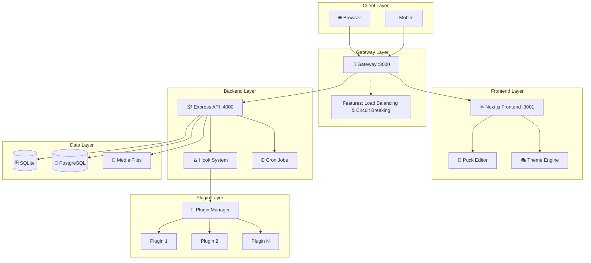

---

## 🔄 Request Flow

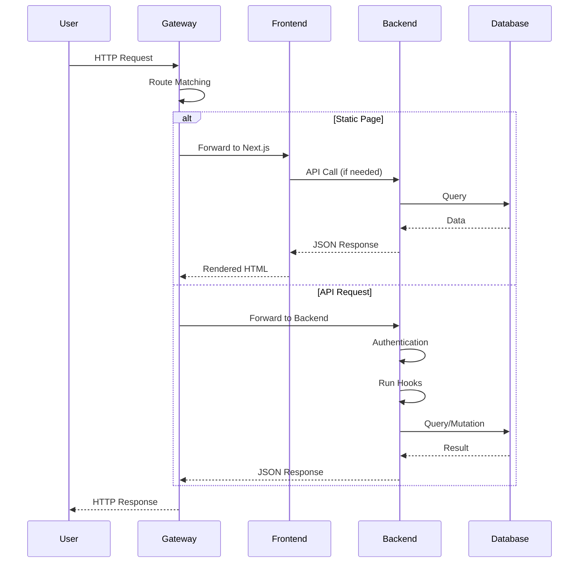

---

## 🎨 Theme System

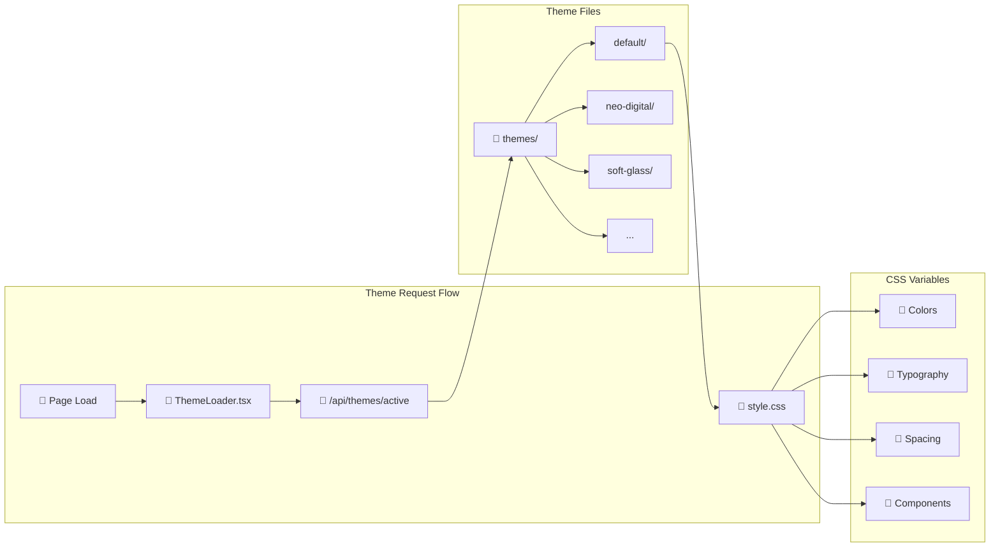

### Theme CSS Variable Flow

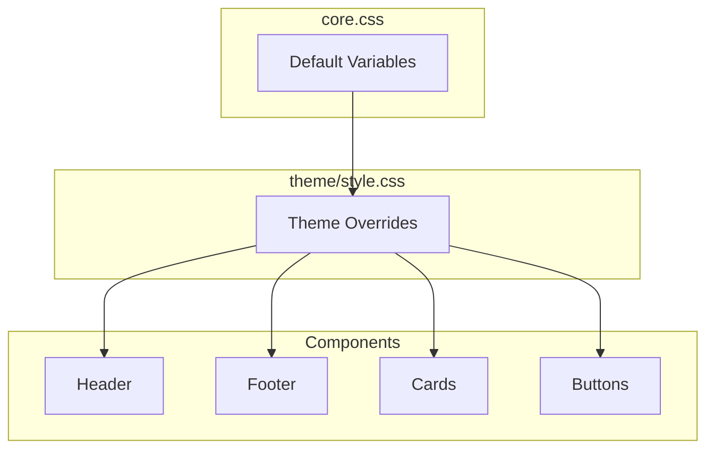

---

## 🎯 Puck Editor Flow

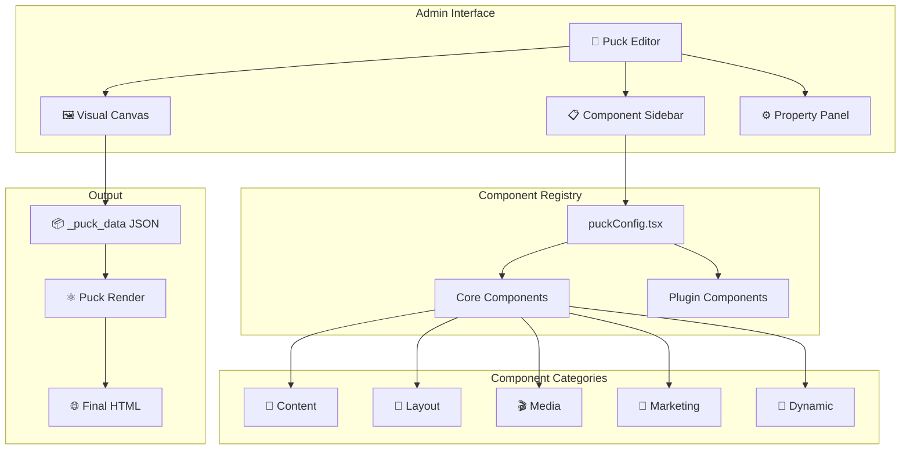

### Component Hierarchy

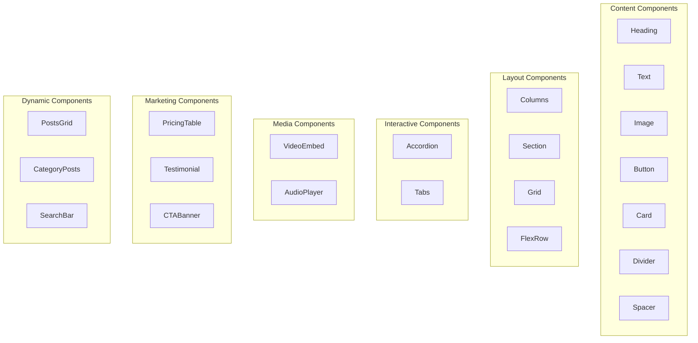

---

## 🔌 Plugin System

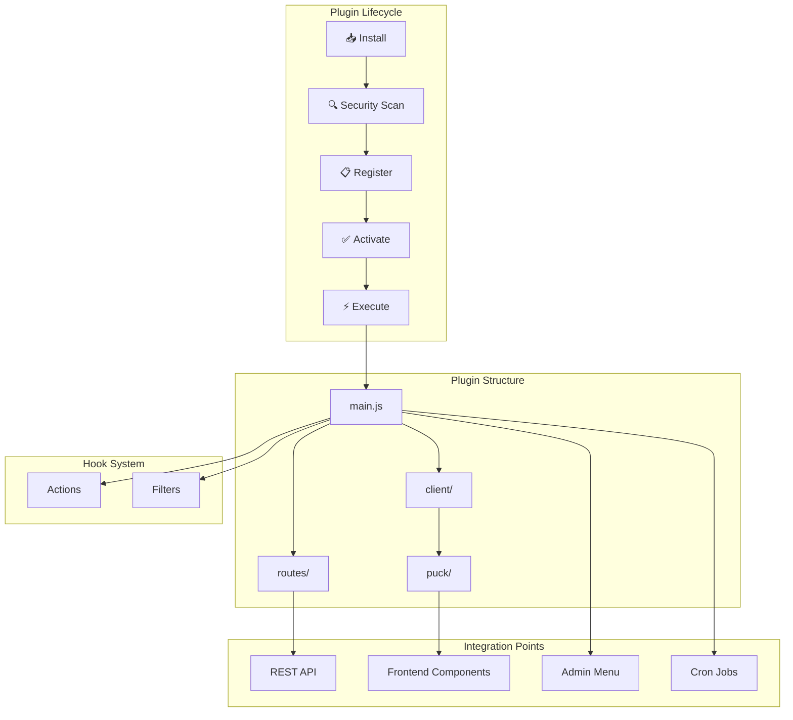

---

## 🔐 Authentication Flow

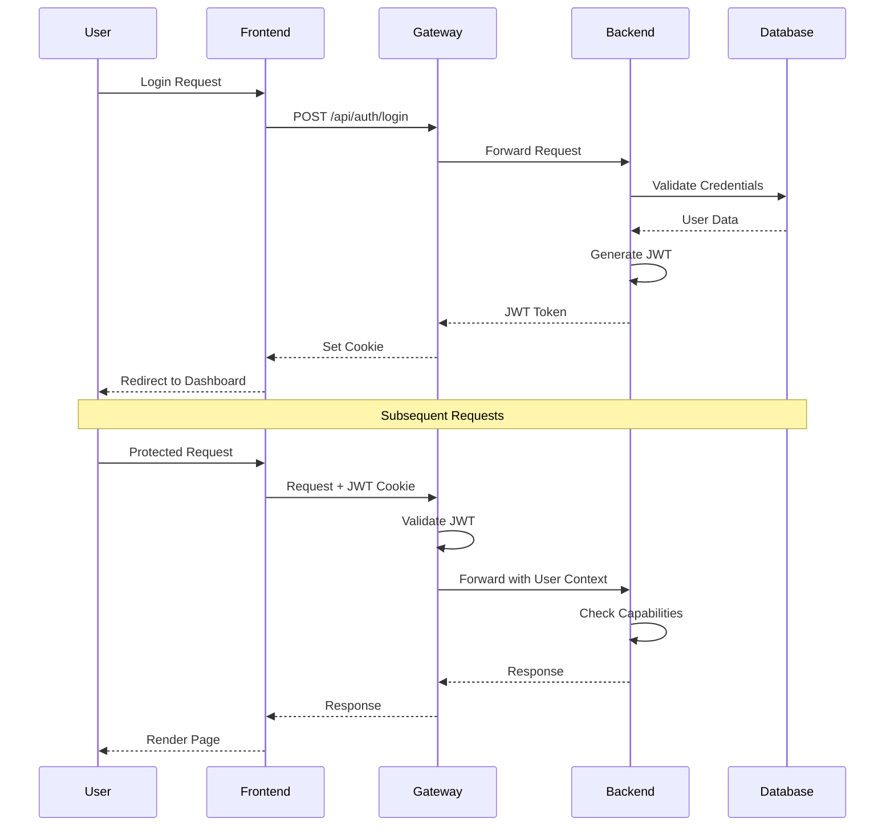

---

## 📊 Data Flow

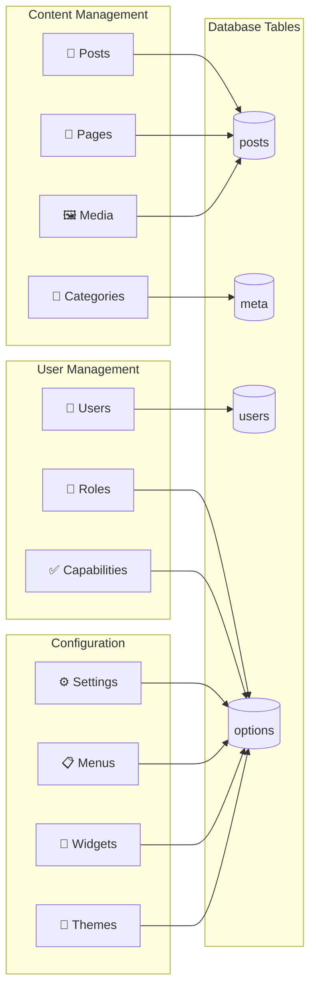

---

## 🖥️ Frontend Component Tree

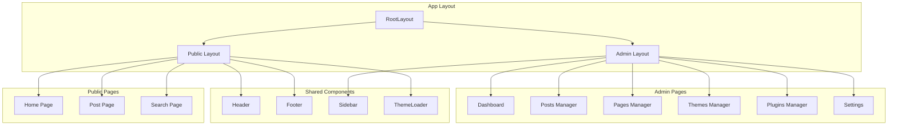

---

## 📁 File Structure Overview

```
wordjs/
├── 📁 frontend/              # Next.js Frontend
│   ├── 📁 src/
│   │   ├── 📁 app/             # App Router Pages
│   │   │   ├── 📁 (public)/    # Public Site
│   │   │   ├── 📁 admin/       # Admin Dashboard
│   │   │   └── 📁 api/         # API Routes
│   │   ├── 📁 components/      # React Components
│   │   │   ├── puckConfig.tsx  # Puck Component Registry
│   │   │   ├── Header.tsx      # Site Header
│   │   │   └── Footer.tsx      # Site Footer
│   │   └── 📁 lib/             # Utilities
│   └── package.json
│
├── 📁 backend/                  # Express.js Backend
│   ├── 📁 src/
│   │   ├── 📁 core/            # Core Modules
│   │   ├── 📁 routes/          # API Routes
│   │   └── 📁 plugins/         # Plugin System
│   ├── 📁 themes/              # Theme Files
│   │   ├── 📁 default/
│   │   ├── 📁 neo-digital/
│   │   ├── 📁 soft-glass/
│   │   └── 📁 .../
│   ├── 📁 public/              # Static Assets
│   │   └── 📁 css/
│   │       └── core.css        # Core Styles
│   └── package.json
│
├── 📁 documentation/            # Documentation
│   ├── api.md
│   ├── frontend.md
│   ├── themes.md
│   ├── plugins.md
│   └── architecture.md         # This file
│
├── gateway.js                   # Gateway Server
├── package.json                 # Root Package
└── README.md                    # Project README
```

---

## 🔗 Quick Reference

| Layer       | Technology        | Port     | Purpose                                     |
| ----------- | ----------------- | -------- | ------------------------------------------- |
| **Gateway** | Node.js Cluster   | **3000** | **Identity & Routing (Single Entry Point)** |
| Frontend    | Next.js           | 3001     | SSR, Visual Editor                          |
| Backend     | Express.js        | 4000     | REST API, Plugins                           |
| Database    | SQLite/PostgreSQL | -        | Data Storage                                |

---

## ⚡ Hybrid Plugin Architecture

WordJS uses a dual-mode loading system for plugins to optimize for both developer experience and production speed.

### Development Mode (`NODE_ENV=development`)
- **Frontend:** Uses **Next.js Dynamic Imports**.
- **Performance:** Supports Hot Module Replacement (HMR).
- **Latency:** Slightly higher initial load due to on-the-fly compilation.

### Production Mode (`NODE_ENV=production`)
- **Frontend:** Loads **Pre-compiled Bundles** via the Plugin API.
- **Performance:** Near-zero activation time. No `next build` required.
- **Sandboxing:** Bundles are evaluated in a blob URL context with React singleton injection.

---

## 🌐 Port Mapping Logic

To avoid CORS and simplify production deployments, all traffic should go through the Gateway on port **3000**.

- `http://localhost:3000/` → Handled by **Frontend** (3001)
- `http://localhost:3000/api/*` → Handled by **Backend** (4000)
- `http://localhost:3000/admin` → Handled by **Frontend** (3001)
- `http://localhost:3000/plugins/*` → Handled by **Backend** (4000)

---

## 🔒 Internal Security (mTLS)

WordJS services communicate securely using a private mTLS cluster.

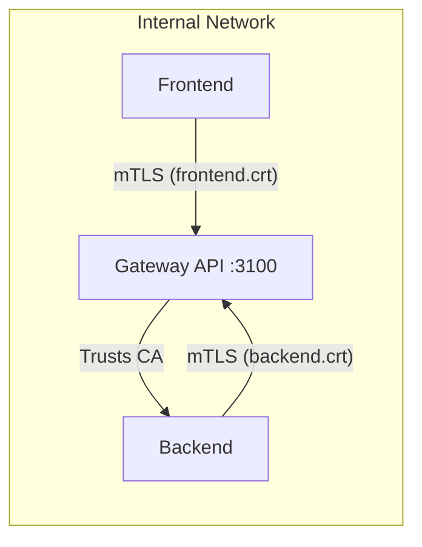

The **Gateway** (port 3100) serves as the control plane. The **Backend** uses this interface to push certificates and configuration updates, ensuring that sensitive keys are never exposed on public ports.
