# WordJS Architecture Overview

This document provides a comprehensive visual overview of the WordJS system architecture.

---

## 🏗️ System Architecture

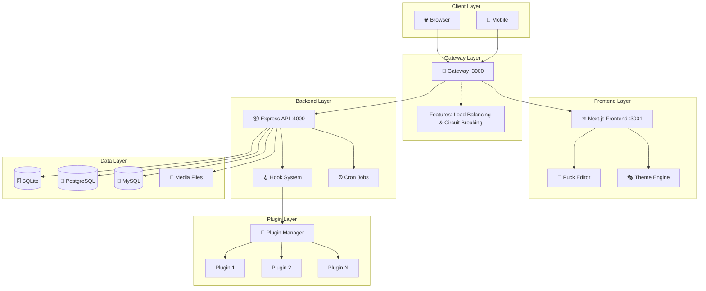
```mermaid
graph TB
    subgraph "Client Layer"
        Browser[🌐 Browser]
        Mobile[📱 Mobile]
    end

    subgraph "Gateway Layer"
        Gateway[🚀 Gateway :3000]
        note[Features: Load Balancing & Circuit Breaking]
        Gateway -.-> note
    end

    subgraph "Frontend Layer"
        NextJS[⚛️ Next.js Frontend :3001]
        Puck[🎨 Puck Editor]
        Themes[🎭 Theme Engine]
    end

    subgraph "Backend Layer"
        Express[📦 Express API :4000]
        Hooks[🪝 Hook System]
        Cron[⏰ Cron Jobs]
    end

    subgraph "Plugin Layer"
        PluginCore[🔌 Plugin Manager]
        Plugin1[Plugin 1]
        Plugin2[Plugin 2]
        PluginN[Plugin N]
    end

    subgraph "Data Layer"
        SQLite[(🗄️ SQLite)]
        PostgreSQL[(🐘 PostgreSQL)]
        MySQL[(🐬 MySQL)]
        MediaFS[📁 Media Files]
    end

    Browser --> Gateway
    Mobile --> Gateway
    Gateway --> NextJS
    Gateway --> Express
    NextJS --> Puck
    NextJS --> Themes
    Express --> Hooks
    Express --> Cron
    Hooks --> PluginCore
    PluginCore --> Plugin1
    PluginCore --> Plugin2
    PluginCore --> PluginN
    Express --> SQLite
    Express --> PostgreSQL
    Express --> MySQL
    Express --> MediaFS
```

---

## 🚦 Run Modes (SPLIT / MONOLITH / SEPARATE)

The **same codebase** runs as **two mutually-exclusive process models** — **SPLIT** (3 processes) and **MONOLITH** (1 process) — and you can switch **at any time** with no migration. Both share the same `backend/wordjs-config.json`, the same database, the same `uploads/`, `themes/`, and `plugins/`, the same secrets, and the same public origin (`https://localhost:3000`). They are **mutually exclusive** — both bind the public port (default **3000**) — so only one runs at a time. A third topology, **SEPARATE**, is SPLIT spread across **different machines**, joined by gateway-minted join tokens (see below). In **all** of them plugins stay **isolated** in separate OS processes (`child_process.fork`) exactly as described in the Plugin System section.

### SPLIT (default — 3 processes)

The architecture diagrams above describe this mode: three processes behind the gateway.

- **gateway** (`:3000`, public) — Node `cluster` reverse proxy.
- **backend** (`:4000`) — Express REST API + plugins.
- **frontend** (`:3001`) — Next.js.

The gateway provides clustering, health-checks, load-balancing, an **mTLS** internal channel (see *Internal Security*), and SSE-aware proxying. Run with `npm run dev` (dev) or `npm start` (prod).

**Choose SPLIT to** scale the services independently and get the gateway's clustering / health-checks / load-balancing.

### MONOLITH (1 process, 1 port)

A single process on one port (`:3000`) via the repo-root entrypoint **`monolith.js`**. It mounts the **backend Express app** (with its isolated child-process plugins) **and** the **Next.js request handler** *in-process* — no loopback proxy, no Node `cluster`, no gateway `/register`. The gateway's still-needed cross-cutting concerns are re-implemented as **local middleware**:

- `helmet`
- `compression` (skipping SSE)
- SEO rewrites — `/sitemap.xml` → `/api/v1/seo/sitemap.xml`, `/robots.txt` → `/api/v1/seo/robots.txt`, and the RSS feed (`/feed`, `/feed.xml`, `/rss.xml`) → `/api/v1/seo/feed.xml`
- `X-Forwarded-Host` pinning for CSRF

It serves **one HTTPS port**, reusing the gateway's certificate (with HTTP fallback). A **loopback-only HTTP listener** serves the frontend's server-side (SSR) API calls.

Scripts: `npm run dev:mono` (dev — Next dev HMR + `ts-node` backend), `npm run build:mono` (compiles the backend to `dist/` + runs `next build`), `npm run start:mono` (prod — runs the compiled build).

> **Internals:** `monolith.js` sets `WORDJS_EMBEDDED=1` (and `WORDJS_MODE=mono`); when embedded, backend `src/index.ts` skips its own self-listen and gateway self-register and instead exposes `initialize()` for the entrypoint to mount.

**Choose MONOLITH for** the simplest single-artifact deploy — one VM/container, TLS via its built-in HTTPS or a single reverse proxy in front.

### SEPARATE (split across machines)

SPLIT run on **different hosts** — a gateway box, a backend box, and a frontend box — joined into one cluster. The barrier is trust: the three tiers talk over **mutual TLS**, so every node needs a certificate signed by a shared cluster CA. Rather than hand-copying certs, WordJS bootstraps trust with **single-use join tokens** (like `kubeadm join` / `docker swarm join`):

- The **gateway is the cluster CA.** `node scripts/cluster.js init --host <gateway-ip>` mints the cluster CA (keeping the CA private key `0600` on the gateway), issues the gateway's own `gateway-internal` identity **and** a public front-door cert that is now **also signed by the cluster CA**, writes a multi-node `gateway/gateway-config.json` (`gatewayInternalBind` = routable IP, `gatewayEnrollPort` default **3101**), and clears the registry.
- `node scripts/cluster.js token <backend|frontend>` mints a **single-use, role-bound, TTL** token and prints the exact `node-join` command.
- On the new machine `node scripts/node-join.js --role … --gateway … --token … --ca-hash … --advertise …` generates a keypair + CSR (openssl) and makes **one** call to the gateway's token-enrollment listener (a **separate** HTTPS listener on `gatewayEnrollPort` that does **not** request a client cert — the strict mTLS `/register` listener is unchanged). The gateway validates the token, **forces `CN=<role>`** from the token (the CSR subject is ignored), signs the cert, and returns `{ cert, cluster-ca, bootstrap config }`. `node-join` verifies `--ca-hash` (a MITM guard), writes `<role>/certs/*` + `<role>/wordjs-config.json`, and starts the service, which then **registers over mTLS**.

Key files: `gateway/src/cluster-ca.js`, `scripts/cluster.js`, `scripts/node-join.js`. Key config keys: `advertiseHost` (this node's routable address), `gatewayHost`, `gatewayInternalBind`, `gatewayEnrollPort`, and — on the frontend — `internalApiUrl` (its SSR base = the gateway's public origin, trusted via `NODE_EXTRA_CA_CERTS` since that origin's cert is cluster-CA-signed). The SQLite DB and `uploads/` stay on the single backend node — no shared filesystem is needed for one replica per role. Full step-by-step: **[separate-mode.md](separate-mode.md)**; scaling a role to **N** replicas (Postgres + Redis + shared FS): **[multi-node.md](multi-node.md)**.

### Boot order — the listener opens BEFORE plugins finish loading

`backend/src/index.ts` builds the Express app at module scope (helmet → CORS → rate limiters → CSRF → body parsers → static mounts → the `/health`, `/healthz`, `/readyz`, `/metrics` probes → the install/migration guard → the `/api/v1/plugin/*` readiness guard → `mfaComplianceGate` → the anonymous-public `Cache-Control` stamper → the routers → `core/db-admin`), then `initialize()` runs the async boot:

1. `core/frontend-purge`'s `initFrontendPurge()` is wired **unconditionally and first**, so even a fresh in-process install purges the frontend cache.
2. `notFound` + `errorHandler` are registered, and (unless `WORDJS_EMBEDDED=1`) **the server starts listening and registers with the gateway** — both *before* plugins load. Plugin isolates fork **one at a time** (CrashGuard must be able to blame exactly one plugin for a boot crash), so that phase dominates boot; opening the listener early means core routes serve during it.
3. Database init, then the seeding section (schema migrations, default options, roles, bootstrap admin, default category/theme) runs inside the `wordjs:boot` distributed-lock lease so concurrent replicas can't double-seed; the lease is released once seeding completes.
4. `loadActivePlugins()`, then `fixMiddlewareOrder()` — plugin routes registered after step 2 would otherwise sit *behind* the 404 handler, so the two terminal handlers are pushed back to the end of the stack. `pluginsReady` flips true here.
5. Cron, cluster coherence, webhooks, theme engine, `doAction('init')`, then `appReady = true`.

Externally visible consequences:

- **`GET /healthz`** — liveness, never touches the DB. **`GET /readyz`** — readiness; returns **503** (`setup_required` / `starting` / `not_ready`) until the instance is installed, `appReady` is set, and the DB answers.
- **`/api/v1/plugin/*` answers `503 plugins_starting`** with `Retry-After: 5` and `Cache-Control: no-store` while the isolates are still forking — an honest "not yet" instead of a 404 that reads as "this endpoint does not exist" (and that a CDN would cache as such). The guard is scoped to `/plugin/*` only; every core route is fully functional in that window.

### Observability — `/metrics`

The backend exposes a Prometheus endpoint at **`GET /metrics`** (`backend/src/core/metrics.ts`): the default Node/process metrics (CPU, RSS/heap, event-loop lag, GC, handles, prefixed `wordjs_`) plus app-level gauges including **`wordjs_sse_clients`** (active SSE clients on this node).

It is **disabled by default** — without a configured scrape token the route returns **404**, so metrics are never exposed publicly by accident. Enable it by setting a token at `config.metrics.token` (or the `METRICS_TOKEN` env var) and scraping with an `Authorization: Bearer <token>` header. The endpoint is reachable through the public origin in **both** run modes — routed by the gateway in SPLIT mode and included in the backend prefixes in MONOLITH mode.

---

## 🔄 Request Flow

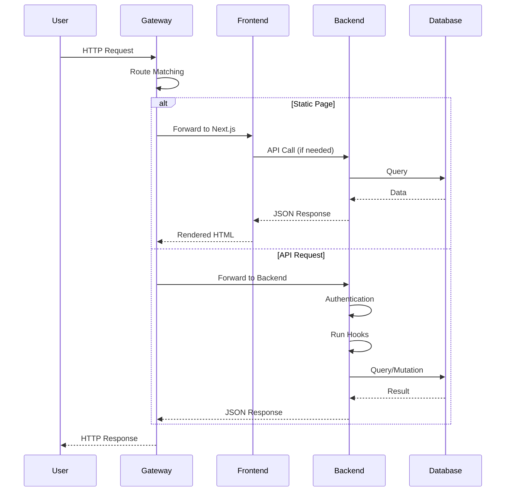
```mermaid
sequenceDiagram
    participant U as User
    participant G as Gateway
    participant F as Frontend
    participant B as Backend
    participant DB as Database

    U->>G: HTTP Request
    G->>G: Route Matching
    
    alt Static Page
        G->>F: Forward to Next.js
        F->>B: API Call (if needed)
        B->>DB: Query
        DB-->>B: Data
        B-->>F: JSON Response
        F-->>G: Rendered HTML
    else API Request
        G->>B: Forward to Backend
        B->>B: Authentication
        B->>B: Run Hooks
        B->>DB: Query/Mutation
        DB-->>B: Result
        B-->>G: JSON Response
    end
    
    G-->>U: HTTP Response
```

### Public-Site SSR Data Flow

The public site is **real server-side rendering**, not the former client-only skeletons: every route under `frontend/src/app/(public)/` — home (`page.tsx`), category/post (`[slug]`, `[slug]/[postSlug]`), standalone pages (`pages/[slug]`), and `search` — is an **async React Server Component** that fetches its content on the server, so the initial HTML (and what crawlers see) already contains the real title/body.

- **Server-only data layer — `frontend/src/lib/server-api.ts`.** Resolves the backend base URL the same way both run modes expect: in MONOLITH it uses the in-process backend's plain-HTTP loopback (`WORDJS_MONO_ORIGIN`, default `http://127.0.0.1:4000`); in SPLIT it reads the backend port from `wordjs-config.json` (default 4000); an `INTERNAL_API_URL` override wins when set. Loaders (`getPostBySlug`, `getPosts`, `getSettings`, …) are wrapped in React `cache()` so `generateMetadata()` and the page body share **one** request-scoped backend call instead of fetching twice.
- **`x-forwarded-host` forwarding (critical).** SSR fetches hit the loopback origin, so `serverFetch` relays the inbound `x-forwarded-host` / `x-forwarded-proto` one more hop to the backend. Without this the backend's host-based logic — the **Site-URL / migration guard, CSRF origin check, and canonical / OpenGraph / sitemap URLs** — would see `localhost:4000` instead of the real public host and (e.g.) reject every SSR request with a `409 migration_required`. The public listener (gateway in SPLIT, the `monolith.js` middleware in MONOLITH) already pins `x-forwarded-host` to the browser's `Host`.
- **Content rendered in client components fed server data as props.** The fetched data is passed into `frontend/src/components/public/PostContent.tsx` and `HomeContent.tsx`, which SSR the content and then hydrate the interactive bits (carousels, comments). `sanitize.ts` is `"use client"`, so `sanitizeHTML` cannot run in a Server Component — sanitized-HTML blocks carry `suppressHydrationWarning` because server `sanitize-html` and client `DOMPurify` serialize styles slightly differently.
- **SEO + 404.** Each page exports `generateMetadata` (title template, description, canonical, OpenGraph / Twitter — built by `buildPostMetadata` / `htmlToText`), and missing content calls `notFound()` for a real HTTP 404. Search is a **no-JS GET form**.

---

## 🎨 Theme System

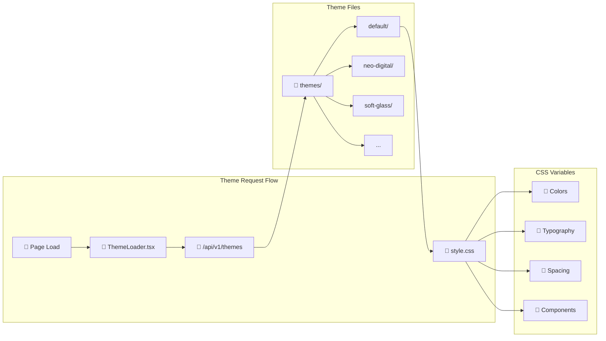
```mermaid
graph LR
    subgraph "Theme Request Flow"
        Page[📄 Page Load]
        ThemeLoader[🔄 ThemeLoader.tsx]
        API[📡 /api/v1/themes]
        CSS[🎨 style.css]
    end

    subgraph "Theme Files"
        ThemeDir[📁 themes/]
        Theme1[default/]
        Theme2[neo-digital/]
        Theme3[soft-glass/]
        ThemeN[...]
    end

    subgraph "CSS Variables"
        Colors[🌈 Colors]
        Typography[📝 Typography]
        Spacing[📏 Spacing]
        Components[🧩 Components]
    end

    Page --> ThemeLoader
    ThemeLoader --> API
    API --> ThemeDir
    ThemeDir --> Theme1
    ThemeDir --> Theme2
    ThemeDir --> Theme3
    ThemeDir --> ThemeN
    Theme1 --> CSS
    CSS --> Colors
    CSS --> Typography
    CSS --> Spacing
    CSS --> Components
```

### Theme CSS Variable Flow

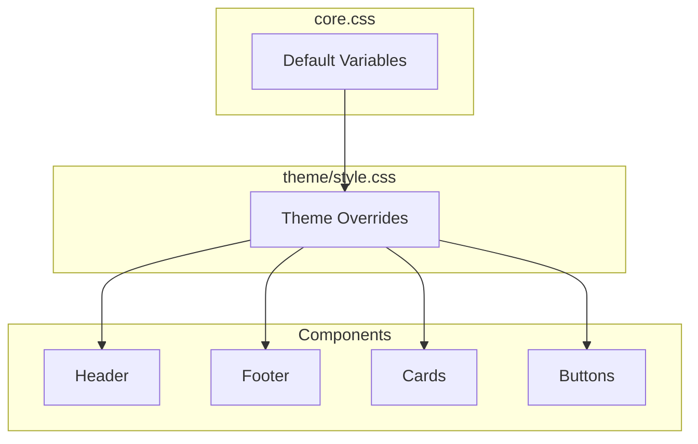
```mermaid
graph TD
    subgraph "core.css"
        CoreVars[Default Variables]
    end

    subgraph "theme/style.css"
        ThemeVars[Theme Overrides]
    end

    subgraph "Components"
        Header[Header]
        Footer[Footer]
        Cards[Cards]
        Buttons[Buttons]
    end

    CoreVars --> ThemeVars
    ThemeVars --> Header
    ThemeVars --> Footer
    ThemeVars --> Cards
    ThemeVars --> Buttons
```

### Token-driven UI framework — `wordjs-ui.css`

On top of per-theme `style.css`, the theme system ships **one shared static stylesheet**, `backend/public/css/wordjs-ui.css` — a token-driven, Bootstrap-like CSS framework. It auto-styles **every** HTML element and provides Bootstrap-compatible components (`.btn` / `.card` / `.alert` / `.badge` / `.table` / `.nav` / `.list-group` / `.pagination` / `.progress` / `.modal` / `.dropdown`, a flexbox grid `.container` / `.row` / `.col-*`) plus a utility layer (spacing / display / flex / text / colors / borders / sizing / shadow).

- **Driven by `--wjs-*` design tokens.** A theme *declares* them in its `theme.json` (`seeds` / `tokens`); `core/theme-compile.ts` compiles that contract into a marked `/* @wjs-generated:start … */` block inside the theme's `style.css`, where the tokens land verbatim in `:root`. The framework carries safe fallbacks, so a theme re-skins everything just by setting tokens. Per-variant `--wjs-color-on-*` tokens hold the max-contrast (black/white) text computed per theme for each solid color.
- **Where it loads:** on **public** pages (frontend `ThemeLoader.tsx`) and inside the **editor preview iframe** (frontend `PuckEditor.tsx`, for true WYSIWYG) — never the admin chrome. `ThemeLoader.tsx` emits it (React 19 `precedence="wjs-base"`) **before** the theme's own `style.css` (`precedence="wjs-theme"`) so the theme wins at equal specificity. (`core.css` is linked only by the *legacy* Handlebars engine's `wordjs_head` (`core/theme-engine.ts`), and that public path is no longer mounted — Next.js renders the live site.)
- The `default` theme ships bundled and 64 first-party themes are available through the theme marketplace — each tunes a full `--wjs-*` token set to its palette. Full reference: **[theming.md](theming.md)**.

---

## 🎯 Puck Editor Flow

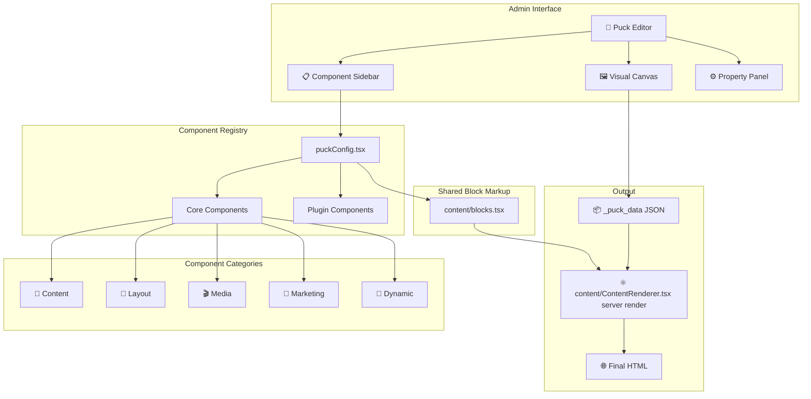
```mermaid
graph TB
    subgraph "Admin Interface"
        Editor[📝 Puck Editor]
        Sidebar[📋 Component Sidebar]
        Canvas[🖼️ Visual Canvas]
        Props[⚙️ Property Panel]
    end

    subgraph "Component Registry"
        Config[puckConfig.tsx]
        Core[Core Components]
        Plugins[Plugin Components]
    end

    subgraph "Shared Block Markup"
        Blocks[content/blocks.tsx]
    end

    subgraph "Component Categories"
        Content[📄 Content]
        Layout[📐 Layout]
        Media[🎬 Media]
        Marketing[📢 Marketing]
        Dynamic[🔄 Dynamic]
    end

    subgraph "Output"
        PuckData[📦 _puck_data JSON]
        Render[⚛️ content/ContentRenderer.tsx server render]
        HTML[🌐 Final HTML]
    end

    Editor --> Sidebar
    Editor --> Canvas
    Editor --> Props
    Sidebar --> Config
    Config --> Core
    Config --> Plugins
    Config --> Blocks
    Blocks --> Render
    Core --> Content
    Core --> Layout
    Core --> Media
    Core --> Marketing
    Core --> Dynamic
    Canvas --> PuckData
    PuckData --> Render
    Render --> HTML
```

### Component Hierarchy

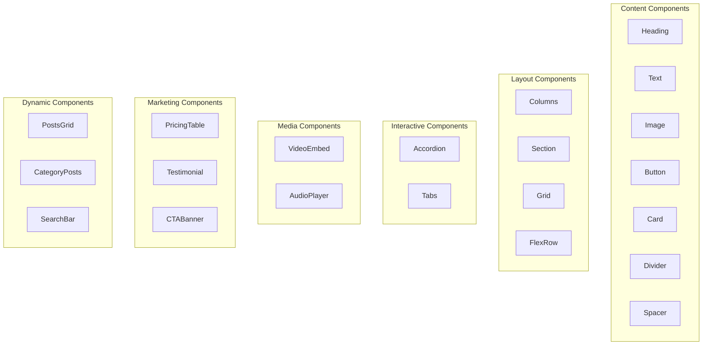
```mermaid
graph TD
    subgraph "Content Components"
        Heading[Heading]
        Text[Text]
        Image[Image]
        Button[Button]
        Card[Card]
        Divider[Divider]
        Spacer[Spacer]
    end

    subgraph "Layout Components"
        Columns[Columns]
        Section[Section]
        Grid[Grid]
        FlexRow[FlexRow]
    end

    subgraph "Interactive Components"
        Accordion[Accordion]
        Tabs[Tabs]
    end

    subgraph "Media Components"
        VideoEmbed[VideoEmbed]
        AudioPlayer[AudioPlayer]
    end

    subgraph "Marketing Components"
        PricingTable[PricingTable]
        Testimonial[Testimonial]
        CTABanner[CTABanner]
    end

    subgraph "Dynamic Components"
        PostsGrid[PostsGrid]
        CategoryPosts[CategoryPosts]
        SearchBar[SearchBar]
    end
```

---

## 🔌 Plugin System

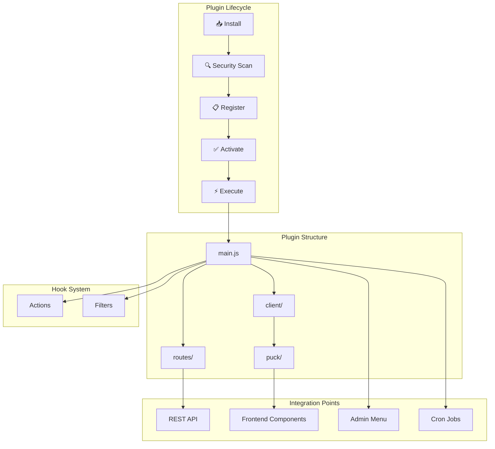
```mermaid
graph TB
    subgraph "Plugin Lifecycle"
        Install[📥 Install]
        Scan[🔍 Security Scan]
        Register[📋 Register]
        Activate[✅ Activate]
        Execute[⚡ Execute]
    end

    subgraph "Plugin Structure"
        MainJS[main.js]
        Routes[routes/]
        Client[client/]
        PuckComp[puck/]
    end

    subgraph "Hook System"
        Actions[Actions]
        Filters[Filters]
    end

    subgraph "Integration Points"
        API[REST API]
        Frontend[Frontend Components]
        Menu[Admin Menu]
        Cron[Cron Jobs]
    end

    Install --> Scan
    Scan --> Register
    Register --> Activate
    Activate --> Execute
    Execute --> MainJS
    MainJS --> Routes
    MainJS --> Client
    Client --> PuckComp
    MainJS --> Actions
    MainJS --> Filters
    Routes --> API
    PuckComp --> Frontend
    MainJS --> Menu
    MainJS --> Cron
```

### Plugin & theme distribution — bundled + Marketplace

Plugins reach a site two ways:

- **Bundled** (`backend/plugins/`) — first-party plugins that ship with core (hello-world, test-schema).
- **Marketplace** — first-party plugins whose sources live in `marketplace/plugins/`, distributed **outside** the core build. `backend/scripts/build-marketplace.js` (run as `npm run build:marketplace` from the repo root) packs each into `marketplace/dist/<slug>-<version>.zip` and emits `marketplace/dist/marketplace-index.json` — the catalog (id/name/version/category/permissions/size + a **sha256** per zip). The `marketplace/dist/` output is a **build artifact and is NOT committed** (it is `.gitignore`d); `.github/workflows/release.yml` runs `build:marketplace` and publishes the catalog + zips as **GitHub Release assets**. So plugin releases are decoupled from core releases, and by default a site fetches the catalog from the release-assets URL `https://github.com/jaimemartinez/wordjs/releases/latest/download` (a dev/full checkout with a local `marketplace/dist/` uses that instead). Sources are **admin-configurable** — see below.

The backend exposes it at **`/api/v1/marketplace`** (`backend/src/routes/marketplace.ts`, admin-only): `GET /catalog` fetches **every** configured source and returns the **merged** catalog (deduped by id, earlier sources winning, each source's errors isolated so one bad URL can't hide the rest) annotated with each entry's installed/active/update state (cached in memory for 5 minutes, keyed by the source set — a **local** source's key additionally carries its index file's `mtime`+`size`, so a `npm run build:marketplace` invalidates it immediately); `POST /install` downloads the zip **server-side from the source the entry was listed under** (https-only, size-capped, strict filename shape), verifies its **sha256** against the catalog entry, and hands it to the **same** `installPluginFromZip()` pipeline as a manual upload (zip-bomb budget, Zip Slip/slug validation, manifest + AST security scan) — the marketplace adds no new install surface beyond the catalog fetch itself. **Sources are admin-configurable** via `GET`/`PUT /api/v1/marketplace/sources`, which read/write the `marketplace_sources` option (a JSON list of https catalogs, max 12; each must be https or `http://localhost`); precedence is that list → the legacy single `marketplace_source` option (back-compat) → the repo-local `marketplace/dist/` → the built-in release-assets default. The admin UI is the **Marketplace tab** of `/admin/plugins` (`frontend/src/app/admin/plugins/MarketplaceTab.tsx`); an installed plugin lands **inactive with default-deny grants**, exactly like any other install.

The **same mechanism also distributes first-party themes.** Theme sources live in `marketplace/themes/`; `build-marketplace.js` packs each into `marketplace/dist/theme-<slug>-<version>.zip` and emits a parallel `marketplace/dist/marketplace-themes-index.json` catalog. The backend serves them via a separate theme catalog on `GET /api/v1/marketplace/themes/catalog` and installs through `POST /api/v1/marketplace/themes/install` (the same hardened `installThemeFromZip()` pipeline, browsed from the Marketplace tab of `/admin/themes`). Theme sources are **independently** admin-configurable via `GET`/`PUT /api/v1/marketplace/themes/sources`, which read/write the `marketplace_theme_sources` option — separate from the plugin source list, so themes can point at a different origin than plugins.

### Isolated sandbox (separate OS process)

Plugin server code marked `"isolated": true` does **not** run in the host process. The host (`src/core/plugin-isolate.ts`) forks each plugin into a **separate OS process** via `child_process.fork`, running the transport-agnostic sandbox entry `src/core/plugin-worker.js` (a Worker-API-shaped adapter object wraps `child.send`/`child.kill` so the host's RPC code stays unchanged; `worker_threads` was the earlier transport, but no live `worker_threads` fallback ships). Because the child is its own process with its own heap and event loop, a **crash, OOM, or heap escape is contained to the child and the host always survives** — a guarantee a worker thread, which shared the host heap/RSS, could not give. The legacy in-process execution path was removed.

The plugin reaches core **only** through the injected `wordjs` capability bridge (`createPluginApi` in `src/core/plugin-api.ts`), whose calls are RPC'd to the host over the IPC channel (v8 structured clone, `serialization: 'advanced'`, so `Buffer`/`Date`/`Map` survive) and **permission-checked on the host** in the plugin's `AsyncLocalStorage` context (`src/core/plugin-context.ts`). The host's heap (secrets, DB handle, other plugins) is unreachable from the child; only a secret-free env allowlist crosses the boundary.

**Exact-method bridge allowlist.** `kind:'call'` IPC messages can reach only an exact allowlist of bridge methods (`ALLOWED_BRIDGE_METHODS`: `options.get/set`, `db.all/get/run/batch/createTable/getType`, `hooks.doAction`, `fs.read/write`, `mail`, `notify`, `adminMenu.add`, `cron.schedule`, `crypto.randomToken/randomInt`, `assets.enqueueScript/enqueueStyle`, the host-mediated `dns.resolveMx/resolveTxt/resolve4/resolve6/resolve`, plus the safe read-only bridges `users.findByEmail/findByLogin/findById/search` and `site.url/domain/adminEmail`). Registration (hooks/filters, routes, shortcodes, mail provider, notify transport) flows **only** through its own dedicated IPC kinds — never a generic call — so privileged surface like `provideMail` can't be reached past its admin-grant gate.

**No trust tiers — Android-style per-capability grants (default-deny).** `plugin-trust.ts` was removed: there is no "operator-trusted"/privileged tier and no plugin bypasses the sandbox. **Every** plugin runs in the child process, DB-scoped to its own `wjp_<slug>_` tables with non-secret options only, routes namespaced under `/api/v1/plugin/<slug>`. A plugin's manifest **REQUESTS** capabilities; an admin **GRANTS** each one per plugin in the Plugins UI (`/admin/plugins`), and a bridge capability is allowed only if the manifest requested it **AND** an admin granted it (`src/core/plugin-permissions.ts`, `isGranted`). Grants are stored server-side in the `plugin_grants` option — never self-declarable. No plugin gets raw-HTML hooks (`wordjs_head`/`wordjs_footer`); the host auth JWT cookie (`wordjs_token`) is stripped from forwarded route requests, and dangerous response headers (`Set-Cookie`/CSP/HSTS/`Location`) are stripped from its replies. `fs` read/write is confined to its own directory.

Host-level capabilities each gate on their own grant: becoming the host mail sender (`register-mail-provider`) requires the `email:provider` grant, registering a core notification transport requires `notifications:provider`, and outbound network requires the separate, manifest-independent `network` grant. First-party/bundled plugins are pre-granted their **declared** capabilities via a one-time non-breaking backfill (`backfillActive`) so flipping to default-deny doesn't break a running site — but they are **not** privileged and an admin can revoke. When a plugin's grants change, the child is **hot-reloaded** (`reloadIsolatedPlugin`) so it re-registers routes and re-evaluates host-capability gates (mail/notify providers, network) without a server restart; unload/reload does a full teardown. Teardown splices the plugin's Express layers out by **handler identity**, not by the verb they were registered under (`app.all()` expands to every concrete verb and never leaves a `route.methods.all` key, so verb-keyed unmounting silently left `all` routes mounted on a dead child), and `rpcSend` rejects **immediately** when `postMessage` reports the child is gone instead of waiting out the 30 s RPC timeout. The former `db-migration` plugin has moved into core at `src/core/db-admin/`.

#### Defense in depth

- **AST static scanner at install** (`validatePluginPermissions` in `src/core/plugins.ts`, via acorn): flags `eval`/`Function`/`exec`/`spawn`/`fork`, `require()`/`import()` of sensitive builtins (`child_process`/`worker_threads`/`vm`/…), dynamic `import()`, the `.constructor` Function build, and `process`/`global`/`require` aliasing. **Fail-closed** — an unparseable file is treated as a violation and blocked. Beyond this static scan there is an **opt-in runtime block**: `config.sandbox.blockCodeGen` forks the child with `--disallow-code-generation-from-strings`, hard-blocking `eval`/`new Function(string)` at the V8 level. It is **OFF by default** (some plugin deps legitimately use `Function()`) and is never applied under ts-node (dev needs codegen to compile TS).
- **In-child runtime guards.** `src/core/secure-require.ts` blocks `worker_threads`/`vm`/`module`/`inspector`/`repl`/`test`/`trace_events`/`cluster`/`async_hooks`/`v8`, `process.binding`/`_linkedBinding`/`getBuiltinModule`, native `.node` addons, and (by default) the network modules `net`/`tls`/`dgram`/`http`/`https`/`http2`. `src/core/io-guard.ts` blocks `fs` writes to plugin code and reads of `.env`/secret files **and** the live database files (any `.db`/`.sqlite`/`.sqlite3` file plus `-wal`/`-shm`/`-journal` sidecars, e.g. `data/wordjs.db`); reads are confined to the plugin's **own** directory, so a plugin cannot read a **sibling** plugin's source/data/secrets (any `package.json`/`node_modules` path stays readable so module resolution works, but never inside a sibling plugin's dir — IO-1). These run inside the child too, so the plugin's own `fs`/`child_process` are sandboxed even there.
- **Egress confinement (network grant → public IPs only).** When an admin grants the `network` permission, the network modules are not opened raw — they are replaced with **egress-guarded** versions (`src/core/egress-guard.ts`) that confine outbound sockets to **public** destinations. It blocks loopback, link-local (incl. `169.254.169.254` cloud-metadata), RFC1918, CGNAT (`100.64/10`), IPv6 ULA/loopback, IPv4-mapped-v6, and multicast/reserved, and **fails closed** on unresolvable/garbage hosts. Validation happens **at connect time** (anti DNS-rebinding) across `net`/`tls`/`http`/`https`/`http2`/`dgram` plus global `fetch`/`WebSocket`; IPC / unix-socket / named-pipe targets (e.g. `/var/run/docker.sock`, the `path` option) are denied. The guard patches **and locks** `net.Socket.prototype.connect` inside the child (non-writable, non-configurable) as the single chokepoint a plugin cannot reassign or un-patch, with TOCTOU-hardened option snapshotting (host/hostname/path read once, validated, then frozen as own data-properties). The `dns` module itself stays available — the connect, not resolution, is the SSRF sink.
- **DB SQL guard** (`assertSqlAllowed` in `src/core/plugin-api.ts`), applied to every plugin (no trusted bypass): default-deny per-plugin `wjp_<slug>_` prefix attribution — every table token the statement references, at any depth and via any keyword (including a comma-join or the Postgres `USING` list), must carry the plugin's own prefix. It rejects `ATTACH`/`DETACH`/`PRAGMA`/`VACUUM`, schema catalogs (`sqlite_master`/`information_schema`/`pg_catalog`), file/extension SQL functions, the Postgres `*_to_xml` family (which executes a query smuggled inside a string literal), stacked statements and `RETURNING`. DDL is constrained by a **positive object-class allowlist** — a plugin may only create/alter/drop its own `TABLE`, `INDEX`, `VIEW` or `TRIGGER`; `SCHEMA`/`DATABASE`/`ROLE`/`FUNCTION`/`EXTENSION`/… name no table, so the prefix walk would have passed vacuously and they are denied outright — and an `ALTER … RENAME TO` must land on a prefixed destination. A **data-modifying CTE** (a `WITH` containing `insert`/`update`/`delete`/`replace`/`merge`) is classified as a write and needs `database:write`, not `database:read`. Core tables (users/options/roles/sessions/…) are off-limits.
- **DoS containment** (in `plugin-isolate.ts`): per-child bridge-call rate (token bucket) + concurrency cap (200 inflight), a global inbound IPC message-rate cap, registration caps (hooks/routes/shortcodes + per-hook + adminMenu), a 30 s RPC timeout that recycles a wedged child, inbound call-arg + outbound reply size caps, and `fs.write` per-write size + per-plugin disk quota.

#### Memory caps (layered, per child)

- **Preventive (opt-in, Linux):** a cgroup v2 `memory.max` via `systemd-run --user --scope -p MemoryMax=768M` (no root; `--scope` runs node as a direct child inheriting the IPC fd). Enabled with `config.sandbox.useCgroupMemoryCap=true`; it is probe-gated (validates spawn + IPC + clean teardown on the host before activating) and logs `[Sandbox] preventive cgroup memory cap ACTIVE`. **Default OFF** — auto-detect proved unreliable (some hosts/CI have `systemd-run` but no usable `--user` bus).
- **Reactive fallback:** a host-side RSS poll (Linux `/proc`, Windows `tasklist`, macOS `ps`) that `SIGKILL`s a child over the **768 MB** budget. It runs on the host loop, so a child blocking its own loop can't evade it.
- **Loose backstop:** a kernel `RLIMIT_AS` virtual ceiling (default **16384 MB**, override via `config.sandbox.addressSpaceCapMb`) applied through an `sh -c 'ulimit -v N; exec node …'` wrapper that preserves the IPC fd, plus `--max-old-space-size=256` for the JS heap. `RLIMIT_AS` can only be loose because V8's ~4 GB pointer-compression cage counts against it.

Process separation means a child OOM/crash never takes down the host on any platform.

> **Honest residual:** the child still has the full Node API and a normal OS uid — it is not yet capability-minimal at the syscall level. The preventive cap is cgroup (opt-in, Linux) and a **Job Object** on Windows (default-on, probe-gated, pure-JS — no native helper); dropped-uid + a seccomp denylist ship as the **default-on / opt-out** bubblewrap layer (Linux, probe-gated — falls back to plain fork isolation where bwrap / rootless user-namespaces are unavailable), and landlock is intentionally not used. No independent third-party audit yet. See **POSITIONING.md** section 2 for the canonical honest posture.

---

## 🔐 Authentication Flow

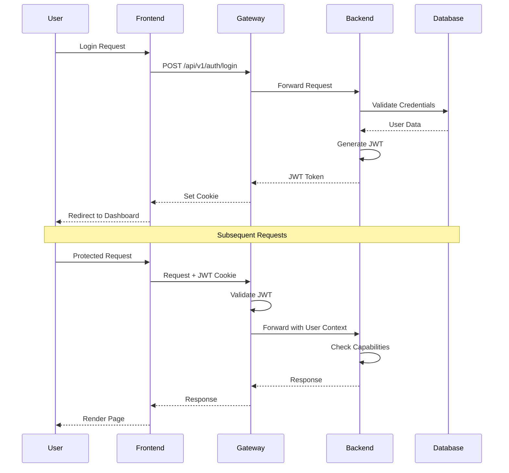
```mermaid
sequenceDiagram
    participant U as User
    participant F as Frontend
    participant G as Gateway
    participant B as Backend
    participant DB as Database

    U->>F: Login Request
    F->>G: POST /api/v1/auth/login
    G->>B: Forward Request
    B->>DB: Validate Credentials
    DB-->>B: User Data
    B->>B: Generate JWT
    B-->>G: JWT Token
    G-->>F: Set Cookie
    F-->>U: Redirect to Dashboard

    Note over U,DB: Subsequent Requests

    U->>F: Protected Request
    F->>G: Request + JWT Cookie
    G->>G: Validate JWT
    G->>B: Forward with User Context
    B->>B: Check Capabilities
    B-->>G: Response
    G-->>F: Response
    F-->>U: Render Page
```

### Additional auth paths

Beyond the browser JWT cookie shown above, core ships two more authentication paths:

- **Scoped API tokens** — headless/machine clients authenticate with `Authorization: Bearer wjt_<secret>` instead of the cookie. Tokens carry global (`read`/`write`/`*`) and per-resource scopes (e.g. `posts:write`, `media:read`); the effective permission is the owner's capabilities **∩** the token scope. Managed via `GET`/`POST`/`DELETE /api/v1/auth/tokens` (self-service UI at `/admin/tokens`), stored sha256-at-rest, and the Bearer path is CSRF-exempt.
- **TOTP two-factor auth** — after password validation an MFA-enabled account completes login by submitting a TOTP or backup code to `POST /api/v1/auth/mfa` (enrol/manage via `/auth/mfa/setup|enable|disable|status|backup-codes`). An admin-enforced **MFA-by-role policy** (`GET`/`PUT /auth/mfa/policy` plus a global compliance gate) can require 2FA for chosen roles.

---

## 📊 Data Flow

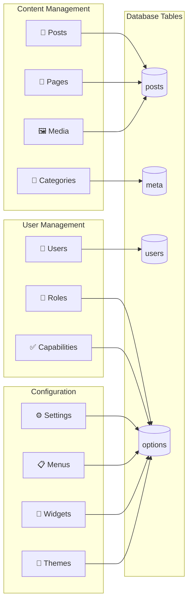
```mermaid
graph LR
    subgraph "Content Management"
        Posts[📝 Posts]
        Pages[📄 Pages]
        Media[🖼️ Media]
        Categories[📂 Categories]
    end

    subgraph "Configuration"
        Settings[⚙️ Settings]
        Menus[📋 Menus]
        Widgets[🧩 Widgets]
        Themes[🎨 Themes]
    end

    subgraph "User Management"
        Users[👥 Users]
        Roles[🔐 Roles]
        Capabilities[✅ Capabilities]
    end

    subgraph "Database Tables"
        posts_table[(posts)]
        options_table[(options)]
        users_table[(users)]
        meta_table[(meta)]
    end

    Posts --> posts_table
    Pages --> posts_table
    Media --> posts_table
    Categories --> meta_table
    Settings --> options_table
    Menus --> options_table
    Widgets --> options_table
    Themes --> options_table
    Users --> users_table
    Roles --> options_table
    Capabilities --> options_table
```

### Outgoing Webhooks

Content events (e.g. `post.published`) fan out to admin-configured **outgoing webhooks** — `backend/src/core/webhooks.ts`, managed through the admin API at `/api/v1/webhooks` (subscription CRUD, a `GET /events` catalog of subscribable event types, per-webhook delivery log, and secret rotation). Deliveries are **HMAC-signed** and **SSRF-safe** — loopback / cloud-metadata / RFC1918 destinations are rejected, validated at delivery time.

### WordPress Importer (WXR)

WordJS can migrate an existing WordPress site from its **WXR** (WordPress eXtended RSS) export. The core lives in `backend/src/core/wxr-import.ts` (`parseWxr` / `analyzeWxr` / `importWxr`), exposed through `backend/src/routes/import.ts` and the **Import** admin screen at `/admin/import` (sidebar entry). Both endpoints are **admin-only** and take the `.xml` export as the multipart `file` field:

- `POST /api/v1/import/wordpress/analyze` — dry-run that returns entity counts without writing anything.
- `POST /api/v1/import/wordpress` — runs the import (form options: `defaultAuthorId`, `importComments`, `importAttachments`).

It maps WordPress onto WordJS models — `wp:author` → users (random password, must be reset; matched by login/email), categories → `category` terms (parent hierarchy preserved), tags → `post_tag` terms, and `item`s → posts/pages with post meta, term relationships, and threaded comments (spam/pingbacks skipped). The import is **idempotent / re-runnable** (existing users, terms, and posts are matched, not duplicated), preserves original publish dates, and applies light `wpautop` to classic content. **Attachments are skipped by default** (the WXR carries only media URLs, not the binaries); enabling the `importAttachments` option creates attachment post records but still does **not** download the media files. `nav_menu_item` entries are always skipped.

---

## 🖥️ Frontend Component Tree

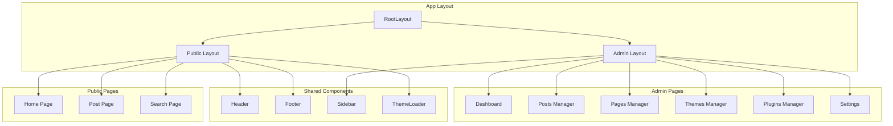
```mermaid
graph TD
    subgraph "App Layout"
        RootLayout[RootLayout]
        PublicLayout[Public Layout]
        AdminLayout[Admin Layout]
    end

    subgraph "Public Pages"
        HomePage[Home Page]
        PostPage[Post Page]
        SearchPage[Search Page]
    end

    subgraph "Admin Pages"
        Dashboard[Dashboard]
        PostsAdmin[Posts Manager]
        PagesAdmin[Pages Manager]
        ThemesAdmin[Themes Manager]
        PluginsAdmin[Plugins Manager]
        SettingsAdmin[Settings]
    end

    subgraph "Shared Components"
        Header[Header]
        Footer[Footer]
        Sidebar[Sidebar]
        ThemeLoader[ThemeLoader]
    end

    RootLayout --> PublicLayout
    RootLayout --> AdminLayout
    PublicLayout --> HomePage
    PublicLayout --> PostPage
    PublicLayout --> SearchPage
    AdminLayout --> Dashboard
    AdminLayout --> PostsAdmin
    AdminLayout --> PagesAdmin
    AdminLayout --> ThemesAdmin
    AdminLayout --> PluginsAdmin
    AdminLayout --> SettingsAdmin
    PublicLayout --> Header
    PublicLayout --> Footer
    PublicLayout --> ThemeLoader
    AdminLayout --> Sidebar
```

---

## 📁 File Structure Overview

```
wordjs/
├── 📁 frontend/              # Next.js Frontend
│   ├── 📁 src/
│   │   ├── 📁 app/             # App Router Pages
│   │   │   ├── 📁 (public)/    # Public Site
│   │   │   ├── 📁 admin/       # Admin Dashboard
│   │   │   └── 📁 api/         # API Routes
│   │   ├── 📁 components/      # React Components
│   │   │   ├── puckConfig.tsx  # Puck Component Registry (editor-side)
│   │   │   ├── 📁 content/     # Public block rendering: blocks.tsx (shared markup),
│   │   │   │                   #   ContentRenderer.tsx (server) + the client islands
│   │   │   ├── 📁 public/      # Public site components (Header.tsx, Footer.tsx, …)
│   │   │   └── 📁 admin/       # Admin components (Header.tsx, …)
│   │   └── 📁 lib/             # Utilities
│   └── package.json
│
├── 📁 backend/                  # Express.js Backend (TypeScript, compiled for prod)
│   ├── 📁 src/                 # All .ts; `npm run build` emits dist/
│   │   ├── index.ts            # App assembly + initialize() (listens BEFORE plugins load)
│   │   ├── 📁 config/          # app.ts (config schema/defaults) + database.ts (driver manager)
│   │   ├── 📁 core/            # Core Modules (incl. db-admin/, plugin-worker.js)
│   │   ├── 📁 drivers/         # DB driver interface + implementations
│   │   ├── 📁 middleware/      # auth.ts (authenticate/csrfProtection/mfaComplianceGate),
│   │   │                       #   permissions.ts (can/canAny/canAll), errorHandler.ts,
│   │   │                       #   image-negotiation.ts
│   │   ├── 📁 models/          # Post, User, Term, Comment, Media, Menu, Email,
│   │   │                       #   Analytics, ApiToken, Webhook, WebhookDelivery, FormSubmission
│   │   ├── 📁 routes/          # API Routes (incl. marketplace.ts)
│   │   ├── 📁 types/           # Ambient .d.ts
│   │   ├── 📁 tests/           # node:test suite (npm test)
│   │   └── 📁 tests-integration/ # node:test suite (npm run test:integration)
│   ├── 📁 plugins/             # Installed/bundled plugins (plugin code stays .js)
│   ├── 📁 cli/                 # wordjs.js CLI + one-off maintenance/debug scripts — see cli.md
│   ├── 📁 scripts/             # Maintenance scripts (incl. build-marketplace.js)
│   ├── dist/                   # Compiled output (npm run build) — prod entry
│   ├── tsconfig.json           # strict typecheck config (commonjs)
│   ├── tsconfig.build.json     # production build config (emits dist/)
│   ├── 📁 themes/              # Runtime theme dir — `default` ships in the repo; every other
│   │   ├── 📁 default/         #   theme lands here when installed from the marketplace
│   │   └── 📁 .../             #   (each: theme.json + the compiled style.css)
│   ├── 📁 public/              # Static Assets
│   │   └── 📁 css/
│   │       ├── wordjs-ui.css   # Shared token-driven UI framework (--wjs-*)
│   │       └── core.css        # Core Styles
│   └── package.json
│
├── 📁 marketplace/              # Plugin & theme Marketplace (distributed outside the core build)
│   ├── 📁 plugins/             # First-party plugin sources
│   ├── 📁 themes/              # First-party theme sources
│   └── 📁 dist/                # Build output (gitignored): marketplace-index.json + <slug>-<version>.zip
│                               #   + marketplace-themes-index.json + theme-<slug>-<version>.zip
│                               #   — published as GitHub Release assets, NOT committed
│
├── 📁 documentation/            # Documentation
│   ├── api.md
│   ├── frontend.md
│   ├── themes.md
│   ├── plugins.md
│   └── architecture.md         # This file
│
├── 📁 gateway/                  # Cluster Gateway (reverse proxy + mTLS)
│   ├── 📁 src/
│   │   ├── index.js            # Gateway entry (Node cluster; mTLS /register + token /enroll servers)
│   │   ├── cluster-ca.js       # Cluster CA: issue/sign identities + join-token store
│   │   └── proxy-config.js     # Proxy + mTLS upstream agent
│   ├── gateway-config.json      # Gateway config (secret, ports, ssl, mtls)
│   └── gateway-registry.json    # Persisted service registry + health
│
├── 📁 scripts/                  # Cluster tooling (SEPARATE mode)
│   ├── cluster.js              # Run on gateway: init CA, mint join tokens
│   └── node-join.js            # Run on a new node: enroll + write certs/config
│
├── 📁 setup/                    # Setup/migration orchestrator + mTLS cert gen
│   └── index.js
├── package.json                 # Root Package (concurrently dev/prod runner)
└── README.md                    # Project README
```

---

## 🔗 Quick Reference

| Layer       | Technology        | Port     | Purpose                                     |
| ----------- | ----------------- | -------- | ------------------------------------------- |
| **Gateway** | Node.js Cluster   | **3000** | **Identity & Routing (Single Entry Point)** |
| Frontend    | Next.js           | 3001     | SSR, Visual Editor                          |
| Backend     | Express.js (TypeScript, compiled) | 4000 | REST API, Plugins                  |
| Database    | SQLite / PostgreSQL / MySQL | -        | Data Storage                                |

> For build/run commands and the dev vs prod workflow, see **[development.md](development.md)**.

---

## 🟦 Backend Runtime (TypeScript, compiled for production)

The backend is written in **TypeScript** (`backend/src/**/*.ts`). In **production it is compiled**: `npm run build` (`tsc -p tsconfig.build.json`, preceded by a `clean` of `dist/`) emits `dist/`, and the `server.js` supervisor runs `node dist/index.js`. `ts-node` is used **only** in development or as a convenience fallback when no `dist/` build exists.

- **Strict typecheck:** `backend/tsconfig.json` has `strict: true`, so the strict core is enforced (`strictNullChecks`, `strictFunctionTypes`, `strictBindCallApply`, `strictPropertyInitialization`, `noImplicitThis`, `alwaysStrict`). `noImplicitAny: true` is now **enforced** (every parameter/variable is annotated — real types where locally determinable, explicit `any` only at genuinely dynamic boundaries; the annotation pass was type-only, zero runtime change). One sub-flag remains explicitly **OFF**: `useUnknownInCatchVariables: false`. `module: commonjs`, `moduleDetection: force`, `allowJs`.
- **Entry / supervisor:** `npm start` runs the `server.js` supervisor. It checks for `backend/dist/index.js`: if present it spawns `node dist/index.js` (compiled); otherwise it falls back to `node -r ts-node/register src/index.ts`. `npm run dev` uses `node --watch-path=./src -r ./scripts/dev-env.js -r ts-node/register src/index.ts` (the `dev-env.js` preload forces `NODE_ENV=development` for the split-mode dev backend).
- **In-tree `.js` files compiled via `allowJs`:** `src/core/db-admin/*` (the in-core DB migration/admin runner that used to be the `db-migration` plugin) and `src/core/plugin-worker.js` (the plugin isolate worker) are carried into `dist/` by `allowJs`.
- **DB drivers:** `src/drivers/` defines a driver interface (`interface.ts`: `connect/get/all/run/exec/transaction/close`, where `transaction(fn)` runs `fn` atomically on a single connection wrapped in BEGIN/COMMIT with ROLLBACK on throw) plus implementations (`sqlite-native`, `sqlite-native-async`, `sqlite-legacy`, `postgres`, and `mysql`). The driver is selected by `config.dbDriver` (`backend/src/config/database.ts`, default `sqlite-native`); `mysql` (aliased `mariadb`) targets MySQL 8.0+/MariaDB via `mysql2` and carries a SQLite→MySQL dialect-translation layer (TEXT→VARCHAR/LONGTEXT + expression defaults, AUTO_INCREMENT, `INSERT OR IGNORE`/`ON CONFLICT`→`INSERT IGNORE`/`ON DUPLICATE KEY UPDATE`, `RETURNING`→`insertId`, ANSI_QUOTES). `getDbType()` returns `{ isPostgres, isMySQL, isSQLite, driver }`. Adding a database = implement the interface + add a conformance block (`src/tests/driver-conformance.test.ts`).
- **Plugins stay JavaScript:** code under `backend/plugins/*` remains `.js` on purpose, because the acorn AST security scanner and dynamic `require` assume `.js`. Plugins are excluded from the build.
- **Tooling & CI:** ESLint (flat config) + Prettier, a `node:test` suite (`src/tests/*.test.ts`, including supertest API integration tests). CI (`.github/workflows/ci.yml`) runs **strict typecheck → build → license gate (block AGPL/SSPL) → tests** for the backend, gateway tests, and frontend lint + build. Beyond `ci.yml`, a separate `.github/workflows/codeql.yml` runs **CodeQL SAST** (JavaScript/TypeScript) on push/PR to `main` and weekly, and `.github/workflows/release.yml` generates a **CycloneDX SBOM** (`wordjs-sbom.cdx.json`) as a release asset; third-party GitHub Actions are pinned to immutable commit SHAs for supply-chain integrity.

---

## ⚡ Hybrid Plugin Architecture

WordJS uses a dual-mode loading system for plugins to optimize for both developer experience and production speed.

### Development Mode (`NODE_ENV=development`)
- **Frontend:** Uses **Next.js Dynamic Imports**.
- **Performance:** Supports Hot Module Replacement (HMR).
- **Latency:** Slightly higher initial load due to on-the-fly compilation.

### Production Mode (`NODE_ENV=production`)
- **Frontend:** Loads **Pre-compiled Bundles** via the Plugin API.
- **Performance:** Near-zero activation time. No `next build` required.
- **Sandboxing:** Bundles are evaluated in a blob URL context with React singleton injection.

---

## 🌐 Port Mapping Logic

To avoid CORS and simplify production deployments, all traffic should go through the Gateway on port **3000**.

- `http://localhost:3000/` → Handled by **Frontend** (3001)
- `http://localhost:3000/api/*` → Handled by **Backend** (4000)
- `http://localhost:3000/admin` → Handled by **Frontend** (3001)
- `http://localhost:3000/plugins/*` → Handled by **Backend** (4000)

---

## 🔒 Internal Security (mTLS)

WordJS services communicate securely using a private mTLS cluster.

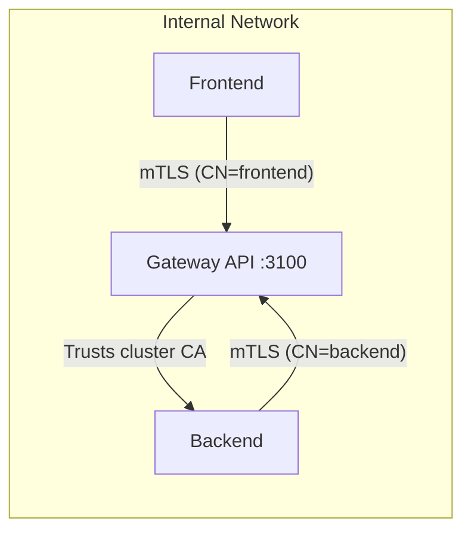
```mermaid
graph LR
    subgraph "Internal Network"
        GatewayAPI[Gateway API :3100]
        Backend[Backend]
        Frontend[Frontend]
    end

    Backend -- "mTLS (CN=backend)" --> GatewayAPI
    Frontend -- "mTLS (CN=frontend)" --> GatewayAPI
    GatewayAPI -- "Trusts cluster CA" --> Backend
```

The **Gateway** runs a private mTLS server on the internal port (`gatewayInternalPort`, default **3100** = public port + 100). Services register and fetch info here over mutual TLS: the TLS layer (`requestCert: true` / `rejectUnauthorized: true`) requires every internal request to present a client certificate that chains to the cluster CA, and each route then enforces an allowed CN via `requireIdentity()`. `POST /register` (CN `backend`/`frontend`) updates the routing registry; `GET /info`, `POST /cert-upload`, and `POST /config-update` (CN `backend` only) return gateway/SSL/cert status and apply cert/config changes.

For a **single-host** deployment the cluster CA and per-service certs are generated by the **setup orchestrator** (`setup/index.js`), so sensitive keys never travel over the public port. For **SEPARATE** (multi-machine) deployments the CA is minted by `node scripts/cluster.js init` and a new node bootstraps its own mTLS identity through the gateway's **token-enrollment listener** — a **separate** HTTPS server on `gatewayEnrollPort` (default **3101**, `startEnrollServer()`) that does **not** request a client cert: it accepts `POST /enroll { role, token, advertiseHost, csr }`, validates a single-use join token, forces `CN=<role>`, and returns the signed cert + cluster CA. See **[separate-mode.md](separate-mode.md)**.

Themes are subject to the **same** OS isolation: a theme's `functions.js` runs in a child-process isolate (`theme:<slug>`, via `loadIsolatedPlugin` in `core/plugin-isolate.ts`) rather than on the host main thread, and any hooks/shortcodes/mail it registers flow through the same permission-checked RPC bridge as plugins.
