# WordJS Architecture Overview

This document provides a comprehensive visual overview of the WordJS system architecture.

---

## 🏗️ System Architecture

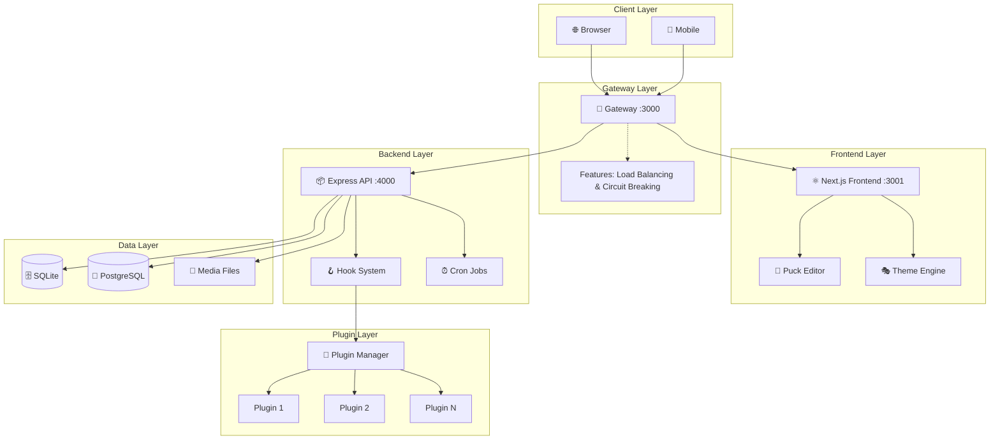
```mermaid
graph TB
    subgraph "Client Layer"
        Browser[🌐 Browser]
        Mobile[📱 Mobile]
    end

    subgraph "Gateway Layer"
        Gateway[🚀 Gateway :3000]
        note[Features: Load Balancing & Circuit Breaking]
        Gateway -.-> note
    end

    subgraph "Frontend Layer"
        NextJS[⚛️ Next.js Frontend :3001]
        Puck[🎨 Puck Editor]
        Themes[🎭 Theme Engine]
    end

    subgraph "Backend Layer"
        Express[📦 Express API :4000]
        Hooks[🪝 Hook System]
        Cron[⏰ Cron Jobs]
    end

    subgraph "Plugin Layer"
        PluginCore[🔌 Plugin Manager]
        Plugin1[Plugin 1]
        Plugin2[Plugin 2]
        PluginN[Plugin N]
    end

    subgraph "Data Layer"
        SQLite[(🗄️ SQLite)]
        PostgreSQL[(🐘 PostgreSQL)]
        MediaFS[📁 Media Files]
    end

    Browser --> Gateway
    Mobile --> Gateway
    Gateway --> NextJS
    Gateway --> Express
    NextJS --> Puck
    NextJS --> Themes
    Express --> Hooks
    Express --> Cron
    Hooks --> PluginCore
    PluginCore --> Plugin1
    PluginCore --> Plugin2
    PluginCore --> PluginN
    Express --> SQLite
    Express --> PostgreSQL
    Express --> MediaFS
```

---

## 🔄 Request Flow

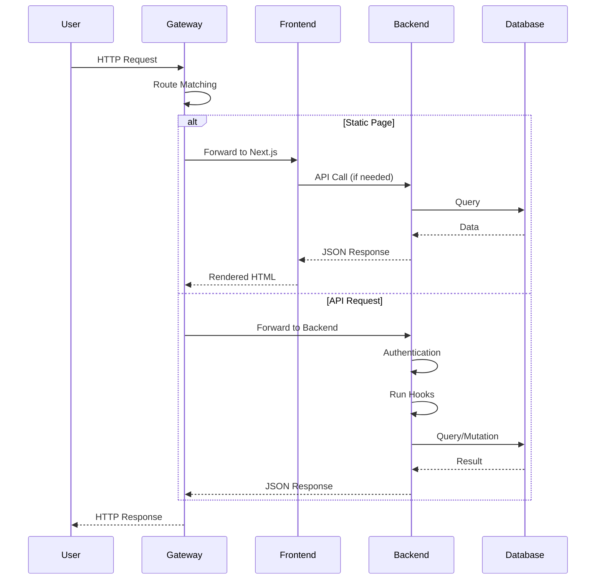
```mermaid
sequenceDiagram
    participant U as User
    participant G as Gateway
    participant F as Frontend
    participant B as Backend
    participant DB as Database

    U->>G: HTTP Request
    G->>G: Route Matching
    
    alt Static Page
        G->>F: Forward to Next.js
        F->>B: API Call (if needed)
        B->>DB: Query
        DB-->>B: Data
        B-->>F: JSON Response
        F-->>G: Rendered HTML
    else API Request
        G->>B: Forward to Backend
        B->>B: Authentication
        B->>B: Run Hooks
        B->>DB: Query/Mutation
        DB-->>B: Result
        B-->>G: JSON Response
    end
    
    G-->>U: HTTP Response
```

---

## 🎨 Theme System

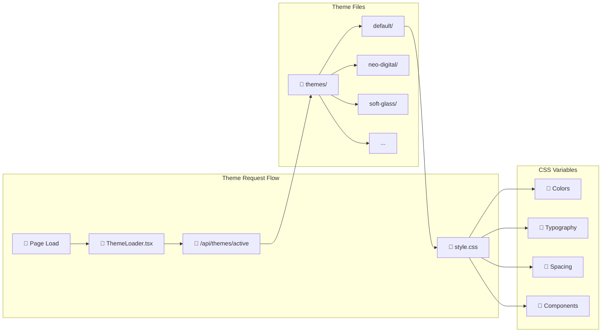
```mermaid
graph LR
    subgraph "Theme Request Flow"
        Page[📄 Page Load]
        ThemeLoader[🔄 ThemeLoader.tsx]
        API[📡 /api/themes/active]
        CSS[🎨 style.css]
    end

    subgraph "Theme Files"
        ThemeDir[📁 themes/]
        Theme1[default/]
        Theme2[neo-digital/]
        Theme3[soft-glass/]
        ThemeN[...]
    end

    subgraph "CSS Variables"
        Colors[🌈 Colors]
        Typography[📝 Typography]
        Spacing[📏 Spacing]
        Components[🧩 Components]
    end

    Page --> ThemeLoader
    ThemeLoader --> API
    API --> ThemeDir
    ThemeDir --> Theme1
    ThemeDir --> Theme2
    ThemeDir --> Theme3
    ThemeDir --> ThemeN
    Theme1 --> CSS
    CSS --> Colors
    CSS --> Typography
    CSS --> Spacing
    CSS --> Components
```

### Theme CSS Variable Flow

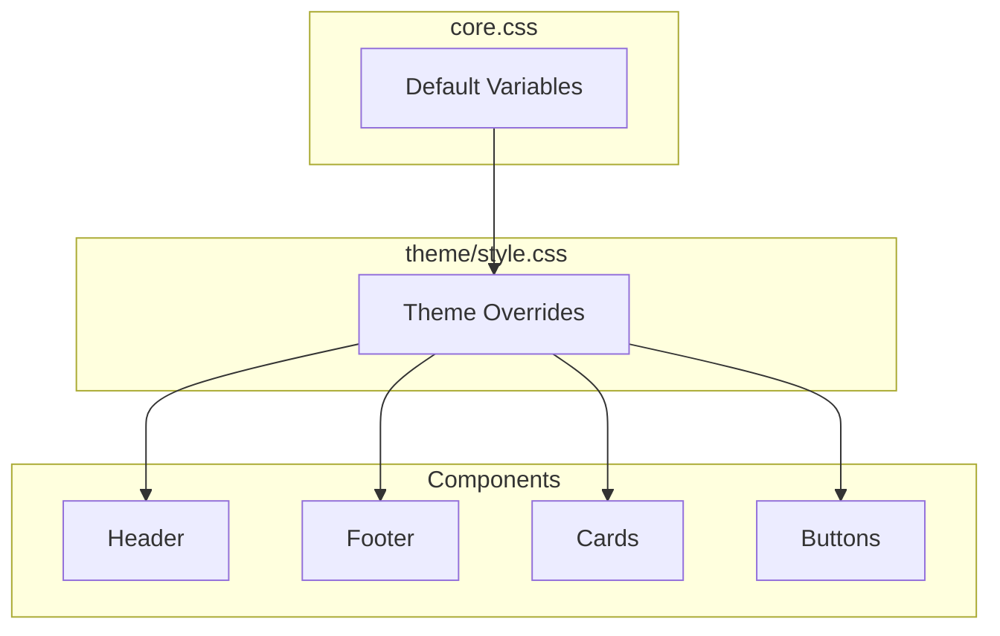
```mermaid
graph TD
    subgraph "core.css"
        CoreVars[Default Variables]
    end

    subgraph "theme/style.css"
        ThemeVars[Theme Overrides]
    end

    subgraph "Components"
        Header[Header]
        Footer[Footer]
        Cards[Cards]
        Buttons[Buttons]
    end

    CoreVars --> ThemeVars
    ThemeVars --> Header
    ThemeVars --> Footer
    ThemeVars --> Cards
    ThemeVars --> Buttons
```

---

## 🎯 Puck Editor Flow

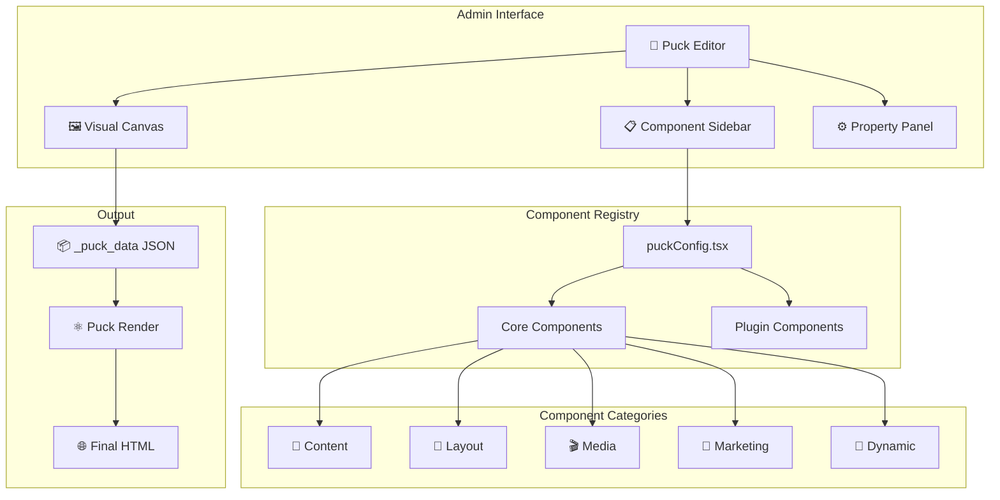
```mermaid
graph TB
    subgraph "Admin Interface"
        Editor[📝 Puck Editor]
        Sidebar[📋 Component Sidebar]
        Canvas[🖼️ Visual Canvas]
        Props[⚙️ Property Panel]
    end

    subgraph "Component Registry"
        Config[puckConfig.tsx]
        Core[Core Components]
        Plugins[Plugin Components]
    end

    subgraph "Component Categories"
        Content[📄 Content]
        Layout[📐 Layout]
        Media[🎬 Media]
        Marketing[📢 Marketing]
        Dynamic[🔄 Dynamic]
    end

    subgraph "Output"
        PuckData[📦 _puck_data JSON]
        Render[⚛️ Puck Render]
        HTML[🌐 Final HTML]
    end

    Editor --> Sidebar
    Editor --> Canvas
    Editor --> Props
    Sidebar --> Config
    Config --> Core
    Config --> Plugins
    Core --> Content
    Core --> Layout
    Core --> Media
    Core --> Marketing
    Core --> Dynamic
    Canvas --> PuckData
    PuckData --> Render
    Render --> HTML
```

### Component Hierarchy

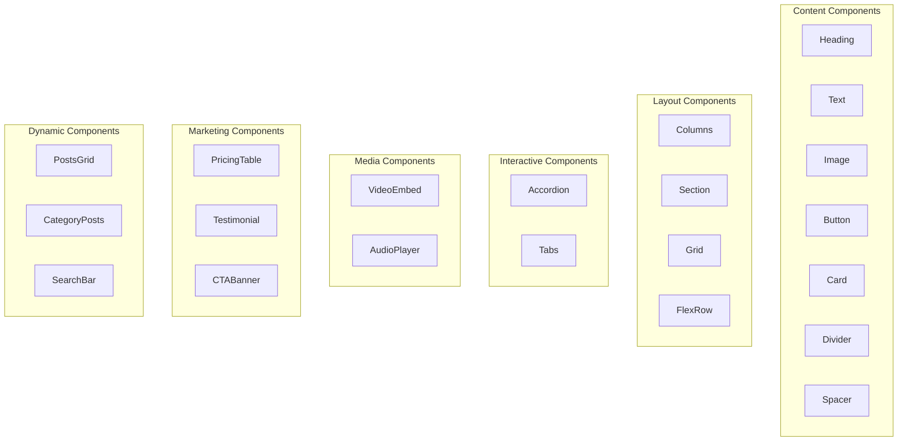
```mermaid
graph TD
    subgraph "Content Components"
        Heading[Heading]
        Text[Text]
        Image[Image]
        Button[Button]
        Card[Card]
        Divider[Divider]
        Spacer[Spacer]
    end

    subgraph "Layout Components"
        Columns[Columns]
        Section[Section]
        Grid[Grid]
        FlexRow[FlexRow]
    end

    subgraph "Interactive Components"
        Accordion[Accordion]
        Tabs[Tabs]
    end

    subgraph "Media Components"
        VideoEmbed[VideoEmbed]
        AudioPlayer[AudioPlayer]
    end

    subgraph "Marketing Components"
        PricingTable[PricingTable]
        Testimonial[Testimonial]
        CTABanner[CTABanner]
    end

    subgraph "Dynamic Components"
        PostsGrid[PostsGrid]
        CategoryPosts[CategoryPosts]
        SearchBar[SearchBar]
    end
```

---

## 🔌 Plugin System

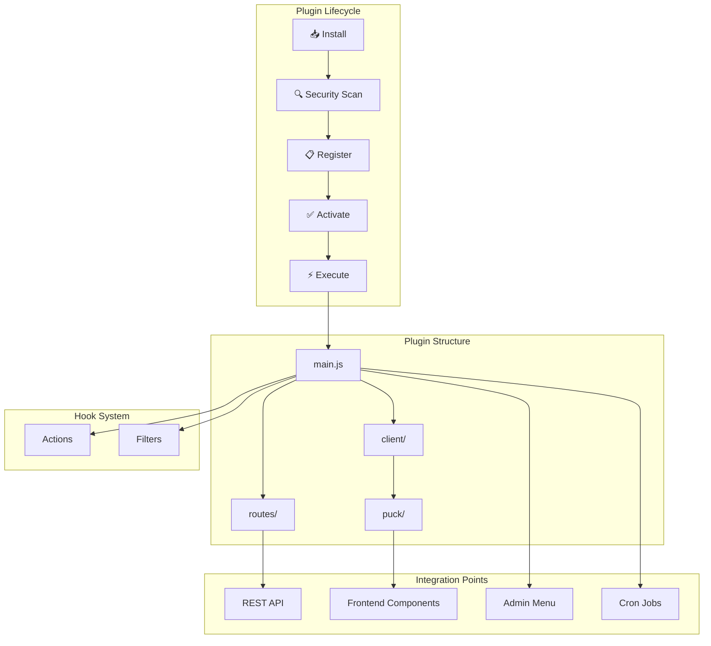
```mermaid
graph TB
    subgraph "Plugin Lifecycle"
        Install[📥 Install]
        Scan[🔍 Security Scan]
        Register[📋 Register]
        Activate[✅ Activate]
        Execute[⚡ Execute]
    end

    subgraph "Plugin Structure"
        MainJS[main.js]
        Routes[routes/]
        Client[client/]
        PuckComp[puck/]
    end

    subgraph "Hook System"
        Actions[Actions]
        Filters[Filters]
    end

    subgraph "Integration Points"
        API[REST API]
        Frontend[Frontend Components]
        Menu[Admin Menu]
        Cron[Cron Jobs]
    end

    Install --> Scan
    Scan --> Register
    Register --> Activate
    Activate --> Execute
    Execute --> MainJS
    MainJS --> Routes
    MainJS --> Client
    Client --> PuckComp
    MainJS --> Actions
    MainJS --> Filters
    Routes --> API
    PuckComp --> Frontend
    MainJS --> Menu
    MainJS --> Cron
```

---

## 🔐 Authentication Flow

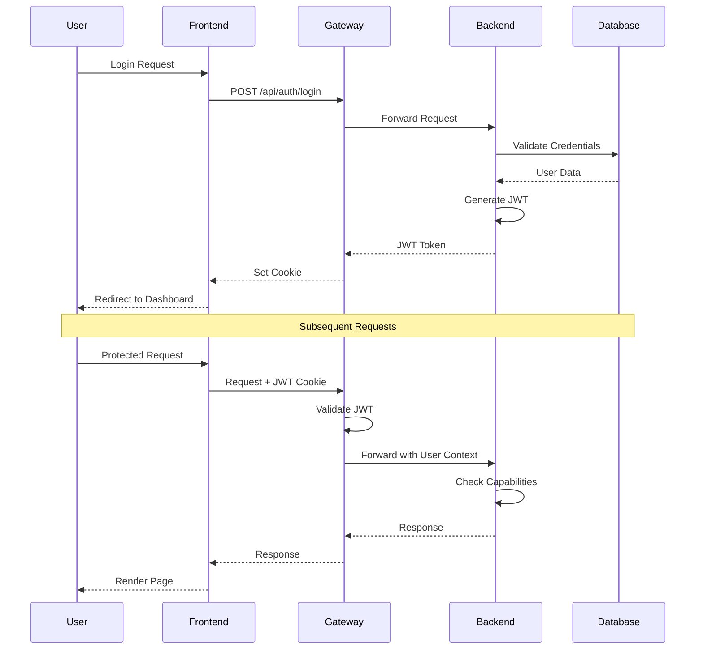
```mermaid
sequenceDiagram
    participant U as User
    participant F as Frontend
    participant G as Gateway
    participant B as Backend
    participant DB as Database

    U->>F: Login Request
    F->>G: POST /api/auth/login
    G->>B: Forward Request
    B->>DB: Validate Credentials
    DB-->>B: User Data
    B->>B: Generate JWT
    B-->>G: JWT Token
    G-->>F: Set Cookie
    F-->>U: Redirect to Dashboard

    Note over U,DB: Subsequent Requests

    U->>F: Protected Request
    F->>G: Request + JWT Cookie
    G->>G: Validate JWT
    G->>B: Forward with User Context
    B->>B: Check Capabilities
    B-->>G: Response
    G-->>F: Response
    F-->>U: Render Page
```

---

## 📊 Data Flow

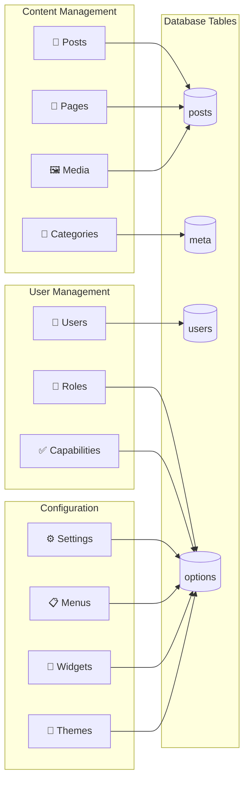
```mermaid
graph LR
    subgraph "Content Management"
        Posts[📝 Posts]
        Pages[📄 Pages]
        Media[🖼️ Media]
        Categories[📂 Categories]
    end

    subgraph "Configuration"
        Settings[⚙️ Settings]
        Menus[📋 Menus]
        Widgets[🧩 Widgets]
        Themes[🎨 Themes]
    end

    subgraph "User Management"
        Users[👥 Users]
        Roles[🔐 Roles]
        Capabilities[✅ Capabilities]
    end

    subgraph "Database Tables"
        posts_table[(posts)]
        options_table[(options)]
        users_table[(users)]
        meta_table[(meta)]
    end

    Posts --> posts_table
    Pages --> posts_table
    Media --> posts_table
    Categories --> meta_table
    Settings --> options_table
    Menus --> options_table
    Widgets --> options_table
    Themes --> options_table
    Users --> users_table
    Roles --> options_table
    Capabilities --> options_table
```

---

## 🖥️ Frontend Component Tree

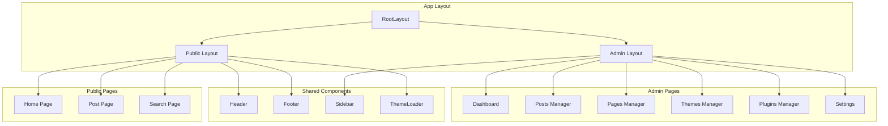
```mermaid
graph TD
    subgraph "App Layout"
        RootLayout[RootLayout]
        PublicLayout[Public Layout]
        AdminLayout[Admin Layout]
    end

    subgraph "Public Pages"
        HomePage[Home Page]
        PostPage[Post Page]
        SearchPage[Search Page]
    end

    subgraph "Admin Pages"
        Dashboard[Dashboard]
        PostsAdmin[Posts Manager]
        PagesAdmin[Pages Manager]
        ThemesAdmin[Themes Manager]
        PluginsAdmin[Plugins Manager]
        SettingsAdmin[Settings]
    end

    subgraph "Shared Components"
        Header[Header]
        Footer[Footer]
        Sidebar[Sidebar]
        ThemeLoader[ThemeLoader]
    end

    RootLayout --> PublicLayout
    RootLayout --> AdminLayout
    PublicLayout --> HomePage
    PublicLayout --> PostPage
    PublicLayout --> SearchPage
    AdminLayout --> Dashboard
    AdminLayout --> PostsAdmin
    AdminLayout --> PagesAdmin
    AdminLayout --> ThemesAdmin
    AdminLayout --> PluginsAdmin
    AdminLayout --> SettingsAdmin
    PublicLayout --> Header
    PublicLayout --> Footer
    PublicLayout --> ThemeLoader
    AdminLayout --> Sidebar
```

---

## 📁 File Structure Overview

```
wordjs/
├── 📁 frontend/              # Next.js Frontend
│   ├── 📁 src/
│   │   ├── 📁 app/             # App Router Pages
│   │   │   ├── 📁 (public)/    # Public Site
│   │   │   ├── 📁 admin/       # Admin Dashboard
│   │   │   └── 📁 api/         # API Routes
│   │   ├── 📁 components/      # React Components
│   │   │   ├── puckConfig.tsx  # Puck Component Registry
│   │   │   ├── Header.tsx      # Site Header
│   │   │   └── Footer.tsx      # Site Footer
│   │   └── 📁 lib/             # Utilities
│   └── package.json
│
├── 📁 backend/                  # Express.js Backend (TypeScript via ts-node)
│   ├── 📁 src/                 # All .ts, run in-place (no dist build)
│   │   ├── 📁 core/            # Core Modules
│   │   ├── 📁 routes/          # API Routes
│   │   └── 📁 plugins/         # Plugin System (plugin code stays .js)
│   ├── tsconfig.json           # ts-node config (commonjs, transpile-only)
│   ├── 📁 themes/              # Theme Files
│   │   ├── 📁 default/
│   │   ├── 📁 neo-digital/
│   │   ├── 📁 soft-glass/
│   │   └── 📁 .../
│   ├── 📁 public/              # Static Assets
│   │   └── 📁 css/
│   │       └── core.css        # Core Styles
│   └── package.json
│
├── 📁 documentation/            # Documentation
│   ├── api.md
│   ├── frontend.md
│   ├── themes.md
│   ├── plugins.md
│   └── architecture.md         # This file
│
├── gateway.js                   # Gateway Server
├── package.json                 # Root Package
└── README.md                    # Project README
```

---

## 🔗 Quick Reference

| Layer       | Technology        | Port     | Purpose                                     |
| ----------- | ----------------- | -------- | ------------------------------------------- |
| **Gateway** | Node.js Cluster   | **3000** | **Identity & Routing (Single Entry Point)** |
| Frontend    | Next.js           | 3001     | SSR, Visual Editor                          |
| Backend     | Express.js (TypeScript / ts-node) | 4000 | REST API, Plugins                  |
| Database    | SQLite/PostgreSQL | -        | Data Storage                                |

---

## 🟦 Backend Runtime (TypeScript via ts-node)

The backend is written in **TypeScript** (`backend/src/**/*.ts`, ~88 files) and executed **in-place** by `ts-node` in CommonJS, transpile-only mode — there is **no compiled `dist/`** output. `__dirname` and dynamic plugin loading behave exactly as in the previous CommonJS setup.

- **Config:** `backend/tsconfig.json` (`module: commonjs`, `moduleDetection: force`, `allowJs`, `strict: false`, `ignoreDeprecations`).
- **Entry:** `npm start` runs the `server.js` supervisor, which spawns `node -r ts-node/register src/index.ts`; `npm run dev` uses `node --watch -r ts-node/register`.
- **Type-checking is opt-in** (`npm run typecheck` → `tsc --noEmit`) and is **not** enforced at runtime. `strict` mode is not fully enabled yet.
- **Plugins stay JavaScript:** code under `backend/plugins/*` remains `.js` on purpose, because the acorn AST security scanner and dynamic `require` assume `.js`.
- **Tooling:** ESLint (flat config `eslint.config.mjs`) + Prettier, a `node:test` suite (~111 tests, including supertest API integration tests in `src/tests/api.test.ts`), and a CI workflow at `.github/workflows/ci.yml`.

---

## ⚡ Hybrid Plugin Architecture

WordJS uses a dual-mode loading system for plugins to optimize for both developer experience and production speed.

### Development Mode (`NODE_ENV=development`)
- **Frontend:** Uses **Next.js Dynamic Imports**.
- **Performance:** Supports Hot Module Replacement (HMR).
- **Latency:** Slightly higher initial load due to on-the-fly compilation.

### Production Mode (`NODE_ENV=production`)
- **Frontend:** Loads **Pre-compiled Bundles** via the Plugin API.
- **Performance:** Near-zero activation time. No `next build` required.
- **Sandboxing:** Bundles are evaluated in a blob URL context with React singleton injection.

---

## 🌐 Port Mapping Logic

To avoid CORS and simplify production deployments, all traffic should go through the Gateway on port **3000**.

- `http://localhost:3000/` → Handled by **Frontend** (3001)
- `http://localhost:3000/api/*` → Handled by **Backend** (4000)
- `http://localhost:3000/admin` → Handled by **Frontend** (3001)
- `http://localhost:3000/plugins/*` → Handled by **Backend** (4000)

---

## 🔒 Internal Security (mTLS)

WordJS services communicate securely using a private mTLS cluster.

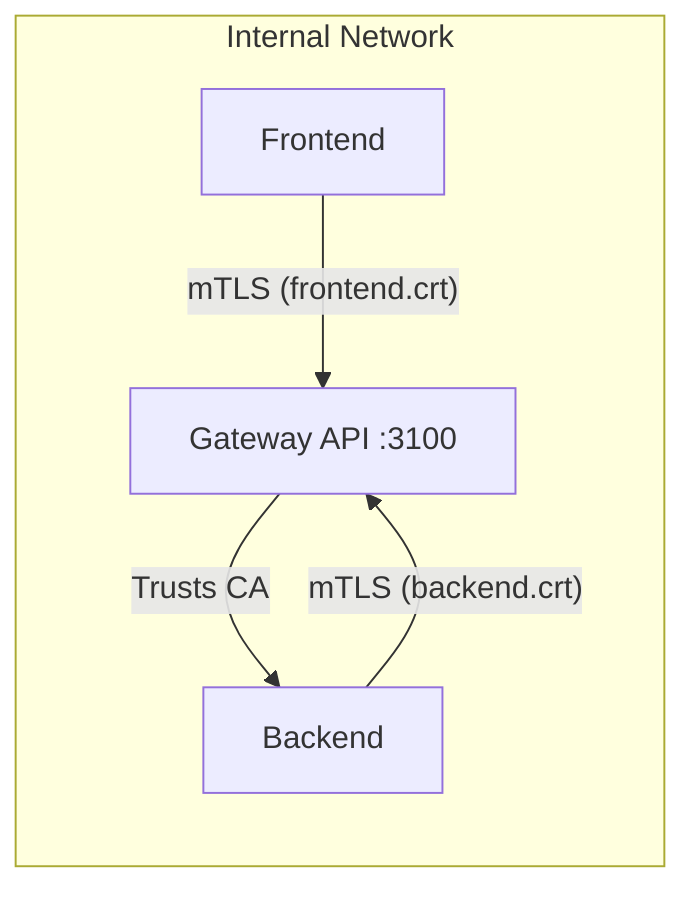
```mermaid
graph LR
    subgraph "Internal Network"
        GatewayAPI[Gateway API :3100]
        Backend[Backend]
        Frontend[Frontend]
    end

    Backend -- "mTLS (backend.crt)" --> GatewayAPI
    Frontend -- "mTLS (frontend.crt)" --> GatewayAPI
    GatewayAPI -- "Trusts CA" --> Backend
```

The **Gateway** (port 3100) serves as the control plane. The **Backend** uses this interface to push certificates and configuration updates, ensuring that sensitive keys are never exposed on public ports.
