# WordJS Architecture Overview

This document provides a comprehensive visual overview of the WordJS system architecture.

---

## 🏗️ System Architecture

```mermaid
graph TB
    subgraph "Client Layer"
        Browser[🌐 Browser]
        Mobile[📱 Mobile]
    end

    subgraph "Gateway Layer"
        Gateway[🚀 Gateway :3000]
        note[Features: Load Balancing & Circuit Breaking]
        Gateway -.-> note
    end

    subgraph "Frontend Layer"
        NextJS[⚛️ Next.js Frontend :3001]
        Puck[🎨 Puck Editor]
        Themes[🎭 Theme Engine]
    end

    subgraph "Backend Layer"
        Express[📦 Express API :4000]
        Hooks[🪝 Hook System]
        Cron[⏰ Cron Jobs]
    end

    subgraph "Plugin Layer"
        PluginCore[🔌 Plugin Manager]
        Plugin1[Plugin 1]
        Plugin2[Plugin 2]
        PluginN[Plugin N]
    end

    subgraph "Data Layer"
        SQLite[(🗄️ SQLite)]
        PostgreSQL[(🐘 PostgreSQL)]
        MediaFS[📁 Media Files]
    end

    Browser --> Gateway
    Mobile --> Gateway
    Gateway --> NextJS
    Gateway --> Express
    NextJS --> Puck
    NextJS --> Themes
    Express --> Hooks
    Express --> Cron
    Hooks --> PluginCore
    PluginCore --> Plugin1
    PluginCore --> Plugin2
    PluginCore --> PluginN
    Express --> SQLite
    Express --> PostgreSQL
    Express --> MediaFS
```



---

## 🔄 Request Flow


---

## 🎨 Theme System

```mermaid
graph LR
    subgraph "Theme Request Flow"
        Page[📄 Page Load]
        ThemeLoader[🔄 ThemeLoader.tsx]
        API[📡 /api/themes/active]
        CSS[🎨 style.css]
    end

    subgraph "Theme Files"
        ThemeDir[📁 themes/]
        Theme1[default/]
        Theme2[neo-digital/]
        Theme3[soft-glass/]
        ThemeN[...]
    end

    subgraph "CSS Variables"
        Colors[🌈 Colors]
        Typography[📝 Typography]
        Spacing[📏 Spacing]
        Components[🧩 Components]
    end

    Page --> ThemeLoader
    ThemeLoader --> API
    API --> ThemeDir
    ThemeDir --> Theme1
    ThemeDir --> Theme2
    ThemeDir --> Theme3
    ThemeDir --> ThemeN
    Theme1 --> CSS
    CSS --> Colors
    CSS --> Typography
    CSS --> Spacing
    CSS --> Components
```



### Theme CSS Variable Flow


---

## 🎯 Puck Editor Flow


### Component Hierarchy


---

## 🔌 Plugin System

```mermaid
graph TB
    subgraph "Plugin Lifecycle"
        Install[📥 Install]
        Scan[🔍 Security Scan]
        Register[📋 Register]
        Activate[✅ Activate]
        Execute[⚡ Execute]
    end

    subgraph "Plugin Structure"
        MainJS[main.js]
        Routes[routes/]
        Client[client/]
        PuckComp[puck/]
    end

    subgraph "Hook System"
        Actions[Actions]
        Filters[Filters]
    end

    subgraph "Integration Points"
        API[REST API]
        Frontend[Frontend Components]
        Menu[Admin Menu]
        Cron[Cron Jobs]
    end

    Install --> Scan
    Scan --> Register
    Register --> Activate
    Activate --> Execute
    Execute --> MainJS
    MainJS --> Routes
    MainJS --> Client
    Client --> PuckComp
    MainJS --> Actions
    MainJS --> Filters
    Routes --> API
    PuckComp --> Frontend
    MainJS --> Menu
    MainJS --> Cron
```



---

## 🔐 Authentication Flow


---

## 📊 Data Flow


---

## 🖥️ Frontend Component Tree


---

## 📁 File Structure Overview

```
wordjs/
├── 📁 admin-next/              # Next.js Frontend
│   ├── 📁 src/
│   │   ├── 📁 app/             # App Router Pages
│   │   │   ├── 📁 (public)/    # Public Site
│   │   │   ├── 📁 admin/       # Admin Dashboard
│   │   │   └── 📁 api/         # API Routes
│   │   ├── 📁 components/      # React Components
│   │   │   ├── puckConfig.tsx  # Puck Component Registry
│   │   │   ├── Header.tsx      # Site Header
│   │   │   └── Footer.tsx      # Site Footer
│   │   └── 📁 lib/             # Utilities
│   └── package.json
│
├── 📁 backend/                  # Express.js Backend
│   ├── 📁 src/
│   │   ├── 📁 core/            # Core Modules
│   │   ├── 📁 routes/          # API Routes
│   │   └── 📁 plugins/         # Plugin System
│   ├── 📁 themes/              # Theme Files
│   │   ├── 📁 default/
│   │   ├── 📁 neo-digital/
│   │   ├── 📁 soft-glass/
│   │   └── 📁 .../
│   ├── 📁 public/              # Static Assets
│   │   └── 📁 css/
│   │       └── core.css        # Core Styles
│   └── package.json
│
├── 📁 documentation/            # Documentation
│   ├── api.md
│   ├── frontend.md
│   ├── themes.md
│   ├── plugins.md
│   └── architecture.md         # This file
│
├── gateway.js                   # Gateway Server
├── package.json                 # Root Package
└── README.md                    # Project README
```

---

## 🔗 Quick Reference

| Layer    | Technology        | Port | Purpose                 |
| -------- | ----------------- | ---- | ----------------------- |
| Gateway  | Node.js Cluster   | 3000 | Routing, Load Balancing |
| Frontend | Next.js           | 3001 | SSR, Visual Editor      |
| Backend  | Express.js        | 4000 | REST API, Plugins       |
| Database | SQLite/PostgreSQL | -    | Data Storage            |
