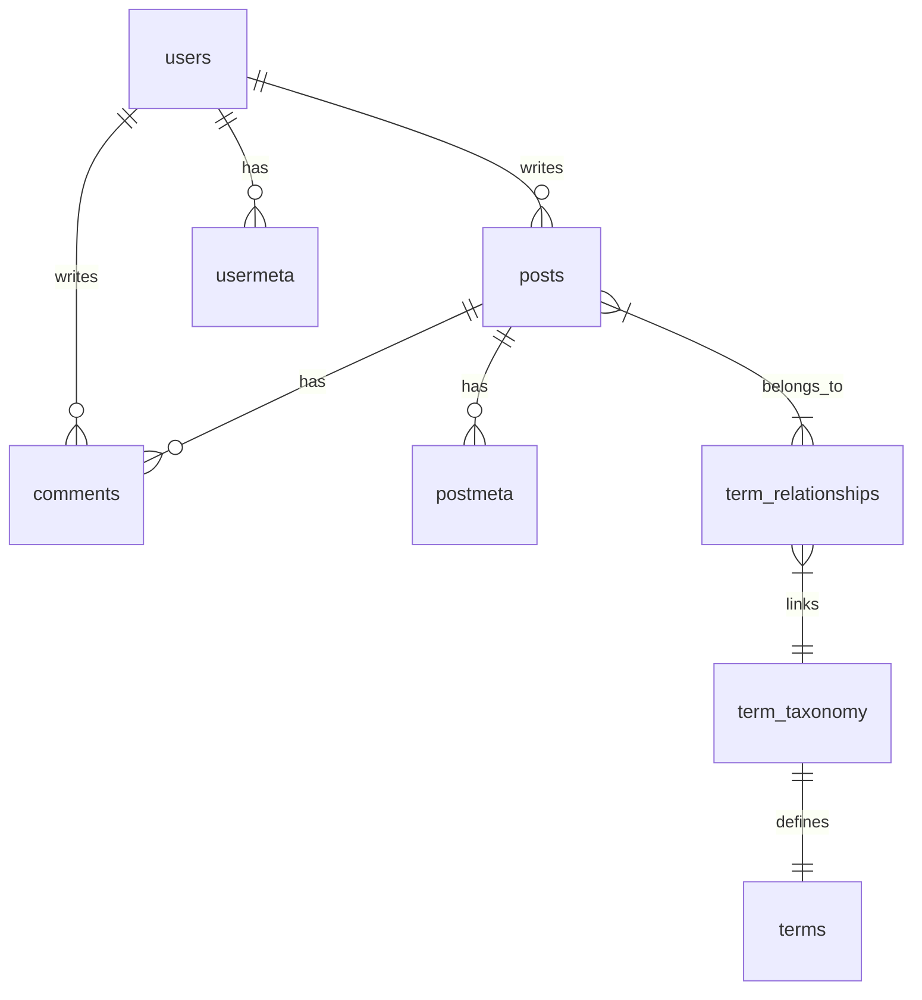

# WordJS Database Documentation 🗄️

WordJS uses a powerful **Multi-Driver** architecture, allowing you to run on anything from a cheap VPS with a file-based DB to a scalable cloud cluster with PostgreSQL.

## 1. Supported Drivers

| Driver              | Description      | Config Value    | Use Case                                                           |
| :------------------ | :--------------- | :-------------- | :----------------------------------------------------------------- |
| **SQLite (Native)** | `better-sqlite3` | `sqlite-native` | **Recommended.** High performance (WAL mode), single-server.       |
| **PostgreSQL**      | `pg`             | `postgres`      | **Scalable.** Best for clusters and high-concurrency environments. |
| **SQLite (Legacy)** | `sql.js` (WASM)  | `sqlite-legacy` | **Fallback.** Pure JS, works in limited containers (no compile).   |

### 1.1 Driver Deep Dive 🏎️

#### **SQLite (Native - Recommended)**
Uses the `better-sqlite3` library, which is the fastest SQLite driver for Node.js. 
*   **Performance:** Enabled with **WAL (Write-Ahead Logging)** mode by default, allowing simultaneous reads and writes.
*   **Safety:** Atomic writes prevent database corruption during power outages.
*   **Requirement:** Requires C++ build tools on your system (e.g., `python`, `make`, `g++`).

#### **SQLite (Legacy - WASM Fallback)**
Uses a pure JavaScript WASM build of SQLite.
*   **Use Case:** Ideal for restricted hosting environments (like some shared hosting or strictly locked-down Docker containers) where you cannot compile C++ modules.
*   **Trade-off:** Slower than Native for heavy write operations but 100% compatible with WordJS schema.

### 1.2 Live Data Migration
WordJS includes a **Zero Data Loss** migration tool. You can switch drivers at any time without losing users or posts.

1. Go to **Admin Panel > Plugins > DB Migration**.
2. Select your target engine (e.g., Switch from SQLite to Postgres).
3. The system will:
    - **Verify** source data integrity.
    - **Stream** data in chunks to the new driver (preventing RAM spikes).
    - **Swap** configuration files atomically.
    - **Restart** the backend automatically to apply changes.

> **Note:** For SQLite-to-SQLite migrations (e.g. Legacy -> Native), the system uses an atomic file swap mechanism to ensure no corruption.

### 1.2 Configuration
To manually change the driver, edit `backend/wordjs-config.json` or set the `DB_DRIVER` environment variable.

**Example `wordjs-config.json`:**
```json
{
  "dbDriver": "postgres",
  "dbHost": "localhost",
  "dbUser": "postgres",
  "dbPassword": "password",
  "dbName": "wordjs"
}
```

## 2. Schema Overview

The database uses a WordPress-like schema to ensure familiarity and flexibility. The schema is automatically adapted for the active driver (e.g., using `SERIAL` for Postgres vs `AUTOINCREMENT` for SQLite).



---

## 2. Core Tables

### 2.1 `users`
Stores user authentication and profile data.

| Column                | Type       | Description         |
| :-------------------- | :--------- | :------------------ |
| `ID`                  | INTEGER PK | Unique User ID      |
| `user_login`          | VARCHAR    | Username (unique)   |
| `user_pass`           | VARCHAR    | Bcrypt hash         |
| `user_nicename`       | VARCHAR    | URL-friendly name   |
| `user_email`          | VARCHAR    | Email address       |
| `user_registered`     | DATETIME   | Registration date   |
| `user_activation_key` | VARCHAR    | For password resets |
| `display_name`        | VARCHAR    | Public display name |

### 2.2 `usermeta`
Key-value store for user preferences and extra fields.

| Column       | Type       | Description |
| :----------- | :--------- | :---------- |
| `umeta_id`   | INTEGER PK |             |
| `user_id`    | INTEGER FK |             |
| `meta_key`   | VARCHAR    |             |
| `meta_value` | LONGTEXT   |             |

### 2.3 `posts`
The central content table. Used for posts, pages, attachments, revisions, and menu items.

| Column           | Type       | Description                     |
| :--------------- | :--------- | :------------------------------ |
| `ID`             | INTEGER PK |                                 |
| `post_author`    | INTEGER FK |                                 |
| `post_date`      | DATETIME   | Published date                  |
| `post_content`   | LONGTEXT   | The main HTML/Puck content      |
| `post_title`     | TEXT       |                                 |
| `post_status`    | VARCHAR    | `publish`, `draft`, `trash`     |
| `comment_status` | VARCHAR    | `open`, `closed`                |
| `post_name`      | VARCHAR    | URL Slug (unique per type)      |
| `post_modified`  | DATETIME   | Last edit                       |
| `post_parent`    | INTEGER    | For hierarchy (pages)           |
| `guid`           | VARCHAR    | Global Unique Identifier        |
| `menu_order`     | INTEGER    | Sorting order                   |
| `post_type`      | VARCHAR    | `post`, `page`, `attachment`... |
| `post_mime_type` | VARCHAR    | For attachments                 |

### 2.4 `postmeta`
Extensible fields for posts (e.g. template settings, SEO data).

| Column       | Type       | Description |
| :----------- | :--------- | :---------- |
| `meta_id`    | INTEGER PK |             |
| `post_id`    | INTEGER FK |             |
| `meta_key`   | VARCHAR    |             |
| `meta_value` | LONGTEXT   |             |

### 2.5 `options`
Global system settings.

| Column         | Type       | Description                 |
| :------------- | :--------- | :-------------------------- |
| `option_id`    | INTEGER PK |                             |
| `option_name`  | VARCHAR    | Unique key (e.g. `siteurl`) |
| `option_value` | LONGTEXT   | Auto-serialized JSON        |
| `autoload`     | VARCHAR    | `yes`/`no` to load on boot  |

### 2.6 `terms` & `term_taxonomy`
Manages Categories and Tags.

**`terms`**
| Column    | Type       | Description   |
| :-------- | :--------- | :------------ |
| `term_id` | INTEGER PK |               |
| `name`    | VARCHAR    | Display name  |
| `slug`    | VARCHAR    | URL safe slug |

**`term_taxonomy`**
| Column             | Type       | Description              |
| :----------------- | :--------- | :----------------------- |
| `term_taxonomy_id` | INTEGER PK |                          |
| `term_id`          | INTEGER FK |                          |
| `taxonomy`         | VARCHAR    | `category` or `post_tag` |
| `description`      | LONGTEXT   |                          |
| `parent`           | INTEGER    | For hierarchy            |
| `count`            | INTEGER    | usage count              |

### 2.7 `comments`
User feedback on content.

| Column                 | Type       | Description      |
| :--------------------- | :--------- | :--------------- |
| `comment_ID`           | INTEGER PK |                  |
| `comment_post_ID`      | INTEGER FK |                  |
| `comment_author`       | TINYTEXT   | Name             |
| `comment_author_email` | VARCHAR    |                  |
| `comment_content`      | TEXT       |                  |
| `comment_approved`     | VARCHAR    | `1`, `0`, `spam` |
| `comment_type`         | VARCHAR    | `comment`        |
| `user_id`              | INTEGER    | If registered    |

### 2.8 `wordjs_analytics`
High-volume event logging table for the internal analytics engine.

| Column       | Type        | Description                                |
| :----------- | :---------- | :----------------------------------------- |
| `id`         | UUID PK     | Unique Event ID                            |
| `type`       | VARCHAR     | `page_view`, `api_call`, `engagement`      |
| `resource`   | VARCHAR     | The URL or resource accessed               |
| `visitor_ip` | VARCHAR     | Anonymized or raw IP (depending on config) |
| `user_id`    | VARCHAR     | User uuid (if logged in) or NULL           |
| `metadata`   | TEXT (JSON) | Extra payload                              |
| `created_at` | DATETIME    | Timestamp                                  |

---

## 3. Extending the Schema

Plugins should generally stick to `postmeta` or `usermeta` for storing extra data.
However, for high-performance needs, custom tables can be created using `db.prepare("CREATE TABLE...")`.
