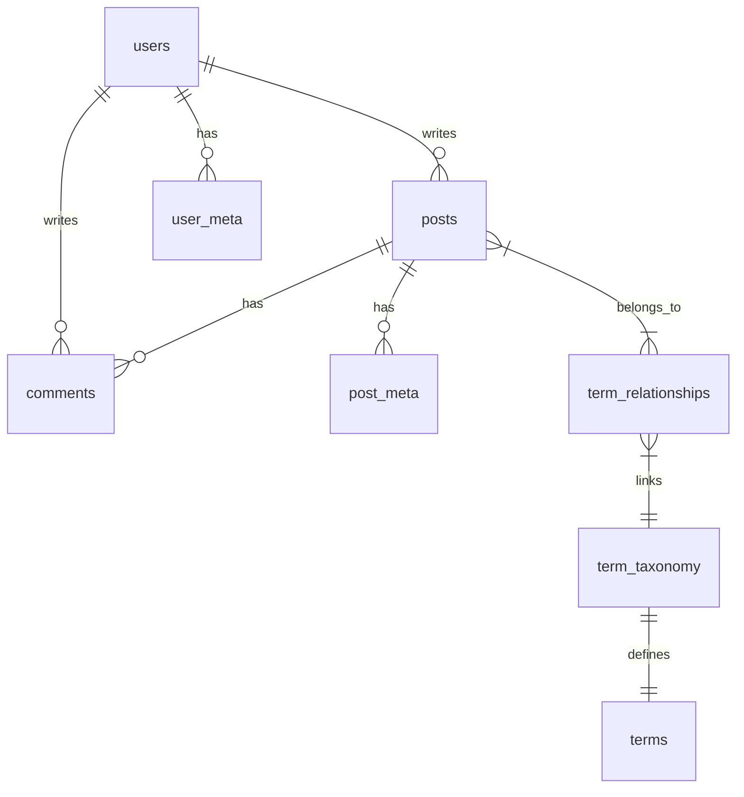

# WordJS Database Documentation 🗄️

WordJS uses a **Multi-Driver** architecture, allowing you to run on anything from a cheap VPS with a file-based DB to a scalable cloud cluster with PostgreSQL.

Every backend implements a single async **driver interface** (`backend/src/drivers/interface.ts`), so the rest of the codebase never branches on which database is active. A small **DB Manager** (`backend/src/config/database.ts`) loads the configured driver, exposes the abstraction proxies (`dbAsync`, `db`), and creates the core schema.

## 1. Supported Drivers

| Driver              | Library          | Config Value    | Role                                                                       |
| :------------------ | :--------------- | :-------------- | :------------------------------------------------------------------------- |
| **SQLite (Native)** | `better-sqlite3` | `sqlite-native` | **Default & recommended.** High performance (WAL mode), single-server.     |
| **PostgreSQL**      | `pg`             | `postgres`      | **Scalable.** Best for clusters and high-concurrency environments.         |
| **MySQL / MariaDB** | `mysql2`         | `mysql`         | External MySQL 8.0+ / MariaDB; the driver translates SQLite-dialect SQL.    |
| **SQLite (Legacy)** | `sql.js` (WASM)  | `sqlite-legacy` | **Automatic fallback only.** Pure JS, used when the native binary fails.    |

`sqlite-native` is the DB Manager default (`config.dbDriver || 'sqlite-native'`). You do not normally select `sqlite-legacy` yourself — see [Automatic Fallback](#13-automatic-fallback-mechanics) below.

### 1.1 Driver Deep Dive 🏎️

#### **SQLite (Native - Default)**
Uses the `better-sqlite3` library, the fastest SQLite driver for Node.js. This is the **canonical SQLite engine** and the DB-manager default.
*   **Performance:** Enabled with **WAL (Write-Ahead Logging)** mode by default, allowing simultaneous reads and writes.
*   **Safety:** Atomic writes prevent database corruption during power outages.
*   **Requirement:** Requires a native binary (prebuilt for most platforms; building from source needs C++ tools like `python`, `make`, `g++`).
*   **Driver file:** `backend/src/drivers/sqlite-native-async.ts` (async, implements the interface). The older sync `sqlite-native.ts` wrapper still exists for compatibility.
*   **Data file:** stores its database at `backend/data/wordjs-native.db` (default). This is a **different file** from the legacy driver — see [§1.7 SQLite Drivers Use Different Files](#17-sqlite-drivers-use-different-files).

#### **PostgreSQL**
Uses the `pg` client (connection **Pool**) via `backend/src/drivers/postgres.ts`.
*   **External by default:** the `postgres` driver connects to an **external** Postgres server using the `db` connection object (host/port/user/password/name/ssl). It does **not** bundle or start a server on its own.
*   **SQLite-compatible SQL:** the driver's `normalizeSql()` rewrites SQLite-style `?` placeholders to `$1, $2, …`, and `run()` auto-injects `RETURNING *` on `INSERT`s so it can report `lastID`. Plugins and models keep writing SQLite-style SQL (see [plugin-database.md](./plugin-database.md)).

#### **MySQL / MariaDB**
Uses the `mysql2` client (connection **Pool**) via `backend/src/drivers/mysql.ts`, connecting to an **external** MySQL 8.0+ / MariaDB server (same `db` connection object — set `dbPort: 3306`). It does **not** bundle or start a server.
*   **Dialect translation:** models and plugins keep writing ONE dialect (SQLite); the driver rewrites it to MySQL at the boundary — `?` placeholders are native; `TEXT`→`VARCHAR(255)` (or `LONGTEXT` for long-content columns) with parenthesised **expression defaults** (MySQL ≥ 8.0.13); `INTEGER PRIMARY KEY AUTOINCREMENT`→`AUTO_INCREMENT`; `INSERT OR IGNORE` / `ON CONFLICT`→`INSERT IGNORE` / `ON DUPLICATE KEY UPDATE`; `RETURNING`→`insertId`; functional-index parens; and the session runs `sql_mode=ANSI_QUOTES` so `"col"` is an identifier like SQLite/Postgres.
*   **Known limitation:** MySQL has no **partial indexes**, so the `posts(post_name) WHERE post_name<>''` unique index is skipped (the app-layer `generateUniqueSlug` enforces slug uniqueness instead).

#### **SQLite (Legacy - WASM Fallback)**
Uses a pure JavaScript WASM build of SQLite (`sql.js`) via `backend/src/drivers/sqlite-legacy.ts`.
*   **Use Case:** Restricted hosting environments (some shared hosting, strictly locked-down containers) where the native binary cannot load.
*   **Trade-off:** Slower than Native for heavy writes, and it uses the older **synchronous** driver shape (the DB Manager adapts it). It reads/writes the **same SQLite file format**.
*   **Data file:** stores its database at `backend/data/wordjs.db` (the config layer defaults `dbPath` **per driver** — `./data/wordjs.db` only when `sqlite-legacy` is configured, `./data/wordjs-native.db` otherwise; `backend/src/config/app.ts`). Although the file *format* is identical to Native, the two SQLite drivers use **different files by default** — see [§1.7 SQLite Drivers Use Different Files](#17-sqlite-drivers-use-different-files).

### 1.2 The Driver Interface & Conformance Suite

All async drivers extend `DatabaseDriverInterface` (`backend/src/drivers/interface.ts`), a seven-method contract:

| Method                 | Purpose                                              |
| :--------------------- | :--------------------------------------------------- |
| `connect()`            | Open the connection / pool.                          |
| `get(sql, params)`     | Run a query, return a single row.                    |
| `all(sql, params)`     | Run a query, return all rows.                        |
| `run(sql, params)`     | Run INSERT/UPDATE/DELETE, return `{ lastID, changes }`. |
| `exec(sql)`            | Run a raw SQL script (e.g. DDL / migrations).        |
| `transaction(fn)`      | Run `fn(tx)` atomically (BEGIN → COMMIT, ROLLBACK on throw). |
| `close()`              | Close the connection / pool.                         |

The base `interface.ts` default `transaction()` throws `transaction() not implemented`; every async driver (`sqlite-native-async`, `postgres`, `sqlite-legacy`) overrides it with a real atomic implementation — see [§1.2.1](#121-atomic-transactionfn) below.

A **conformance test** (`backend/src/tests/driver-conformance.test.ts`) runs the *same* contract (create → insert → get → all → update → delete → drop) against every async driver, asserting `run()` returns a truthy `lastID` and correct `changes`, that params bind, and that mutations persist. Drivers whose backend isn't reachable **skip gracefully**: if `better-sqlite3` can't load it's treated as the sql.js-fallback case, and if no Postgres is reachable that block is skipped (3s connect timeout). The legacy sync `sqlite-legacy` driver is intentionally out of scope (the suite validates the async interface implementers).

#### 1.2.1 Atomic `transaction(fn)`

`transaction(fn)` is part of the driver contract and is genuinely **atomic** on every async driver. The callback receives a `tx` exposing `get`/`all`/`run`/`exec` with the **same SQLite-style SQL shape** (placeholders, `RETURNING` auto-injection, `{ lastID, changes }`) inside the transaction as outside it, so callers write identical SQL either way.

*   **PostgreSQL** (`postgres.ts`) pins **one** pooled client for the whole unit of work — `BEGIN` → `fn(tx)` → `COMMIT`, `ROLLBACK` on throw, and the client is **always** released in a `finally`. This matters because the per-statement methods each grab a *different* pooled connection, so a multi-statement unit would otherwise not share a transaction.
*   **SQLite (Native)** (`sqlite-native-async.ts`) wraps `BEGIN`/`COMMIT`/`ROLLBACK` on its single shared `better-sqlite3` handle.
*   **SQLite (Legacy)** (`sqlite-legacy.ts`) suppresses its per-write disk flush while a transaction is open and saves to disk **once** after `COMMIT`; on `ROLLBACK` it restores the pre-transaction in-memory image (so a failed tx leaves both memory and disk at the prior committed state).

**SQLite transaction serialization & re-entrancy.** Both SQLite drivers serialize `transaction()` through a per-driver promise-chain mutex (`_txChain` / module-level `txChain`): because the callback is async and may `await` between `BEGIN` and `COMMIT`, two overlapping callers could otherwise interleave their `BEGIN`/`COMMIT` on the single shared connection (SQLite has no nested `BEGIN`). Each call waits for the previous to fully settle before its own `BEGIN` runs. A **re-entrant** `transaction()` — one invoked from inside another's callback — fails fast by throwing `nested transaction() is not supported` rather than deadlocking the queue, and `_inTransaction` is reset in a `finally` on **both** commit and rollback.

**Clean unique-constraint errors.** `User.create` and `User.update` translate a cross-driver UNIQUE-constraint violation (on `idx_users_login` / `idx_users_email`) into a clean application error — `Username or email already exists` on create, `Email already in use` on update — instead of surfacing a raw driver constraint error / 500. The detector `isUniqueViolation` handles Postgres SQLSTATE `23505` and SQLite `SQLITE_CONSTRAINT*` / `UNIQUE constraint failed`. Emails are canonicalized (full-Unicode lowercase + NFC via `normalizeEmail`) before store/lookup, so the ASCII-only SQLite `LOWER()` backstop holds.

> **Roles cache (DATA-05).** `getRoles()` serves from an in-memory cache that, once older than `ROLES_CACHE_TTL_MS` (**10s** in code), kicks a non-blocking, single-flight background re-read to bound staleness and self-heal a missed pub/sub invalidation. A monotonic `_localWriteEpoch` is captured before the background DB read and the result is applied **only** if the epoch is unchanged, so a stale read cannot clobber a just-written local change. Cross-node coherence (DATA-COH-01) is **deferred**.

### 1.3 Automatic Fallback Mechanics

The DB Manager (`loadDriver` in `config/database.ts`) falls back to `sqlite-legacy` **only** when loading any SQLite driver fails *and* the failed name isn't already `sqlite-legacy`:

*   A failed **SQLite** driver (default path, or any `sqlite*` name) → silently falls back to pure-JS `sqlite-legacy` (same file format).
*   A failed **non-SQLite** override (e.g. an explicit `postgres`) is **not** silently downgraded to SQLite — the error propagates so a misconfigured Postgres deployment fails loudly instead of quietly running on a local file.

### 1.4 Live Data Migration

WordJS includes a **Zero Data Loss** migration tool for switching drivers without losing users or posts.

> **This is core infrastructure, not a plugin.** Database migration manages the DB lifecycle — work that must happen in the host process and cannot run in an isolated plugin. (Isolated plugins run in a separate OS process via `child_process.fork` with no host-heap access and a scoped bridge, so they have neither the DB handle nor the privileges this needs.) It was formerly the `db-migration` *plugin*; it now lives in core at `backend/src/core/db-admin/` and is wired in at boot.

1. Go to the **DB Migration** entry in the admin sidebar (route `/admin/db-migration`). It is a native admin route, always available — it is not tied to plugin activation.
2. Select your target engine (e.g., switch from SQLite to Postgres).
3. The system will:
    - **Verify** source data integrity.
    - **Stream** data in chunks to the new driver (preventing RAM spikes).
    - **Swap** configuration atomically.
    - **Restart** the backend automatically to apply changes.

> **Note:** For SQLite-to-SQLite migrations (e.g. Legacy -> Native), the system uses an atomic file swap mechanism to ensure no corruption.

The backing API is mounted at `/api/v1/db-migration` (guarded by `authenticate` + the `manage_options` permission).

### 1.5 Backups & Retention

Full-site backups (logical DB export + a physical DB snapshot for SQLite + the `uploads/`, `plugins/`, `themes/` content roots) are produced by `backend/src/core/backup.ts` (`createBackup()`) and stored **on-host** under `backend/backups/`. Off-host/S3 destinations remain on the roadmap.

After every backup, retention pruning runs automatically (`pruneBackups()` in `backend/src/core/backup.ts`): only the newest **N** backups are kept and older ones are deleted, so scheduled/auto backups can no longer fill the disk unbounded. **N** comes from the `backup_retention` option (**default 7**); set it to `0` (or a negative value) to keep all backups and disable pruning.

### 1.6 Configuration

To change the driver, edit `backend/wordjs-config.json`. The flat `db*` keys (`dbDriver`, `dbHost`, `dbUser`, `dbPassword`, `dbName`, `dbPort`, `dbSsl`, `dbPath`) and a nested `db: { … }` object are both accepted; the config layer normalizes them into a single `db` connection object (`backend/src/config/app.ts`).

**Example — external Postgres:**
```json
{
  "dbDriver": "postgres",
  "dbHost": "localhost",
  "dbPort": 5432,
  "dbUser": "postgres",
  "dbPassword": "change-me",
  "dbName": "wordjs"
}
```

**Example — SQLite (default):**
```json
{
  "dbDriver": "sqlite-native",
  "dbPath": "./data/wordjs-native.db"
}
```
> Each SQLite driver defaults to its **own** file (`sqlite-native` → `data/wordjs-native.db`, `sqlite-legacy` → `data/wordjs.db`). If you set `dbPath` explicitly, point it at the file for the driver you selected. See [§1.7](#17-sqlite-drivers-use-different-files).

> **Secrets:** on boot the config layer auto-generates and persists a secure `jwtSecret` and `dbPassword` if the existing config still holds the insecure defaults. Operators should still review these.

### 1.7 SQLite Drivers Use Different Files

The two SQLite drivers do **not** share a data file by default — each maps to a distinct file under `backend/data/`:

| `dbDriver`        | Library                | Default data file            |
| :---------------- | :--------------------- | :--------------------------- |
| `sqlite-native`   | `better-sqlite3`       | `backend/data/wordjs-native.db` |
| `sqlite-legacy`   | `sql.js` (WASM)        | `backend/data/wordjs.db`     |

PostgreSQL (via `pg`) is a **separate engine** entirely, not a file under `data/`.

> ⚠️ **Switching `dbDriver` points the app at a different file/engine.** Data written under one driver is **not** visible under another until it is migrated. Flipping `dbDriver` in `backend/wordjs-config.json` alone makes your existing data look **"missing"** — nothing is lost, the app is just reading a different file (or engine). The same applies when switching between SQLite and PostgreSQL.

To actually **move your data between drivers/engines** (e.g. `sqlite-legacy` → `sqlite-native`, or SQLite → Postgres), use the admin **DB Migration** route described in [§1.4](#14-live-data-migration) — it streams the data into the target driver and, for SQLite-to-SQLite, performs an atomic file swap so the data ends up in the new driver's file. Do **not** edit `dbDriver` by hand for this.

> **`npm run migrate` is a different thing — it does *not* switch drivers.** The root `npm run migrate` (`node setup/index.js --migrate` → `backend/scripts/migrate.js`) applies any pending **schema** migrations to the *currently configured* database and exits, without copying data between drivers or starting the server. It is idempotent and useful in deploy pipelines (apply migrations before rolling out new code); the same schema migrations also run automatically at boot.

> **Run modes:** both run modes (split services and the single-process monolith) use the **same configured database** — the run mode does not change which driver or file is used; only `dbDriver` (and `dbPath`) in `wordjs-config.json` does.

## 2. Schema Overview

The database uses a WordPress-like schema to ensure familiarity and flexibility. The schema is automatically adapted for the active driver (e.g., using `SERIAL` for Postgres vs `AUTOINCREMENT` for SQLite).


```mermaid
erDiagram
    users ||--o{ posts : writes
    users ||--o{ comments : writes
    posts ||--o{ comments : has
    posts ||--o{ post_meta : has
    users ||--o{ user_meta : has
    posts }|--|{ term_relationships : belongs_to
    term_relationships }|--|| term_taxonomy : links
    term_taxonomy ||--|| terms : defines
```

---

## 2. Core Tables

> **Naming note:** the tables below follow WordPress conventions, but the **actual** schema (`initializeSchema` in `backend/src/config/database.ts`) uses lowercase, snake_case identifiers: the primary keys are `id` (not `ID`), meta/relationship tables are `post_meta` / `user_meta` / `comment_meta` / `term_relationships` (with underscores), and the comment columns are `comment_id` / `comment_post_id`. Column names in the tables below are illustrative of the WordPress mapping.

### 2.1 `users`
Stores user authentication and profile data.

| Column                | Type       | Description         |
| :-------------------- | :--------- | :------------------ |
| `ID`                  | INTEGER PK | Unique User ID      |
| `user_login`          | VARCHAR    | Username (unique)   |
| `user_pass`           | VARCHAR    | Bcrypt hash         |
| `user_nicename`       | VARCHAR    | URL-friendly name   |
| `user_email`          | VARCHAR    | Email address       |
| `user_registered`     | DATETIME   | Registration date   |
| `user_activation_key` | VARCHAR    | For password resets |
| `display_name`        | VARCHAR    | Public display name |

### 2.2 `user_meta`
Key-value store for user preferences and extra fields.

| Column       | Type       | Description |
| :----------- | :--------- | :---------- |
| `umeta_id`   | INTEGER PK |             |
| `user_id`    | INTEGER FK |             |
| `meta_key`   | VARCHAR    |             |
| `meta_value` | LONGTEXT   |             |

### 2.3 `posts`
The central content table. Used for posts, pages, attachments, revisions, and menu items.

| Column           | Type       | Description                     |
| :--------------- | :--------- | :------------------------------ |
| `ID`             | INTEGER PK |                                 |
| `post_author`    | INTEGER FK |                                 |
| `post_date`      | DATETIME   | Published date                  |
| `post_content`   | LONGTEXT   | The main HTML/Puck content      |
| `post_title`     | TEXT       |                                 |
| `post_status`    | VARCHAR    | `publish`, `draft`, `trash`     |
| `comment_status` | VARCHAR    | `open`, `closed`                |
| `post_name`      | VARCHAR    | URL Slug (unique per type)      |
| `post_modified`  | DATETIME   | Last edit                       |
| `post_parent`    | INTEGER    | For hierarchy (pages)           |
| `guid`           | VARCHAR    | Global Unique Identifier        |
| `menu_order`     | INTEGER    | Sorting order                   |
| `post_type`      | VARCHAR    | `post`, `page`, `attachment`... |
| `post_mime_type` | VARCHAR    | For attachments                 |

### 2.4 `post_meta`
Extensible fields for posts (e.g. template settings, SEO data).

| Column       | Type       | Description |
| :----------- | :--------- | :---------- |
| `meta_id`    | INTEGER PK |             |
| `post_id`    | INTEGER FK |             |
| `meta_key`   | VARCHAR    |             |
| `meta_value` | LONGTEXT   |             |

### 2.5 `options`
Global system settings.

| Column         | Type       | Description                 |
| :------------- | :--------- | :-------------------------- |
| `option_id`    | INTEGER PK |                             |
| `option_name`  | VARCHAR    | Unique key (e.g. `siteurl`) |
| `option_value` | LONGTEXT   | Auto-serialized JSON        |
| `autoload`     | VARCHAR    | `yes`/`no` to load on boot  |

> Option writes are an **atomic** `INSERT … ON CONFLICT (option_name) DO UPDATE` upsert (`updateOption`), and `DO NOTHING` for insert-if-absent (`addOption`) — replacing the old SELECT-then-INSERT/UPDATE that raced the `idx_options_name` UNIQUE index (two concurrent first-writes both INSERTed, and the loser hit a raw violation). Supported by SQLite ≥3.24 and Postgres; the legacy sql.js driver strips `RETURNING` but honors `ON CONFLICT`.

### 2.6 `terms` & `term_taxonomy`
Manages Categories and Tags.

**`terms`**
| Column    | Type       | Description   |
| :-------- | :--------- | :------------ |
| `term_id` | INTEGER PK |               |
| `name`    | VARCHAR    | Display name  |
| `slug`    | VARCHAR    | URL safe slug |

**`term_taxonomy`**
| Column             | Type       | Description              |
| :----------------- | :--------- | :----------------------- |
| `term_taxonomy_id` | INTEGER PK |                          |
| `term_id`          | INTEGER FK |                          |
| `taxonomy`         | VARCHAR    | `category` or `post_tag` |
| `description`      | LONGTEXT   |                          |
| `parent`           | INTEGER    | For hierarchy            |
| `count`            | INTEGER    | usage count              |

### 2.7 `comments`
User feedback on content.

| Column                 | Type       | Description      |
| :--------------------- | :--------- | :--------------- |
| `comment_ID`           | INTEGER PK |                  |
| `comment_post_ID`      | INTEGER FK |                  |
| `comment_author`       | TINYTEXT   | Name             |
| `comment_author_email` | VARCHAR    |                  |
| `comment_content`      | TEXT       |                  |
| `comment_approved`     | VARCHAR    | `1`, `0`, `spam` |
| `comment_type`         | VARCHAR    | `comment`        |
| `user_id`              | INTEGER    | If registered    |

### 2.8 `wordjs_analytics`
High-volume event logging table for the internal analytics engine. Its schema lives on the `Analytics` model (`backend/src/models/Analytics.ts`, `Analytics.init()`) rather than inline in `initializeSchema`, deliberately kept out of the core schema to avoid a boot race. It is, however, created during **`initializeDatabase()`** (`config/database.ts`) — right after the core schema and migrations run, `initializeDatabase()` calls `Analytics.init()` (`CREATE TABLE IF NOT EXISTS`, with an index on `created_at`). This guarantees the table exists after a **fresh install**: the install wizard's setup flow calls `initializeDatabase()` but never the app's `initialize()`, so without this a fresh deploy would hit `no such table: wordjs_analytics` on every request.

| Column       | Type        | Description                                          |
| :----------- | :---------- | :--------------------------------------------------- |
| `id`         | UUID PK     | Unique Event ID                                      |
| `type`       | VARCHAR     | `page_view`, `api_call`, `engagement`                |
| `resource`   | VARCHAR     | The URL or resource accessed                         |
| `visitor_ip` | VARCHAR     | Privacy-preserving: daily-salted SHA-256 hash of the IP (or `0.0.0.0`), never the raw IP |
| `user_id`    | VARCHAR     | User uuid (if logged in) or NULL                     |
| `metadata`   | TEXT (JSON) | Extra payload                                        |
| `created_at` | DATETIME    | Timestamp                                            |

> Other core tables created by `initializeSchema` but not detailed above include `comment_meta`, `links`, and `notifications`.

---

---

## 2.9 Indexes

On boot, the schema (`backend/src/config/database.ts`) creates a set of indexes with `CREATE INDEX IF NOT EXISTS` (supported by both SQLite and Postgres) on hot columns. These speed up meta lookups, listing queries, slug resolution, and comment/option access:

| Index                          | Table / Columns                            |
| :----------------------------- | :----------------------------------------- |
| `idx_post_meta_post_id`        | `post_meta (post_id)`                      |
| `idx_post_meta_post_id_key`    | `post_meta (post_id, meta_key)`            |
| `idx_user_meta_user_id`        | `user_meta (user_id)`                      |
| `idx_user_meta_user_id_key`    | `user_meta (user_id, meta_key)`            |
| `idx_term_rel_object_id`       | `term_relationships (object_id)`           |
| `idx_term_rel_tt_id`           | `term_relationships (term_taxonomy_id)`    |
| `idx_term_taxonomy_taxonomy`   | `term_taxonomy (taxonomy)`                 |
| `idx_posts_status_type`        | `posts (post_status, post_type)`           |
| `idx_posts_name`               | `posts (post_name)`                        |
| `idx_posts_parent`             | `posts (post_parent)`                      |
| `idx_comments_post_approved`   | `comments (comment_post_id, comment_approved)` |
| `idx_options_name` (UNIQUE)    | `options (option_name)`                    |
| `idx_options_autoload`         | `options (autoload)`                       |
| `idx_notifications_user_read_created` | `notifications (user_id, is_read, created_at)` |
| `idx_users_login` (UNIQUE)     | `users (user_login)`                       |
| `idx_users_email` (UNIQUE)     | `users (LOWER(user_email))` — case-insensitive backstop |
| `idx_posts_name_type` (UNIQUE) | `posts (post_name, post_type)` — partial: `WHERE post_name <> ''` |

> `options.option_name` uniqueness is enforced by the **`idx_options_name` UNIQUE index** (created alongside the others), not by an inline column constraint.

> **UNIQUE constraints (TOCTOU-closing).** `users (user_login)`, `users (LOWER(user_email))`, and `posts (post_name, post_type)` [partial, `WHERE post_name <> ''` — real slugs only] now carry UNIQUE indexes that close the check-then-insert race for duplicate logins/emails/slugs. The non-unique `idx_posts_name` (above) coexists with the new partial-unique `idx_posts_name_type` — both are real. **Fresh installs** create all three in `initializeSchema`. **Existing installs** get them via schema migration `0001_unique_constraints_users_posts`, which is **defensive**: it first detects and logs any duplicate groups, then attempts each `CREATE UNIQUE INDEX` in its own `try/catch`, and **never throws** — a residual duplicate logs a warning and boot continues (the migration is still recorded as applied so it doesn't retry every boot). This is a deliberate exception: the schema-migration runner is otherwise **fail-closed** (a failing migration aborts boot to avoid a half-migrated schema).

### Batched Meta Loading (N+1 avoidance)

Post listing (`Post.findAllWithRelations`) **batch-loads** post meta for the whole result set in a single query rather than issuing one query per post, eliminating the previous N+1 pattern on listing pages.

---

## 3. Extending the Schema (Plugins)

Plugins should generally stick to `post_meta` or `user_meta` for storing extra data. For high-performance needs they can create their **own** tables.

Plugins do this through the permission-checked `wordjs` capability bridge (`wordjs.db.createTable(...)` / `wordjs.db.run(...)`), **not** by reaching into the raw driver. Plugin SQL is **table-scoped by prefix (default-deny)**: every table a query touches must be one the plugin owns under its `wjp_<slug>_` prefix (`wordjs.db.tablePrefix`), so core tables (`users`, `user_meta`, `options`, `roles`, `sessions`, …) and other plugins' tables are unreachable, and `createTable` refuses non-prefixed names. Two practical consequences of the guard: **`ON CONFLICT … DO UPDATE` upserts are rejected** (use UPDATE-then-INSERT instead — the core `updateOption` upsert in §2.5 is core-only), and the bridge exposes only `get`/`all`/`run`/`createTable` — **no `transaction()`**, so multi-statement plugin writes are not atomic. The full rules, the driver-agnostic type aliases (`INT_PK`, `DATETIME`, …), and examples live in **[plugin-database.md](./plugin-database.md)**.

## 4. Adding a New Database Driver

Multi-DB support is designed to be a contained, **verifiable** unit. To add a backend (e.g. MySQL):

1. **Implement the interface.** Create `backend/src/drivers/<name>.ts` exporting a singleton that extends `DatabaseDriverInterface` (`interface.ts`) and implements all seven methods. `run()` must return `{ lastID, changes }`; `get`/`all` must return a row / array of rows. If the engine uses non-`?` placeholders, normalize SQLite-style `?` internally (see `postgres.ts`'s `normalizeSql`) so callers keep writing SQLite-style SQL.
2. **Register it in the DB Manager.** Add the `<name>` branch in `loadDriver` (`config/database.ts`) so it's loaded as the async driver, and extend the dialect handling (`isPostgres` checks, `createPluginTable` type map, `clearDatabase` truncate syntax) if the new engine needs different DDL.
3. **Add a conformance block.** Add a `test(...)` block in `backend/src/tests/driver-conformance.test.ts` with the engine's dialect descriptor (placeholder style, auto-increment PK, INSERT-returns-id mechanism). The shared `runContract` then validates the whole contract — and skips gracefully if the backend isn't reachable in CI.

### Dialect Handling Today

Dialect differences are confined to a few spots:

*   **Auto-increment PK:** `SERIAL PRIMARY KEY` (Postgres) vs `INTEGER PRIMARY KEY AUTOINCREMENT` (SQLite), chosen in `initializeSchema` and `createPluginTable`.
*   **Placeholders:** SQLite-style `?` everywhere; the Postgres driver rewrites to `$1, $2` (single source of truth — the proxy passes SQL through untouched, so there's no double-normalization).
*   **`RETURNING`:** auto-injected by the Postgres driver on `INSERT`; stripped by the legacy WASM driver.
*   **Clearing tables:** `TRUNCATE … RESTART IDENTITY CASCADE` (Postgres) vs `DELETE FROM …` plus a `sqlite_sequence` reset (SQLite), in `clearDatabase`.
