# Production Deployment Guide 🚀

WordJS is designed to be easy to deploy. It defaults to a file-based **SQLite** database for zero-config startups, but fully supports **PostgreSQL** and **MySQL / MariaDB** for external-database needs.

---

## 🧭 Deployment Modes: Split, Monolith & Separate

<div align="center">



</div>

The **same codebase** runs as **two mutually-exclusive process models** — **Split** and **Monolith** — and you can switch between them **at any time** with **no migration**. Both share the same `backend/wordjs-config.json`, the same database, the same `uploads`/`themes`/`plugins`, the same secrets, and the same public origin (default `https://localhost:3000`). They are **mutually exclusive** because both bind the public port (default `3000`), so run one or the other. A third topology, **Separate**, is Split spread across **different machines** (joined by gateway-minted join tokens — see below).

In **both** modes, plugins marked `"isolated": true` run **in a separate OS process** (`child_process.fork`) behind the `wordjs` capability bridge — that behavior is identical. See **[Plugin Sandbox & Memory Caps](#-plugin-sandbox--memory-caps)** for the operator-facing knobs.

### Split (default — 3 processes)

The gateway (`:3000`, public) + backend (`:4000`) + frontend (`:3001`). The gateway is a Node `cluster` reverse-proxy that provides clustering, health-checks, load-balancing, an mTLS internal channel, and SSE-aware proxying.

- **Dev:** `npm run dev`
- **Prod:** `npm start`

### Monolith (1 process, 1 port `:3000`)

A single artifact via the repo-root entrypoint `monolith.js`. It mounts the **backend Express app** (with its isolated plugins, each running in its own forked OS process) **and** the **Next.js request handler** **in-process** — no loopback proxy, no Node `cluster`, no gateway `/register`. The gateway's still-needed cross-cutting concerns are re-implemented as **local middleware**: `helmet`, `compression` (skipping SSE), a `405` answer for `TRACE`/`TRACK`, SEO rewrites (`/sitemap.xml` → `/api/v1/seo/sitemap.xml`, `/robots.txt` → `.../robots.txt`, `/feed` | `/feed.xml` | `/rss.xml` → `.../feed.xml`), and `X-Forwarded-Host` / `X-Forwarded-Proto` pinning for CSRF. It serves **one HTTPS port** reusing the gateway's certificate (HTTP fallback), plus a loopback-only HTTP listener for the frontend's server-side (SSR) API calls.

- **Dev:** `npm run dev:mono` (Next dev HMR + `ts-node` backend)
- **Build:** `npm run build:mono` (compiles backend to `dist/` + runs `next build`)
- **Prod:** `npm run start:mono` (runs the compiled build)

> **How it works internally:** `monolith.js` sets `WORDJS_EMBEDDED=1` (and `WORDJS_MODE=mono`); the backend's `src/index.ts` detects this, skips its own self-listen and gateway self-register, and exposes `initialize()` for in-process mounting.

### Separate (split across different machines)

**Split** can also run with the three services on **different hosts** — a gateway box, a backend box, and a frontend box — joined into one cluster. Because the tiers talk over **mutual TLS**, each node needs a cert signed by a shared cluster CA; WordJS bootstraps that trust with **single-use join tokens** (like `kubeadm join`) instead of hand-copying certs. **One command per machine:**

```bash
npx create-wordjs@latest gateway --host <gateway-ip>     # machine 1: cluster CA + prints ready-to-paste join commands
npx create-wordjs@latest join backend  --gateway <ip> --token <t> --ca-hash <fp> --advertise <backend-ip>
npx create-wordjs@latest join frontend --gateway <ip> --token <t> --ca-hash <fp> --advertise <frontend-ip>
```

Each command downloads the pre-compiled release, enrolls the machine and starts its service. Under the hood (and the manual path from a source checkout — `scripts/cluster.js init` / `token`, `scripts/node-join.js`): the gateway mints the CA (key kept `0600` on the gateway) and per-role single-use tokens; each node makes one `POST /enroll` call with a CSR, receives a signed `CN=<role>` cert + the cluster CA + bootstrap config, then starts and registers over mTLS.

One backend + one frontend per gateway needs **no** shared database or filesystem — SQLite stays on the single backend and the frontend reaches uploads through the gateway. Scaling a role to **N** replicas is a further step (Postgres + Redis + shared FS). Full step-by-step (npx quickstart + manual procedure): **[separate-mode.md](separate-mode.md)**; horizontal scaling: **[multi-node.md](multi-node.md)**.

### Which one should I pick?

| | **Monolith** | **Split** |
|---|---|---|
| **Best for** | Simplest single-artifact deploy: one VM/container | Scaling services independently |
| **Processes / ports** | 1 process, 1 public port (`:3000`) | 3 processes (`:3000` / `:4000` / `:3001`) |
| **TLS** | Built-in HTTPS, or a single reverse proxy in front | Reverse proxy / Cloudflare in front of the gateway |
| **You get** | Minimal footprint, fewer moving parts | Gateway clustering, health-checks, load-balancing, mTLS internal channel |

> Steps **1–4** below (clone, build, plugin frontends, configure) apply to both modes. The split-specific PM2 layout is in **[Run in Production](#-run-in-production)**; for monolith you run a single process (`npm run start:mono`, e.g. under PM2 as `pm2 start npm --name wordjs -- run start:mono`).

---

## 📦 Releases & Distribution

WordJS ships **downloadable, pre-compiled bundles** so an operator can deploy without cloning the repo or building anything locally. If you just want to run WordJS, grab a release ZIP instead of following the from-source installation steps below.

> **First release:** [v1.0.0](https://github.com/jaimemartinez/wordjs/releases) at `github.com/jaimemartinez/wordjs/releases`.

### How a release is cut (maintainers)

Push a version tag and the release pipeline does the rest:

```bash
git tag v1.0.0
git push origin v1.0.0
```

A `v*` tag triggers **`.github/workflows/release.yml`**. It runs a **`verify`** job first — `npm run ci:all` (the parallel workspace installer, root `scripts/ci-install.mjs`), then the dependency-audit gate (`scripts/ci-audit.mjs`, which wraps `npm audit --omit=dev --audit-level=high` and blocks on any high/critical advisory in production dependencies) in `backend`, `gateway`, `frontend` and `packages/create-wordjs`, a strict backend type check (`npx tsc --noEmit`) and the backend unit tests (`npm test`). Nothing is built or published unless that job is green. The **`build-release`** job (`needs: verify`) then runs `npm run ci:all` again followed by `npm run bundle-release` (root `scripts/make-release.js`). The packager:

1. Builds the **frontend** (`next build` → `.next`).
2. Compiles the **backend** to `dist/` (`tsc`), so the bundle runs without `ts-node`.
3. Builds the **plugin frontend bundles** (`backend/scripts/build-plugin.js --all`).
4. Writes a self-contained `INSTALL.md` and writes the ZIP as `release/wordjs-compiled-release.zip`, zipping everything **except** `node_modules`, `.git`/`.github`, the `release/` folder, local config (`wordjs-config.json`, `gateway-config.json`, `gateway-registry.json`), `.env`, logs, local certs (`ssl-auto.crt`/`ssl-auto.key`), `backend/uploads`, the `backend/cli` debug scripts, and the `marketplace/` tree (marketplace plugins ship as separate release assets, never inside the core bundle). The `backend/cli` exclusion carves out the **product CLI** — `backend/cli/wordjs.js` and `backend/cli/templates/` do ship, so the documented CLI commands exist in the artifact operators deploy.

Beyond those, the packager applies a **security-anchored secret filter** so no credentials or runtime state can leak into a bundle:

- **Any** `*.db` / `*.sqlite` / `*.sqlite3` / `*.key` / `*.pem` / `*.mailenc` file, wherever it sits.
- The runtime DB/cert/TLS directories: `data/`, `backend/data/`, `certs/`, `backend/certs/`, `gateway/certs/`, `gateway/ssl/`.
- **Each plugin's own `plugins/<slug>/data/` directory** — e.g. `mail-server`'s AES-GCM root key (`.mailenc`).
- Any **config backup** carrying `jwtSecret`/`gatewaySecret`/`dbPassword` — both `*-config.json` and any basename containing `wordjs-config` / `gateway-config` (so `wordjs-config.backup.json` is caught, not just `wordjs-config.json`).

Before anything can be published the workflow **deploys the artifact it just built**: it extracts the ZIP, runs `npm run release:install` inside it, and hands the app root to **`scripts/smoke-deploy.sh`**, which drives the bundle in every mode it claims to support — **mono** (boot + `/healthz`), **split** (three processes: the wizard must be reachable *through* the gateway on a fresh instance, the install must complete through the gateway, all three services must end up holding their certificates, the public site must render real settings both on first install and after a restart, and `admin`/`admin123` must not log in), and **enrollment** (a node carrying a `node-join`-shaped `wordjs-config.json` must enter setup mode instead of seeding its own administrator). A failing leg fails the job and nothing is published. `.github/workflows/ci.yml` runs the same script on every push/PR.

After the core bundle, the workflow runs `npm run build:marketplace` (`backend/scripts/build-marketplace.js`), which packs every plugin under `marketplace/plugins/` into per-plugin zips plus a `marketplace-index.json` catalog (sha256 per entry) in `marketplace/dist/`, then `npm run verify:marketplace` (`verify-marketplace.js --rebuild`), which re-hashes the zips on disk against the catalog entries advertising them and refuses to publish a drifted catalog.

The workflow then publishes a **GitHub Release** with the versioned `wordjs-<tag>.zip` (copied from `wordjs-compiled-release.zip` on tag pushes) attached **plus the marketplace assets** (`marketplace/dist/*`), with auto-generated release notes. A manual **`workflow_dispatch`** run builds the same bundles but uploads them only as **workflow artifacts** (`wordjs-compiled-release` — the un-versioned `wordjs-compiled-release.zip` — and `wordjs-marketplace`) — no Release is created — which is handy for testing the packaging.

### What the bundle contains

- **Pre-compiled** frontend (`.next`), backend (`dist/`), and plugin bundles — recipients **do not build or compile anything**.
- **No secrets.** `jwtSecret`, `gatewaySecret`, and the DB password are **generated locally during install** and written to `backend/wordjs-config.json` — they never ship and are never committed. The packager's secret filter (above) additionally strips any `*.key`/`*.pem`/`*.mailenc`, the cert/TLS dirs, each plugin's `plugins/<slug>/data/`, and config backups so even a stray local secret can't be bundled.
- **No data.** The database is created fresh by the install wizard; no `database.sqlite` (or any `*.db`/`*.sqlite`/`*.sqlite3`) is included.
- **No marketplace plugins.** Optional plugins are installed post-deploy from the admin **Marketplace** tab (see below), not shipped in the bundle.

> **Plugin marketplace at runtime.** The admin **Plugins → Marketplace** tab lists a catalog the backend fetches **server-side** (`backend/src/routes/marketplace.ts`). With no configuration it uses the **GitHub Release assets** at `https://github.com/jaimemartinez/wordjs/releases/latest/download` (the catalog + zips are published there by `release.yml`; `marketplace/dist/` is a build output and is **not** committed) — so the server needs outbound HTTPS to `github.com` for the tab to work (a dev/full checkout with a local `marketplace/dist/` uses that instead). Sources are **admin-configurable** from the UI, backed by `GET`/`PUT /api/v1/marketplace/sources` writing the `marketplace_sources` option — a **list** of https catalogs (max 12) that are fetched and **merged** (deduped by id, earlier sources win, each source's errors isolated). E.g. add a fixed catalog snapshot at `https://github.com/jaimemartinez/wordjs/releases/download/vX.Y.Z`, since tagged releases attach the same assets. (The legacy single `marketplace_source` option — an https URL or a **local directory** for air-gapped installs — is still honored for back-compat when the list is empty.) Downloads are **sha256-verified** against the catalog entry and installed through the **same pipeline as manual zip uploads** (size cap, Zip-Slip/zip-bomb guards, manifest + AST scan), so the marketplace adds no new install surface beyond the catalog fetch itself.

### How an operator deploys a release

> **Fastest path — `npx create-wordjs`.** The `create-wordjs` bootstrapper (`packages/create-wordjs`, published to npm by the same release pipeline) downloads and unpacks the latest release ZIP for you:
> ```bash
> npx create-wordjs@latest my-site
> ```
> It then installs the runtime dependencies for you (`npm run release:install` — no build step), seeds self-signed HTTPS (pass `--http` for plain HTTP) and starts the server (`npm run start:mono`) with a one-time install token, printing a ready-to-click `https://localhost:3000/install#token=…` URL. Pass `--no-start` to scaffold + install only; start it later with `cd my-site && npm run start:mono` (or `npm start` for the 3-service split). The manual download below is the equivalent, step-by-step alternative.

1. Download `wordjs-<tag>.zip` from the GitHub Release and unzip it.
2. Install **runtime deps only** (no build/compile step — prebuilt native binaries are downloaded):
   ```bash
   npm run release:install
   ```
3. Start in either mode:
   ```bash
   npm run start:mono     # single process, one port (simplest), default https://localhost:3000
   # or
   npm start              # 3-service split: gateway + backend + frontend
   ```
4. **Read the one-time install token from the server console.** On a not-yet-installed instance the boot path mints a random token (24 random bytes, hex) and prints it in a banner, together with a ready-to-click install URL that pre-fills it:
   ```
   ━━━━━━━━━━━━━━━━━━━━━━━━━━━━━━━━━━━━━━━━━━━━━━━━━━━━
   🔑 WordJS is not installed yet — finish setup in your browser:

      → https://localhost:3000/install#token=<token>

      Install token (if you prefer to paste it): <token>
   ━━━━━━━━━━━━━━━━━━━━━━━━━━━━━━━━━━━━━━━━━━━━━━━━━━━━
   ```
   The pre-install endpoints (`POST /api/v1/setup/install`, `POST /api/v1/setup/test-db`) reject any request whose token is missing or mismatched (constant-time), so this gates a pre-install takeover. The install wizard prompts for it; supply it via the `x-install-token` header or an `installToken` body field. For headless/Docker deploys the same token is **also** mirrored to a `0600` file in the runtime data dir (`backend/data/install-token`, never shipped, removed once installed) and can be **overridden** out-of-band via the `WORDJS_INSTALL_TOKEN` env var — but an operator-supplied env token **must be ≥ 16 chars** or it is ignored (a warning is logged) and a random token is used instead. The token is in-memory only: a fresh one is minted on each restart while uninstalled, and it becomes irrelevant once the instance is installed.
5. Finish in the **browser install wizard**: pick your database — **SQLite** (native, zero-config), **PostgreSQL**, **MySQL / MariaDB**, or **SQLite (legacy / WASM)** (the wizard runs a live connection test for PostgreSQL/MySQL) — then create your admin account. See `INSTALL.md` inside the bundle for the same steps.

> **LAN / remote access & TLS.** In monolith mode the process binds **`0.0.0.0`** on the public port, so it is reachable from other machines. The backend's **Site-URL guard rejects host mismatches**, so set the site host / `siteUrl` (in the install wizard or `backend/wordjs-config.json`) to the **IP or domain you will actually use** — not `localhost`. For a public deployment, terminate **TLS at a reverse proxy** (Nginx/Caddy/Cloudflare) in front of the bundle, or use the built-in HTTPS. (Behind a TLS-terminating proxy you can force the monolith to serve **plain HTTP** by setting `WORDJS_HTTP=1`, which skips the self-signed/gateway-cert resolution entirely.) CORS needs **no per-deployment config**: it allows the configured origins (`siteUrl`, `frontendUrl`, `gatewayUrl`) **plus any same-origin request** — detected by matching the request's `Origin` hostname against the **gateway-pinned `X-Forwarded-Host`**, falling back to `Host` for the direct monolith. (This is the same trusted-host derivation the CSRF check uses, so the two always agree; matching the raw `Host` would treat any `127.0.0.1` page as same-origin behind the gateway's `changeOrigin` rewrite.) Because the monolith (and a reverse proxy that forwards `Host`) serves the app and API from one origin, this same-origin match covers `npx create-wordjs` + nginx with zero CORS tuning. Only an explicit `nodeEnv: "development"` additionally reflects `localhost`/`127.0.0.1`/`::1`; an arbitrary origin is never reflected (since `credentials: true` is set).

> The remaining sections describe installing **from source** (clone + build) and running under **PM2**. The release bundle skips the build steps — go straight from `npm run release:install` to `npm run start:mono` / `npm start`.

---

## 📋 Prerequisites

- **Node.js:** v20.9 or higher (the `engines` field requires `>=20.9.0`; CI builds and tests on Node 22).
- **PM2:** (Recommended) A process manager for Node.js to keep your app alive.
  ```bash
  npm install -g pm2
  ```

---

## 🛠️ Installation Steps

### 1. Clone & Install
```bash
git clone <your-repo-url>
cd wordjs
# Installs root + backend + frontend + gateway + setup deps in one shot
npm run install:all
```

### 2. Build the Backend & Frontend
Both the backend and the frontend are **compiled** for production.

```bash
# Backend: strict typecheck + emit dist/ (prod runs node dist/index.js, no ts-node)
cd backend
npm run build      # tsc -p tsconfig.build.json (cleans dist/ first)
cd ..

# Frontend: Next.js production build
cd frontend
npm run build
cd ..
```

> The backend `server.js` supervisor automatically runs the compiled `dist/index.js` when it exists, and only falls back to `ts-node` when no build is present. Always run `npm run build` for production. See **[development.md](development.md)** for the full dev vs prod workflow.

### 3. Build Plugin Frontends (NEW)
WordJS uses a hybrid system. In production, plugins load frontend code from pre-compiled bundles. You must compile them once before starting.
```bash
cd backend
node scripts/build-plugin.js --all
cd ..
```

### 4. Configure the Site
You have two options for production:

**A. Using the Interactive Installer (Default)**
1. Start the app (see "Run in Production").
2. The server will detect that `wordjs-config.json` is missing and start in **Setup Mode**.
3. Visit your server's IP/Domain (e.g., `http://localhost:3000`).
4. You will be redirected to the installation screen to set up your admin account and site details.

**B. Using Configuration File (Recommended)**
All configuration is handled via `wordjs-config.json` in the `backend` directory.

Example `backend/wordjs-config.json`:
```json
{
  "siteUrl": "https://my-site.com",
  "frontendUrl": "https://my-site.com",
  "port": 4000,
  "gatewayPort": 3000,
  "jwtSecret": "auto-generated-secure-secret",
  "gatewaySecret": "auto-generated-secure-secret",
  "nodeEnv": "production"
}
```

> The **gateway has its own config file** at `gateway/gateway-config.json` (`gatewaySecret`, `gatewayPort`, `gatewayInternalPort`, `gatewayInternalBind`, `gatewayEnrollPort`, `siteUrl`, `ssl`, `acme`). The mTLS cluster certificates are **not** configured there: the gateway reads `cluster-ca.crt`, `gateway-internal.key` and `gateway-internal.crt` from fixed filenames in `gateway/certs/`, falling back to `backend/certs/` when `gateway/certs/gateway-internal.crt` is absent (the `mtls` block the setup orchestrator writes into the file is informational only) — see [gateway.md](gateway.md#configuration). The setup orchestrator (`npm run setup`) writes the matching secret and ports into both config files and generates the mTLS cluster CA + per-service certs. Keep the two `gatewaySecret` values in sync.

> **Database choice:** SQLite is the zero-config default — the canonical driver is `sqlite-native` (better-sqlite3); `sqlite-legacy` (pure-JS WASM) is an automatic fallback. The browser install wizard offers all four engines — **SQLite (native)**, **PostgreSQL**, **MySQL / MariaDB**, and **SQLite (legacy / WASM)** — with a live connection test for PostgreSQL and MySQL; each corresponds to a `dbDriver` value in `backend/wordjs-config.json`, which you can also set directly. For **Postgres** set `dbDriver: "postgres"` (the `pg` client) + the `db` block pointed at an external Postgres server. For **MySQL / MariaDB** (8.0+) set `dbDriver: "mysql"` (aliased `mariadb`, via `mysql2`) with `dbPort: 3306` and the same `db` connection block — the driver translates the SQLite dialect to MySQL at the boundary.

---

## 🏃 Run in Production

> **Deploying a release bundle?** You can skip the build steps entirely — see **[Releases & Distribution](#-releases--distribution)**. After `npm run release:install`, run `npm run start:mono` (or `npm start`) and the PM2 patterns below apply unchanged.

> **Monolith mode?** Skip the three-process layout below and run a single process: `npm run start:mono` (after `npm run build:mono`), e.g. `pm2 start npm --name wordjs -- run start:mono`. See **[Deployment Modes](#-deployment-modes-split-monolith--separate)**. The rest of this section covers the default **split** deployment.

We recommend using **PM2** to manage the three components (Gateway, Backend, Frontend).

### A. Automatic (using concurrently)
You can use the root script but it's less granular for logs:
```bash
pm2 start "npm start" --name wordjs
```

### B. Granular (Recommended)
This allows you to restart individual services if needed.

```bash
# Start Gateway
pm2 start gateway/src/index.js --name "wordjs-gateway"

# Start Backend (server.js supervisor runs the compiled dist/index.js)
cd backend
pm2 start npm --name "wordjs-backend" -- start

# Start Frontend
cd ../frontend
pm2 start npm --name "wordjs-frontend" -- start
```

> Make sure `cd backend && npm run build` has run first, otherwise the backend falls back to slower `ts-node`.

---

## 🧱 Plugin Sandbox & Memory Caps

Plugins marked `"isolated": true` run in a **separate OS process** (`child_process.fork` of `backend/src/core/plugin-worker.js`), each with its **own heap, event loop, and OS memory budget**. They reach core only through the permission-checked `wordjs` bridge (RPC over IPC); the host's secrets, DB handle, and other plugins are unreachable from a child. A crash, OOM, or heap escape is therefore **contained to the child — the host process always survives, on every platform.** (Earlier versions ran plugins in `worker_threads`, which shared the host heap/RSS; that model is gone.)

**Every** plugin runs in this isolated child — there is **no "trusted" tier** and no plugin bypasses the sandbox. Each gets a scoped DB (`wjp_<slug>_` tables only), namespaced routes under `/api/v1/plugin/<slug>`, fs confined to its own directory, and **no outbound network** unless an admin grants the `network` capability (public-IP-only egress when granted). Capabilities are **granted per plugin by an admin** (Android-style, default-deny) in **Admin → Plugins**; a bridge call works only if the capability is both **declared** in the manifest AND **granted**. Activating a plugin that holds no grant record grants it exactly its **declared** capabilities — this is the same path for **every** plugin, first-party (`mail-server`, `conference-manager`) or uploaded — and grants no privilege beyond them. Grants are server-side and **never self-declarable** by a plugin.

### Memory caps (per child, layered)

Each isolated child is held to a **768 MB resident budget** plus a 256 MB JS heap (`--max-old-space-size=256`). How the resident budget is enforced depends on the platform and one opt-in config flag:

| Layer | How | Platform | Default |
|---|---|---|---|
| **Preventive** | cgroup v2 `MemoryMax` via `systemd-run --user --scope` — the kernel OOM-kills only the offending child the instant it exceeds budget | **Linux** (systemd, user scopes) | **OFF** (opt-in) |
| **Reactive** | host-side RSS poll that `SIGKILL`s a child over budget (`/proc` on Linux, `tasklist` on Windows, `ps` on macOS) | **Linux / Windows / macOS** | ON (used when the cgroup cap is not active) |
| **Loose backstop** | kernel `RLIMIT_AS` virtual ceiling (`ulimit -v`) + the 256 MB JS-heap flag | **Linux**; only on another POSIX host if its enforcement probe proves the limit actually bites | ON when probe-certified |

Because each plugin is a **separate process**, an OOM or crash never takes down the host on *any* platform — even with no cap configured.

### Native plugin sandbox — zero configuration and fail-closed

Every isolated plugin is wrapped by the mechanism native to its OS. All three paths are enabled by default, need no daemon or privileged setup, and are activated only after a real control-versus-confined child proves filesystem, process and both network-policy shapes:

| OS | Native mechanism | Guarantees retained for every plugin |
|---|---|---|
| Linux | Landlock + `no_new_privs` + seccomp-bpf | read/write allowlist, W^X writable zones, cross-process and process-creation restrictions, dangerous-syscall/anonymous-executable/x32-ABI denial; every socket denied without the network grant and only AF_INET/AF_INET6 clients admitted with it |
| Windows | AppContainer + Job Object | package-SID filesystem boundary, child-process prohibition, memory/process/CPU limits; only `internetClient` is added when network is granted |
| macOS | deny-by-default Seatbelt | scoped reads/writes, process fork/exec and process-inspection denial; outbound network is allowed only when granted |

A network grant changes only egress. It never removes the filesystem, process or resource sandbox. Linux no longer needs a separately installed launcher, unprivileged user namespaces or sysctl changes; `/usr/bin/perl` applies Landlock/seccomp to itself and then `exec`s Node.

`sandbox.requireHardening` is **true by default**. If the native probe fails, or a certified profile cannot be built/launched for a specific plugin, that plugin is refused. Setting it to `false` is an explicit unsafe compatibility downgrade. The source-only Windows `ts-node` development worker is the single carve-out; compiled production is always subject to this gate.

The live result is exposed by admin `GET /health/details` as `sandbox.kernel` plus `sandbox.network`; `status: REFUSING` means the required native sandbox is unavailable. Re-certify the production implementation on the current OS after `cd backend && npm run build` with:

```bash
node backend/scripts/verify-sandbox-parity.mjs --json=sandbox-parity-report.json
```

### `config.sandbox.usePermissionModel` — common capability floor (default-on / opt-out)

Each compiled child also uses Node's C++ permission model. Reads and writes are scoped to the same zones as the native sandbox, while `child_process`, `worker_threads`, native addons and WASI are never granted. It is probe-gated and defense-in-depth; it is not a replacement for Landlock, AppContainer or Seatbelt and it does not implement network policy.

### `config.sandbox.useCgroupMemoryCap` — opt-in preventive cgroup cap (Linux)

The RSS poll is *reactive* (a fast off-heap allocation loop can spike the box within a poll window) and `RLIMIT_AS` can only be a *loose virtual* backstop (V8's ~4 GB pointer-compression cage forces it generous). A cgroup v2 `memory.max` is the only **preventive resident cap**: the kernel kills the child by construction the moment its resident set crosses the budget, with the blast radius contained to that child.

It is **OFF by default** because auto-detecting usable cgroup/systemd support across hosts and CI is unreliable — a host can have `systemd-run` yet no working `--user` bus. Enable it explicitly only on a systemd Linux host where you have confirmed user scopes work:

```json
{
  "sandbox": {
    "useCgroupMemoryCap": true
  }
}
```

Setting `sandbox.cpuQuotaPercent` (default `0` = off) adds a **per-plugin CPU quota** — `CPUQuota=N%` of *one* core, so `100` is a full core and `50` is half — inside the **same** systemd scope, so it only takes effect together with `useCgroupMemoryCap` and needs a host whose `cpu` controller is delegated to the user cgroup (true on bare metal and Proxmox LXC, not on ephemeral CI runners). The probe validates the exact memory+CPU scope before activating.

(Add the `sandbox` block to `backend/wordjs-config.json`.) No root is required — `systemd-run --user --scope` runs `node` as a **direct child** of `systemd-run`, inheriting the IPC fd. Even when the flag is set, WordJS runs a **probe first** (validates spawn + IPC round-trip + clean teardown on this host) and only activates the cap if the probe passes; any failure falls back cleanly to the Linux `RLIMIT_AS` + RSS-poll path.

**Sanity-check the host before enabling.** A user manager must be running for your account (enable lingering so it survives logout), and a `--user --scope` unit with a memory cap must actually run:

```bash
# Ensure the per-user systemd manager persists (run once, as the service account)
loginctl enable-linger <user>

# Confirm a memory-capped user scope works (should print: ok)
systemd-run --user --scope -p MemoryMax=64M -- echo ok
```

If that prints `ok`, the cap will activate. On startup with the cap active you will see this in the backend log:

```
[Sandbox] preventive cgroup memory cap ACTIVE (systemd-run --user --scope, MemoryMax=768 MB per child).
```

If the flag is set but the probe fails (e.g. "Failed to connect to bus"), the log instead warns and falls back to the RSS poll:

```
[Sandbox] sandbox.useCgroupMemoryCap is set but the cgroup probe failed (no usable --user scope) — falling back to the RSS poll.
```

> On **Windows** and **macOS** there is no cgroup option. On **Windows** a preventive cap now ships as a **Job Object** (`ProcessMemoryLimit` = 768 MB, default-on, probe-gated, pure-JS via PowerShell P/Invoke; opt out with `sandbox.useJobObjectMemoryCap=false`), with the reactive RSS poll as a backstop. On **macOS** the reactive RSS poll provides the resident cap, and process separation provides crash containment either way.

### `config.sandbox.cpuBurstSeconds` — reactive CPU watchdog (default-on, no cgroup needed)

`cpuQuotaPercent` above is *preventive* but needs systemd, a delegated `cpu` controller and two opt-ins. On every path that has none of that — a plain Linux launch, macOS, a host whose cgroup probe failed — a **default-on reactive watchdog** is the CPU bound instead. The same host-side poll that reads the child's rss also reads its cumulative CPU time, and a child that holds **≥ 95% of one core for `cpuBurstSeconds` seconds with no quiet tick** is `SIGKILL`ed, with the reason on the plugin's health surface:

```
[Isolate my-plugin] killed: child cpu over budget (>=95% of one core sustained for 60s).
```

```json
{
  "sandbox": {
    "cpuBurstSeconds": 60
  }
}
```

Default `60`; `0` disables it. The window is a full minute on purpose: legitimate plugin work is bursty (an import, a thumbnail batch, a sitemap rebuild all peg a core for seconds) and a false positive kills a *working* plugin, so a single tick below the threshold resets the window. Raise it if your plugins do long CPU-bound batches; lower it only if you would rather kill honest work than wait a minute. It is **not** applied on Windows (the Job Object CPU *rate* cap there is preventive and already default-on) nor inside the cgroup scope (there `child.pid` is `systemd-run`, not the plugin — set `cpuQuotaPercent` for a preventive cap in that mode). Being reactive, it bounds a burn rather than preventing one; `cpuQuotaPercent` remains the real ceiling where you can run scopes.

### `config.sandbox.addressSpaceCapMb` — RLIMIT_AS override (Linux; probe-certified POSIX only)

On Linux the child is also launched under a kernel `RLIMIT_AS` (virtual address-space) ceiling — a coarse backstop that holds even if the host event loop is wedged. WordJS only activates it after a child proves that the candidate limit boots with the real arguments. It defaults to **16384 MB** and is deliberately loose: V8 reserves a ~4 GB pointer-compression cage, and in dev the `ts-node` compiler needs several GB of virtual space, so a tighter ceiling crashes legitimate plugin loads. Override it only on a **compiled (non-`ts-node`) production build with ample RAM headroom**:

```json
{
  "sandbox": {
    "addressSpaceCapMb": 16384
  }
}
```

The value is floored at 6144 MB and validated by a boot probe (using the same `execArgv` the real child uses); if even the floor will not boot on this host, WordJS falls back to the native sandbox plus the RSS poll. When the cap is active you will see:

```
[Sandbox] kernel memory cap active: RLIMIT_AS <N> MB per isolated child.
```

> `RLIMIT_AS` is not available on **Windows**. Darwin accepts `ulimit -v` but aliases it to an unenforced `RLIMIT_RSS` on current macOS, so WordJS's enforcement probe rejects that false cap instead of claiming it. Windows uses a preventive Job Object plus its RSS poll; macOS uses the V8 heap ceiling, process separation and its reactive RSS poll. The precise Linux resident cap is the RSS poll or cgroup cap — not `RLIMIT_AS`.

---

## 🔒 Security Checklist

1.  **Firewall:** Only open port `3000` (Gateway) to the public. Ports `4000` (Backend) and `3001` (Frontend) should stay internal.
2.  **HTTPS:** Use a service like **Cloudflare** or a simple **Nginx Reverse Proxy** on top of the Gateway to handle SSL (Certbot).
3.  **Secrets:** Ensure your `gatewaySecret` and `jwtSecret` in `wordjs-config.json` are cryptographically secure (auto-generated by the installer).
4.  **Install token:** On a fresh, not-yet-installed instance the pre-install endpoints (`POST /api/v1/setup/install`, `POST /api/v1/setup/test-db`) are gated by a **one-time install token** printed to the server console (also mirrored to `backend/data/install-token`, `0600`, and overridable via `WORDJS_INSTALL_TOKEN` ≥ 16 chars). Read it from the console to complete the wizard; it is cleared once installed. See **[How an operator deploys a release](#how-an-operator-deploys-a-release)**.
5.  **Metrics:** The Prometheus `/metrics` endpoint is **disabled (returns 404) by default** — it only serves once a scrape token is set via `config.metrics.token` (`wordjs-config.json`) or the `METRICS_TOKEN` env var. Once set, scrape with `Authorization: Bearer <token>` (header only — `?token=` is not accepted); a wrong token returns 401. So metrics are never exposed publicly unless you opt in.
6.  **CORS:** No extra config is needed — in production CORS allows the configured origins (`siteUrl`, `frontendUrl`, `gatewayUrl`) **plus any same-origin request** (`Origin` host matching the gateway-pinned `X-Forwarded-Host`, or `Host` when there is no proxy), which covers the monolith and a reverse proxy that forwards `Host`; only an explicit `nodeEnv: "development"` additionally reflects `localhost`/`127.0.0.1`/`::1`.
7.  **Private keys 0600:** Auto-generated private keys (`ssl-auto.key`, `gateway-internal.key`, ACME `privkey.pem`) are written owner-only (`0600`) on POSIX (`chmod` is a no-op on Windows), so the self-signed/auto keys are not world-readable.

### Production Checklist

Before going live, confirm:

1. [ ] **Real `gatewaySecret`** — do not ship the public default. If unset, the gateway warns at startup and falls back to the public default `secure-your-gateway-secret`, but it never accepts that value as credentials: while the default is in effect the secret-gated endpoint (`/gateway-status`) answers **503** ("Gateway management disabled: configure gatewaySecret.") instead of 200/401, and the backend's `/api/internal/gateway-update` likewise rejects requests when no real secret is configured. Note that whatever value the gateway holds (including the default) is what enrolling nodes receive, so set a real one before enrolling any node or going live. Rotate this away from any value committed during development, and keep `backend/wordjs-config.json` and `gateway/gateway-config.json` in sync.
2. [ ] **Real `jwtSecret`** — a cryptographically secure value, not a placeholder. JWTs are revocable via `token_valid_after` (logout and password change invalidate older tokens).
3. [ ] **Real `dbPassword`** — rotate any password committed during development.
4. [ ] **Proper mTLS certificates** — the gateway verifies upstream (backend/frontend) certificates against the cluster CA and requires an allowed internal CN. Provide real certs rather than relying on insecure defaults.
5. [ ] **CSP follow-up** — the gateway's Helmet config now sets a CSP, but still a permissive one (it mirrors the backend's — `'unsafe-inline'` in `script-src`, open `img-src`/`connect-src` — minus `'unsafe-eval'`, which has been removed), and it only covers the responses the gateway generates itself — proxied responses keep the upstream's own policy. Tightening it is still a hardening item.

> **Status:** WordJS is pre-production and primarily solo-maintained. An **independent security audit is recommended before production**. See `POSITIONING.md` for the sandbox-as-thesis product direction.

---

## 📄 Licensing

WordJS is **MIT-licensed** consistently across every package (root, `backend`, `frontend`, `gateway`, `setup`), with the root `LICENSE` being MIT. Third-party / dual-licensed dependencies are documented in `THIRD-PARTY-NOTICES.md`. CI enforces a **license gate** that fails the build on network-copyleft licenses (`AGPL`, `SSPL`) in production dependencies, so the distribution stays cleanly MIT-compatible.

---

## 🤖 Continuous Integration

CI runs on every push and pull request via `.github/workflows/ci.yml`, on **Node 22**, with eight parallel jobs:

- **Gates that travel:** a checkout-only job (no npm, no database, no build) that asserts two things a checkout can answer: every file on an explicit manifest of required gate files is present **and tracked by git**, and every tracked test file is actually run by one of the suites this workflow invokes. It exists because an untracked gate is vacuously green in CI, and because `node --test 'src/tests/*.test.ts'` does not recurse into subdirectories.
- **Backend:** **audit gate** (`npm audit --omit=dev --audit-level=high`, blocks high/critical prod vulns) → strict type check (`npx tsc --noEmit`) → **lint** (`npm run lint`; ESLint errors block the job, warnings do not) → **build** (`npm run build`, compile to `dist/`) → the **F0–F6 verifiers** (`npm run verify:f0` … `verify:f6`, one step each) → **license gate** (`license-checker --production --failOn 'AGPL;SSPL'`, blocks network-copyleft deps) → unit tests (`npm test`) → the **F0 content performance budget** (`npm run perf:f0`) → **integration tests** (`npm run test:integration`). The job brings up real **`postgres:16`**, **`redis:7`** and **`mysql:8`** service containers, and both test steps run with `WORDJS_CI_DB=1`, which turns the Postgres/MySQL driver-conformance blocks from graceful skips into hard failures — this is the only coverage of the SQLite→MySQL translation layer. The integration tests exercise the multi-node coordination paths — distributed-lock lease CAS against Postgres, Redis pub/sub cache/role coherence — plus the health and `/metrics` endpoints (`backend/src/tests-integration/`). The job ends with a **marketplace catalog integrity** step that rebuilds the catalog (`build-marketplace.js`) and then runs `verify-marketplace.js --rebuild`, which re-hashes every zip on disk against the catalog entry advertising it, checks each manifest and its compiled frontend bundles, rejects packages carrying a plugin's runtime `data/` or exceeding the installer's 10 MB cap, and requires a second build of unchanged sources to be byte-identical. The catalog itself (`marketplace/dist/`) is **not** committed — it is a build output published as GitHub Release assets by `release.yml` — so this step validates the build rather than a checked-in artifact.
- **Multi-node coherence:** boots **two** backend cores as separate OS processes against one shared `postgres:16` + `redis:7` and asserts that an option/role change written on node A is observed on node B through the Redis bus + shared Postgres — the cross-process coverage the single-process integration test cannot give. It also `docker compose config`-validates the Docker stack.
- **Gateway:** audit gate → tests (`npm test`), including the proxy/mTLS integration test.
- **Install channel:** the `create-wordjs` bootstrapper (`packages/create-wordjs`), the first thing a new user runs and a package published to immutable npm — audit gate (the same `scripts/ci-audit.mjs` wrapper around `npm audit --omit=dev --audit-level=high` used by the other jobs) → its unit tests (`npm test`, i.e. `node --test test/*.test.js`, with the step failing unless the runner reports a non-zero test count, because `node --test` exits 0 when its pattern matches no files) → a `node index.js --help` smoke run so a syntax error or top-level throw in the published bin can never reach npm.
- **Verso E2E:** the visual editor's own browser gate — Playwright (chromium, headless) driving a real ephemeral monolith over plain HTTP (`dev:mono` with `WORDJS_HTTP=1`, started by Playwright's `webServer`). A `setup` project logs in via the API and shares its storage state with the specs; `perf.spec.ts` also asserts editor latency budgets (input p95, `transact` p95, TTI), read from `backend/f0-performance-budgets.json#versoEditorMilliseconds` — the one place those numbers are written. `VERSO_PERF_*_MS` can TIGHTEN them per runner; a value looser than the committed budget is refused when the spec is collected, so raising a ceiling is a reviewed edit to that file. Traces are uploaded as an artifact on failure.
- **Frontend:** audit gate → plugin-registry regeneration (`generate-plugin-registry.js`, `generate-admin-plugin-registry.js`, `generate-verso-plugin-registry.js`) → **anti-drift gates** (`backend/public/theme-tokens.json` and `frontend/src/lib/assetVersion.generated.ts` are regenerated and diffed; both are committed, and each gate first asserts the file is tracked so `git diff --exit-code` cannot pass vacuously) → type check → lint (`npm run lint`) → **unit tests** (`npm run test`, vitest — e.g. the XSS sanitizer) → production build (`npm run build`).
- **Compiled bundle smoke-boot:** builds the real release bundle (`npm run bundle-release`), extracts it, runs `npm run release:install` on the extract and drives it through **`scripts/smoke-deploy.sh`** in all three deploy shapes (mono, split, enrollment) — the only job that runs the packaged, compiled artifact rather than the TypeScript source. It is the same step `release.yml` runs before publishing.

Beyond `ci.yml`, a separate **`.github/workflows/codeql.yml`** runs **CodeQL SAST** (`security-and-quality` queries, JavaScript/TypeScript) on push/PR to `main` and weekly, reporting to the repo's **Security** tab without blocking merges. A second per-push/PR workflow, **`.github/workflows/sandbox-parity.yml`**, certifies the compiled sandbox on a four-way OS matrix (`ubuntu-latest`, `ubuntu-22.04`, `macos-14`, `windows-latest`) by running `backend/scripts/verify-sandbox-parity.mjs` against the real kernel of each runner. The release pipeline (`release.yml`) also emits a **CycloneDX SBOM** (`release/wordjs-sbom.cdx.json`) attached as a release asset, and third-party Actions are **pinned to immutable commit SHAs** for supply-chain integrity.

> **Note:** Production runs the **compiled** backend — the `server.js` supervisor launches `node dist/index.js` when `dist/` exists, and only falls back to `ts-node` in development or when no build is present. Run `npm run build` before deploying.

---

## 🔄 Updates

To update the CMS:
```bash
git pull
npm run install:all
cd frontend && npm run build
cd ../backend && npm run build && node scripts/build-plugin.js --all
pm2 restart all
```

---

## 🌐 Domain Migration

When migrating WordJS to a new domain, keep these important considerations in mind:

### SSL Certificates (Self-Signed)

If you are using **self-signed certificates** (`ssl-auto.crt` and `ssl-auto.key`), you **must regenerate** them for the new domain. Self-signed certificates are bound to the domain they were created for, and the browser will reject connections if there's a mismatch.

To regenerate a self-signed certificate:
```bash
# Generate new self-signed certificate for new domain
openssl req -x509 -nodes -days 365 -newkey rsa:2048 \
  -keyout ssl-auto.key \
  -out ssl-auto.crt \
  -subj "/CN=your-new-domain.com"
```

Alternatively, use the **Admin Panel → Security → SSL Certificate Manager** to provision a new Let's Encrypt certificate for the new domain.

### Media URLs (Important!)

WordJS stores media URLs as **relative paths** (e.g., `/uploads/image.jpg`) rather than absolute URLs (e.g., `https://old-domain.com/uploads/image.jpg`). This is by design to ensure:

- ✅ **Seamless migration** — No database updates needed when changing domains
- ✅ **Multi-environment support** — Same database works in dev/staging/production
- ✅ **CDN flexibility** — Easy to add or change CDN prefixes

If you have legacy content with absolute URLs, you may need to run a migration script to convert them to relative paths.

### Migration Checklist

1. [ ] Update `siteUrl` and `frontendUrl` in `wordjs-config.json`
2. [ ] Regenerate SSL certificate if using self-signed
3. [ ] Update DNS records to point to the new server (if applicable)
4. [ ] Verify media URLs are relative (not absolute)
5. [ ] Clear any CDN or browser caches
6. [ ] Test all functionality on the new domain
