# WordJS Themes Documentation

> **Contrato F5.** Los tipos, propiedades, slots, límites y políticas de seguridad compartidas por
> templates, chrome, temas, el renderer y Verso se definen en
> `contracts/visual-contract.v1.json`. Ejecute `npm run generate:f5`; no copie constantes desde
> `backend/src/core/template-validate.ts` ni desde `frontend/src/lib/templateData.ts`. El backend
> continúa siendo la autoridad de seguridad y el frontend consume una proyección generada separada.
> La referencia generada para plugins está en `documentation/generated/plugin-visual-contract.md`.

WordJS uses a **CSS Variable-based theming system** that allows complete visual customization without code changes.

<div align="center">



</div>

## Theme Structure

Each theme is located in `backend/themes/{theme-slug}/`. **`theme.json` is the source of truth**: it
declares the theme's tokens, and `style.css` is compiled from it (see *Declarative themes* below).
The stylesheet is generated output. Hand-written CSS is still possible — the compiler only ever
replaces the region between the `@wjs-generated` markers and preserves every byte outside them
(`writeCompiled()`) — but it is the exception: 54 of the 64 marketplace themes are pure generated
output, and the 10 that are not use it only for chrome decoration.

```
themes/
├── my-theme/
│   ├── style.css         # Generated from theme.json (the file the Next.js frontend loads)
│   ├── theme.json        # The theme: generator, seeds, tokens, styles, layout + metadata
│   ├── fonts.css         # @font-face rules for the theme's own families, @import-ed from style.css
│   ├── fonts/            # The .woff2 files those rules point at — one copy per theme
│   ├── chrome/           # Optional: header.json / footer.json compositions, plus any NAMED TEMPLATE
│   │                     # PART declared in theme.json `templateParts`
│   ├── functions.js      # Optional: Theme logic/hooks, loaded by the backend theme engine
│   ├── templates/        # Optional: <name>.json page templates (the hierarchy below); also the dead
│   │                     # Handlebars index.html/single.html/archive.html — extension picks the system
│   ├── screenshot.png    # Optional: Theme preview (also .jpg/.webp)
│   ├── partials/         # Optional: Shared Handlebars partials (header.html, footer.html)
│   └── .design/          # Marketplace source only: stitch.json, the design system the theme was built
│                         # from — read by `verify theme` and the catalogue authoring scripts
```

What the 64 catalog themes actually ship: **all 64** carry `style.css`, `theme.json`, `fonts.css`,
`fonts/` and `.design/stitch.json`; **20** add a `chrome/` directory and a `screenshot.png`, **19**
a `functions.js`, and **8** still carry `templates/` + `partials/` for the legacy engine. `fonts.css`
and `fonts/` are not optional in practice — a theme that names a non-system family gets it only if it
ships the files (see *Self-host the webfonts* below).

> **One live renderer: Next.js.** The public site is rendered entirely by Next.js
> (`frontend/src/app/(public)/`) in **both** the split and monolith modes. WordJS still ships a
> backend Handlebars template engine (`backend/src/core/themes.ts` + `theme-engine`, which can
> consume `templates/`, `partials/`, and `functions.js`), but its public catch-all is **no longer
> mounted** (`backend/src/index.ts`): it was unreachable behind the gateway/monolith routing, so it
> is kept on disk as a marked *legacy* / library path, not the renderer. What the live site consumes
> from a theme is its **`style.css`** (design tokens + rules), injected as a `<link>` by
> `ThemeLoader`, plus an optional **`theme.json` `layout`** block and the admin **customizer**
> overrides (see "Theme integration with the live site" below). So for the live site's **rendering**,
> `style.css` + `theme.json` are what matter, and `templates/`/`partials/` belong only to the legacy
> engine. A theme's optional `functions.js` still loads at boot — now in an **isolated child process**
> (see the sandbox note below) — so it can register hooks/shortcodes, but it does not drive the
> Next.js page render.
>
> Theme metadata is parsed from `theme.json` by `parseThemeMetadata()`; missing fields fall
> back to defaults (name = slug, version = `1.0.0`). A `screenshot.{png,jpg,webp}`, if present,
> is auto-detected and exposed in the theme picker.

> **`functions.js` runs OS-isolated (like an isolated plugin).** A theme's optional `functions.js`
> is *not* trusted code. When the theme engine loads it (`loadThemeLogic()` in
> `backend/src/core/theme-engine.ts`, invoked from `themeEngine.init()` at boot and on a theme
> switch) it first runs the same install-time **AST static scanner** as plugins
> (`validatePluginPermissions`, which fails closed and blocks `eval`/`Function`, `exec`/`spawn`,
> `require()`/`import()` of sensitive builtins such as `child_process`, etc.); if that scan trips,
> `functions.js` is blocked and the rest of the theme still loads. It then runs the logic in a
> **separate OS process** — exactly like an isolated plugin — via
> `loadIsolatedPlugin('theme:<slug>', …)` (`child_process.fork` of `plugin-worker.js`), **not**
> in-process. This closed the in-process-theme RCE cluster: theme code on the host main thread had
> no runtime `eval`/`Function`/dynamic-import guard, so a malicious theme could achieve host RCE that
> no static scan can fully prevent. Any hooks/shortcodes/mail the theme registers now flow through the
> **same RPC bridge** isolated plugins use (the isolate layer already namespaces `theme:` slugs), and
> the runtime guards (`secure-require`/`io-guard`) confine `fs`/`require` to the theme's own directory
> and deny secret/DB files. By default a theme is granted only `settings:read` + `content:read`; a
> theme that needs more must ship a `manifest.json`. (Handlebars helpers stay built-in and host-side —
> they are not registered from `functions.js`.)

## Available Themes

WordJS offers **65 first-party themes**. Only **default** (WordJS) ships bundled in
`backend/themes/`; the other 64 (`marketplace/themes/`, the exact contents of the marketplace
catalog index) install on demand through the **theme
marketplace** (see *Installing a Theme* below). (`backend/themes/herbario` is also committed —
the reference theme built by `import stitch` / checked by `verify theme`; it is not in the
marketplace catalog.) A representative selection:

| Theme               | Aesthetic          | Key Features                                |
| ------------------- | ------------------ | ------------------------------------------- |
| **default** (WordJS)| Clean, Modern      | Indigo→violet gradient, Space Grotesk, deep-indigo footer |
| **neo-digital**     | Cyberpunk/Terminal | Matrix green `#00ff41` on pure black, Anton display type, square corners, hard offset shadows |
| **brutalist-paper** | Neo-brutalist      | Sharp corners, bold borders, offset shadows |
| **soft-glass**      | Soft, Pastel       | Pale-blue canvas, sky→violet, wide diffuse shadows, pill buttons |
| **swiss-minimal**   | Bauhaus/Flat       | No shadows, high contrast B/W/Red           |
| **midnight-luxury** | Dark Premium       | Gold `#d4af37` on near-black, Playfair Display headings over Montserrat body |
| **aurora-gradient** | Dark, Borderless   | Indigo `#818cf8` → mint `#34d399` on deep navy, no borders, pale diffuse glow |
| **neon-pulse**      | Club-flyer Dark    | Fuchsia `#f0abfc` + cyan on near-black, 2px outlines, hard fuchsia offsets |
| **carbon-terminal** | OLED Dev/Docs      | OLED-dark, terminal-green accent            |
| **noir-or**         | Luxury             | Gold accents on deep charcoal               |
| **pop-studio**      | Bold Creative      | Vibrant pink/cyan, big rounded shapes       |
| **sage-calm**       | Wellness           | Organic sage greens on soft cream           |
| **sepia-press**     | Editorial Magazine | Serif headlines on warm paper               |

> **These descriptions are read from each theme's `theme.json`** (`seeds` + `tokens`), not from an
> intended look. The whole catalogue is now built from per-theme Stitch design systems (the last 44
> in commit `aac7f49`, the other 20 before it), and that repainted several themes past their old
> names: `neo-digital` uses no monospace family and no glow (Anton headings over Chivo,
> `--wjs-shadow: none`, hard `4px 4px 0` offsets); `soft-glass` compiles no `blur()` or
> `backdrop-filter` anywhere — its "glass" is wide, soft `rgba` shadows on a pale-blue canvas; and
> `aurora-gradient` emits no gradient at all (`--wjs-hero-gradient: none`, `-from` and `-to` set to
> the same color) — its aurora is an indigo-to-mint palette with borderless cards and a pale diffuse
> glow. A slug is the identity an installed site is pinned to, so the names stayed.

> **`--wjs-` variable adoption.** All first-party themes ship the `--wjs-*` token set documented in
> [`theming.md`](./theming.md) — every marketplace theme now compiles its whole `:root` from
> `theme.json`, declaring **260** (`artisan-craft`, `apex-enterprise`) to **325** (`sunset-drive`)
> tokens (`paper-press` 281, `carbon-terminal` 316); the hand-authored bundled `default` declares
> **75** —
> including the `--wjs-color-on-*` contrast set. The **default** theme's `:root` is entirely
> `--wjs-*` (no older bare `--primary`/`--text` aliases remain). Copy any theme as a starting point.

## The WordJS UI Framework

Beyond a theme's own `style.css`, WordJS ships **one shared, token-driven CSS framework** —
`backend/public/css/wordjs-ui.css` (served at `/public/css/wordjs-ui.css`). It is the
"Bootstrap-like" base that every theme builds on:

- **Auto-styles every standard HTML element** (typography, forms, tables, lists, etc.).
- **Bootstrap-compatible components**: `.btn`/`.card`/`.alert`/`.badge`/`.table`/`.nav`/
  `.list-group`/`.pagination`/`.progress`/`.modal`/`.dropdown`, plus a flexbox grid
  (`.container`/`.row`/`.col-*`).
- **A utility layer**: spacing, display, flexbox, text, colors, borders, sizing, and shadow helpers.

Everything in the framework is driven by the same `--wjs-*` design tokens (see the *CSS Variables
Reference* below and the manifest `backend/public/theme-tokens.json`), each with
a sensible fallback. Because the tokens land in each theme's **`style.css :root`** (compiled there
from `theme.json`), a theme re-skins the entire framework — every element, component, and utility — just by
overriding tokens. Per-variant `--wjs-color-on-*` tokens carry the max-contrast text color
(black/white) for each solid color, computed per theme so text on `.btn-primary`, `.badge`, etc.
stays legible against that theme's palette.

**Where it loads (and where it does not):**

- On **public pages**, `ThemeLoader` (`frontend/src/components/public/ThemeLoader.tsx`) injects
  `wordjs-ui.css` **first** (id `wjs-ui-framework`), then the active theme's `style.css` — so the
  theme's `:root` tokens and custom rules win at equal specificity.
- In the **editor canvas iframe** (`frontend/src/app/admin/canvas-frame/page.tsx` — the Verso canvas is a
  real same-origin route, not a `srcdoc` document), the same framework + active-theme stylesheet are
  emitted (framework first), so the WYSIWYG canvas matches the live site. Switching theme goes through
  `FrameController.swapThemeCss()`, which waits for the new sheet’s `onload` before removing the old one.
- *(Legacy engine — not the live renderer.)* The backend Handlebars `wordjs_head` helper (`backend/src/core/theme-engine.ts`) emits the framework
  (`wordjs-ui.css`, before `core.css`). The active theme's `style.css` is linked separately by the theme's
  `header.html` partial via the `get_stylesheet_uri` helper (in the bundled partials that link comes *before*
  `{{wordjs_head}}`, so on the backend Handlebars path the theme stylesheet precedes the framework).
- It is **never** loaded into the admin UI. Selectors are intentionally low-specificity, so themed
  chrome built with utility/Tailwind classes keeps winning; in practice the framework styles raw
  content HTML and offers opt-in classes wherever it's loaded.

**Responsive out of the box (v1.5.4).** First-party themes are browser-verified at mobile, tablet
and desktop widths. The framework contributes the shared guards: below `768px` it caps the
visual-editor heading sizes through the `--wjs-h{1..6}-size` aliases (`min(var(--wjs-hN), cap)`, so a
theme whose scale is already smaller wins), and at **every** width it contains wide content — tables
and `pre` scroll inside their own container, long unbroken strings wrap — so nothing forces body-level
horizontal scroll. It also ships the editor's per-block device-visibility classes `.wjs-hide-mobile` /
`.wjs-hide-tablet` / `.wjs-hide-desktop` (breakpoints `<768` / `768–1023` / `≥1024`). Themes layer
their own scoped media queries on top where their design needs it (e.g. narrow-viewport header-fit
rules). When a theme hides or rearranges header pieces such as `.wjs-header-actions`, keep those rules
**scoped to the intended breakpoint/selector** — an unscoped `display: none` there also kills the
mobile nav toggle.

All first-party themes ship a `--wjs-*` token set tuned to their palette (see the adoption note
above for the real per-theme declaration counts). For the full token + class reference, see
[`documentation/theming.md`](./theming.md).

## Theme integration with the live site

The active theme drives the **entire** live (Next.js) site — not just raw content — through four seams,
all of which default to today's look so the existing themes render unchanged:

1. **Token-driven chrome.** The fixed React chrome consumes `--wjs-*` tokens instead of hardcoded
   colors: the header/nav/burger (`Header.tsx`), the footer (`Footer.tsx`), the post/page meta and
   cards (`PostContent.tsx`), and the blog roll (`app/(public)/page.tsx`). Text on solid fills uses the
   `--wjs-color-on-*` contrast tokens, so a theme re-skins the whole shell by setting tokens. The chrome
   also honors the **menu editor** (`menusApi.getByLocation('header'|'footer')`) and the **footer
   editor** (`footer_text`/`footer_socials`/`footer_copyright`).
2. **Themed post content.** Rendered post/page bodies are wrapped in `.wjs-content` (the framework's
   long-form content rules) so headings, links, lists, tables, code, etc. pick up the theme's tokens.
3. **Widget areas.** The widget editor's sidebars are now rendered: `footer-1` inside the footer, and
   an opt-in primary `sidebar-1` (see `layout.sidebar` below), both via
   `PublicSidebar.tsx` → `widgetsApi.renderSidebar` (sanitized). Each area collapses to nothing when it
   has no assigned widgets, so there is no empty column. Widgets are themed by token-driven
   `.widget`/`.widget-title`/`.widget-area` rules in `wordjs-ui.css`.
4. **`theme.json` `layout` (structure config).** A theme may declare a `layout` block, e.g.:

   ```json
   { "layout": { "containerWidth": "72rem", "sidebar": true } }
   ```

   `parseThemeMetadata()`/`switchTheme()` surface it into the `active_theme_layout` option (in
   `PUBLIC_SETTINGS`), and the SSR public layout (`app/(public)/layout.tsx`) honors it — `containerWidth`
   caps the main column, `sidebar: true` switches content/archive pages to two columns with `sidebar-1`.
   Omitting the block (as every first-party theme does today) keeps the current single-column, default-width layout.
   The full v2 schema is documented in "Structure config (layout)" below.

### Structure config (layout)

`theme.json` may declare a `layout` block (schema v2 — machine-readable copy in
`backend/public/theme-layouts.schema.json`). Every key is **optional**: omitting a key — or the
whole block, as the default theme does — keeps the current design exactly.

```json
{
  "layout": {
    "header": { "variant": "centered", "sticky": true, "transparent": false },
    "footer": { "variant": "minimal" },
    "sidebar": { "position": "left" },
    "containerWidth": "72rem"
  }
}
```

| Key | Values (default) | Meaning |
| --- | --- | --- |
| `header.variant` | `classic` \| `centered` \| `minimal` (`classic`) | `classic` = today's markup unchanged; `centered` = logo centered on top, nav in a row below; `minimal` = logo + hamburger only (nav always in the mobile panel). |
| `header.sticky` | boolean (`true`) | `false` renders the header static in flow — no fixed positioning and no main offset. |
| `header.transparent` | boolean (`false`) | `true` = no header background over the start of the page until the first scroll (`data-scrolled` restores it). |
| `footer.variant` | `columns` \| `minimal` (`columns`) | `minimal` = a single row: copyright + socials, no column grid. |
| `footer.columns` | `1`–`4` (`4`) | Footer grid column count; only applies to `variant: "columns"`. |
| `sidebar` | boolean or `{ "position": "left" \| "right" }` | `true` ≡ `{ "position": "right" }` (back-compat with the existing boolean form). |
| `containerWidth` | CSS length | Caps the main column (existing key, kept as-is). |

The variants themselves are implemented by the platform chrome (`Header.tsx`/`Footer.tsx`/
`PublicLayoutShell.tsx`) — a theme only *declares* them here; no markup or CSS ships in the theme,
so every declared value renders consistently across themes. `node backend/cli/wordjs.js doctor theme <slug>`
lints the block against the schema: unrecognized keys warn as `LAYOUT_UNKNOWN_KEY` (with a
did-you-mean suggestion) and invalid enum/type values as `LAYOUT_INVALID_VALUE`.

### Composable chrome (`chrome/*.json`)

Beyond the layout *variants* above, a theme (or the site itself) can compose the header/footer
from blocks. A composition is an **editor document JSON** — `{ "root": { "props": {} }, "content": [ { "type", "props" } ] }` —
validated on the backend by `core/chrome-validate.ts` (contract v1, the write authority) and
rendered by the public SSR layout without mounting any editor runtime.

**Effective chrome precedence** (header, footer and the optional [announcement bar](#announcement--top-bar-chromeannouncementjson)
resolve independently; any invalid/unreadable level falls through to the next — fail-closed, never a
partial render):

1. **Site composition** — options `site_chrome_header` / `site_chrome_footer` (JSON strings),
   written only via `PUT /api/v1/chrome/:part` (admin; a 400 carries the validator's
   `errors: [{ code, path, message }]`) and cleared via `DELETE /api/v1/chrome/:part`. Both
   travel in the public `/api/v1/settings` payload — readable there, but **not writable** through
   it (see below).
2. **Theme composition** — `chrome/header.json` / `chrome/footer.json` inside the active theme,
   served statically at `/themes/<slug>/chrome/*.json`.
3. **Layout variant** — `theme.json` `layout` (v2, previous section).
4. **Default** — today's built-in chrome.

**Block allowlist (closed)** — a type outside it invalidates the whole composition. Props marked
`?` are optional; every block also accepts the editor's per-instance `id` string:

| Block | Props |
| --- | --- |
| `ChromeLogo` | `size?: "sm" \| "md" \| "lg"` |
| `ChromeSiteTitle` | `showTagline?: boolean` |
| `ChromeNav` | `location: "header" \| "footer"`, `orientation: "horizontal" \| "vertical"` — **site chrome only**, see the position rule below. Renders the menu's **parent→child hierarchy** as submenus (below) |
| `ChromeSearch` | `placeholder?: string` |
| `ChromeSocials` | `source: "settings"` |
| `ChromeText` | `text: string` (plain text — always rendered escaped) |
| `ChromeButton` | `label: string`, `href: string`, `variant: "primary" \| "ghost"` |
| `ChromeSpacer` | `size: "sm" \| "md" \| "lg"` |
| `ChromeRow` | `items` (slot: array of blocks), `align: "start" \| "center" \| "end" \| "between"`, `gap: "sm" \| "md" \| "lg"`, `wrap?: boolean` |

**Budgets & security**: JSON ≤ **64KB**, ≤ **100 blocks**, nesting depth ≤ **3** (only via
`ChromeRow.items`); `ChromeButton.href` must be site-relative (`/…`, never `//`) or `http(s)://`
— `javascript:` and every other scheme are rejected. Blocks are presentational: data (menus,
logo, socials) is resolved by the renderer from already-fetched settings, never fetched by a
block. Styling rides the existing `.wjs-chrome-*` hook classes + `--wjs-*` tokens.

Minimal `chrome/header.json`:

```json
{
  "root": { "props": {} },
  "content": [
    { "type": "ChromeRow", "props": { "align": "between", "gap": "md", "items": [
      { "type": "ChromeLogo", "props": { "size": "md" } },
      { "type": "ChromeNav", "props": { "location": "header", "orientation": "horizontal" } }
    ] } }
  ]
}
```

**Navigation submenus.** A menu item can have children (the menu model's `parent` hierarchy —
`post_parent`). `ChromeNav` renders that nesting as submenus: a parent item becomes a `<li>` with a
nested `<ul>` of its children. On a **horizontal** nav the submenu is a **CSS-only** dropdown —
hidden with `visibility:hidden` and revealed on `:hover` **or** `:focus-within` of the parent (so it
is keyboard-reachable: Tab to the parent link opens it, Tab through the children, Tab out closes it;
no theme JavaScript, matching the "a theme never ships client JS" boundary). On a **vertical** (footer)
nav the children render as a static indented sub-list. Positioning uses **logical** properties
(`start`/`ps`/`ms`) so submenus are correct under RTL, and the mobile drawer renders the same children
as an indented list (there is no hover on touch). A menu with **no** child items renders exactly as
before — a flat list of links, no `<ul>`. Submenu hooks: `.wjs-has-submenu` (parent `<li>`) and
`.wjs-chrome-submenu` (the nested `<ul>`).

`node backend/cli/wordjs.js doctor theme <slug>` validates shipped compositions: contract
violations are **errors** (`CHROME_INVALID`, with the offending block path); a file that cannot
be read or parsed is a **warning** (`CHROME_UNREADABLE`).

**`chrome/` can hold more than those two files.** `header.json` and `footer.json` are the *site*
chrome — the only two the public layout resolves on every page. Any other `chrome/<name>.json` is a
[named template part](#named-template-parts-themejson-templateparts--chromenamejson): it must be
declared in `theme.json` `templateParts` and referenced by a page template, and it is validated by
this very contract. An undeclared file is unreachable and the doctor says so
(`TEMPLATE_PART_UNDECLARED`).

**…but the allowlist is NARROWER in a template part.** The site header and footer are resolved
**once per document** by the public layout. A template part is not: a page template may place it more
than once, and it renders inside the page body. A block that owns **document-level state** therefore
has no single-instance guarantee there, so it is refused in that position:

| Block | Refused in a template part because |
| --- | --- |
| `ChromeNav` | its mobile drawer portals into `document.body`, writes `document.body.style.overflow` to lock page scroll, and binds a document-level `keydown` listener. Two instances save and restore that one global from each other, so closing one drawer can leave the page permanently unscrollable. |

The bar is on the **block**, not on a prop combination: only `location: "header"` +
`orientation: "horizontal"` mounts the drawer today, but which props reach it is an internal of the
component rather than part of this contract. Every other block in the table above is a presentational
server component and stays legal in a part at any count.

Violating this is `CHROME_INVALID` in the doctor with rule `CHROME_BLOCK_NOT_IN_PART`, and at runtime
the part resolves to nothing. Keep the site's navigation in `chrome/header.json` /
`chrome/footer.json`, which is also where a nav belongs as a landmark.

### Announcement / top bar (`chrome/announcement.json`)

A **third** site chrome slot the public layout resolves itself — an optional band rendered
**full-bleed above the header** when the theme or site ships it, and **nothing at all** when absent
(no reserved space, no empty band). It follows the **exact same precedence** as header/footer:

1. **Site composition** — option `site_chrome_announcement`, written via `PUT /api/v1/chrome/announcement`
   and cleared via `DELETE /api/v1/chrome/announcement`.
2. **Theme composition** — `chrome/announcement.json` in the active theme, served at
   `/themes/<slug>/chrome/announcement.json`.
3. **Default** — none (the bar is opt-in).

It is a *single-instance* site slot like header/footer, but it is validated at its **own position**,
which **refuses `ChromeNav`** (rule `CHROME_BLOCK_NOT_IN_PART`, same as a template part) — *not*
because it renders more than once, but because the **header already mounts the one `ChromeNav` mobile
drawer**, so a second `ChromeNav` anywhere on the page (announcement bar included) would be a second
owner of the `document.body` scroll-lock global. Build the bar from the presentational blocks —
`ChromeText`, `ChromeButton`, `ChromeRow`, `ChromeSpacer`, and the other non-`ChromeNav` blocks above.
`announcement` is a **reserved** name (like `header`/`footer`): it can never be declared as a template
part. Styling rides `.wjs-chrome-announcement` + the `--wjs-bg-announcement` / `--wjs-color-on-primary`
tokens (with fallbacks, so it works untuned).

Minimal `chrome/announcement.json`:

```json
{
  "root": { "props": {} },
  "content": [
    { "type": "ChromeRow", "props": { "align": "center", "gap": "md", "items": [
      { "type": "ChromeText", "props": { "text": "Free shipping this week" } },
      { "type": "ChromeButton", "props": { "label": "Shop", "href": "/shop", "variant": "primary" } }
    ] } }
  ]
}
```

### Options with a dedicated write API

**Six** theme-related options are **readable** through `GET /api/v1/settings` (the SSR public layout
needs them on first paint) but are **never writable through the generic settings API**. `PUT
/api/v1/settings` silently skips them and `PUT /api/v1/settings/:key` answers **400
`rest_invalid_param`** (`DEDICATED_WRITE_API` in `backend/src/routes/settings.ts`):

| Option | Only writable through | Why a plain option write is not enough |
| --- | --- | --- |
| `site_chrome_header`, `site_chrome_footer`, `site_chrome_announcement` | `PUT`/`DELETE /api/v1/chrome/:part` | `core/chrome-validate.ts` is the write authority — the closed block allowlist, the href rules and the budgets above are enforced there (and `announcement` bars `ChromeNav`). A raw option write stores an unvalidated composition on every public page. |
| `template`, `stylesheet` | `POST /api/v1/themes/:slug/activate` (`switchTheme()`) | Activating a theme is much more than an option write: it also republishes the new theme's `layout` to `active_theme_layout`, clears the previous theme's customizer mods, re-initializes the theme engine (retiring the outgoing theme's isolated `functions.js` child) and fires `switch_theme` to purge the frontend. Written alone, the site serves the new theme's CSS with the old theme's structure and token overrides, and the replaced theme's code keeps running. |
| `active_theme_layout` | *(nothing — it is derived)* `switchTheme()` publishes it | It is not an input at all: activation copies the active `theme.json` `layout` block into it. Nothing reconciles a hand-written value, so the site would render a structure the theme never declared until the next activation silently replaced it. |

**`active_theme_mods` is deliberately *not* in that set.** The theme customizer saves the active
theme's `--wjs-*` overrides through this very API (`PUT /api/v1/settings`, admin-gated), and the
value is sanitized where it is rendered (`ThemeTokenOverlay.tsx`, see below) rather than at write
time — so it is a normal settings write.

The same refusal holds on every other generic write path, so there is no side door: plugins
holding `settings:write` cannot reach these keys through the options bridge
(`isProtectedOption` in `backend/src/core/plugin-api.ts`), and a **site import**
(`POST /api/v1/import`) skips them too, listing what it refused in
`results.settings.skipped` (`backend/src/core/import-export.ts`). That list is a **superset** of
the table above: it also covers `active_theme_mods`/`theme_mods`, so the customizer's option is
reachable by an admin through the settings API but never by a plugin or an import bundle.

### Theme customizer (live `--wjs-*` overrides)

`/admin/themes/customize` lets an admin edit the active theme's `--wjs-*` tokens with a live `<iframe>`
preview. Saving stores the overrides as JSON in the `active_theme_mods` option (admin-gated write,
public read for SSR). `ThemeTokenOverlay.tsx` (a server component) SSR-injects them as a single
`<style id="wjs-theme-mods">:root{…}</style>` **after** the theme stylesheet, so overrides win at equal
specificity with no flash-of-unstyled-content. The overlay is **strictly sanitized** — only keys
matching `^--wjs-[a-z0-9-]+$` and values free of `;{}:<>` are emitted (no CSS injection). It renders
nothing when empty, and `switchTheme()` resets it, so changing themes starts from that theme's own look.

## CSS Variables Reference

The narrative reference (core tables, alias/editor-internal rules, per-block groups) lives in
[`theming.md`](./theming.md); the **complete machine-readable contract** is
`backend/public/theme-tokens.json`, regenerated from `wordjs-ui.css` with
`node scripts/generate-token-manifest.js`. The manifest currently tracks **754 tokens** and
**1715 `var()` uses** across 73 name groups — mostly per-block groups such as `cta` (55),
`pricing` (49), `card` (40), `accordion` (38), `form` (37), `hero` (37), `audio` (34), `tabs` and
`testimonial` (29 each), `search` (26), `button` (25).

### Core variables (defaults as declared in `wordjs-ui.css`)

```css
:root {
  /* Primary Brand Color */
  --wjs-color-primary: #2563eb;
  --wjs-color-primary-dark: #1e40af;

  /* Background Colors */
  --wjs-bg-canvas: #ffffff;        /* Page background */
  --wjs-bg-surface: #ffffff;       /* Card/panel background */
  --wjs-bg-muted: #f8f9fa;         /* Subtle fills: code, thead, inputs */

  /* Text Colors */
  --wjs-color-text-main: #1f2937;  /* Main text */
  --wjs-color-text-muted: #6b7280; /* Secondary text */

  /* Border */
  --wjs-border-subtle: #e5e7eb;
}
```

### `--wjs-color-scheme` — the browser's own widgets

The one token that does not paint anything WordJS draws. It reaches the parts the **browser** draws:
the viewport scrollbar, `<select>` / date / checkbox / radio widgets, the autofill background, the
spellcheck underline, the default `Highlight` colours. A dark theme could restyle every surface it
owned and still ship bright chrome bolted to a dark page, because `color-scheme` has to sit on the
**root element** and a theme has no way to reach the root except through this contract.

```jsonc
// theme.json
"tokens": {
  "--wjs-color-scheme": "dark"       // normal (default) | light | dark | "light dark"
}
```

`wordjs-ui.css` consumes it with `html { color-scheme: var(--wjs-color-scheme); }`. The default is
`normal`, i.e. today's behaviour, so a theme that says nothing is unaffected.

One honest limit: CSS's grammar for `color-scheme` is
`normal | [ light | dark | <custom-ident> ]+ && only?`, and `<custom-ident>` matches **any**
identifier — so the compiler cannot tell you that `"darc"` is a typo. It only rejects values that
are not identifiers at all (a colour, a length, a quoted string).

### Right-to-left

`<html lang>` and `<html dir>` come from the **site**, not the theme: the *Site language* and *Text
direction* settings (options `WPLANG` and `site_text_direction`) drive them, and the direction is
derived from the locale unless overridden — Arabic, Hebrew, Persian, Urdu, Pashto, Sindhi, Uyghur,
Yiddish, Divehi and Sorani Kurdish all resolve to `rtl`. A theme does not (and cannot) set them.

What a theme *should* do is stay direction-agnostic. `wordjs-ui.css` uses logical properties
(`margin-inline`, `padding-inline-start`, `border-inline-start`, `inset-inline-*`, `text-align:
start`, `float: inline-start`) for everything structural, and the `.ms-*` / `.me-*` / `.ps-*` /
`.pe-*` / `.border-start` / `.border-end` / `.start-0` / `.end-0` / `.float-start` / `.float-end`
utilities are implemented on the inline axis, as their names claim. **Declarations written in a
theme's `styles` block are passed through as-is**, so a theme that writes `margin-left` gets
`margin-left` — prefer `margin-inline-start` if the theme is meant to work in both directions.

### Chrome (header/footer) tokens

The React chrome reads the **canonical** tokens (`--wjs-bg-surface`, `--wjs-color-heading`,
`--wjs-color-primary`, `--wjs-color-text-muted`, …). On top of those, `wordjs-ui.css` styles the
chrome hook classes (`.wjs-header-nav`, `.wjs-header-logo`, `.wjs-footer-*`, `.wjs-chrome-*`) from a
dedicated, opt-in family — 9 `--wjs-nav-*` (family/size/weight/transform/letter-spacing/color/
hover color/hover decoration/transition), 2 `--wjs-logo-*` (`-color`, `-color-hover`) and 7
`--wjs-footer-*` (`-bg`, `-text-heading`, `-text-body`, `-text-hover`, `-icon-bg`, `-icon-color`,
`-icon-hover-bg`). All are in the manifest, and every one is declared **only** as a `var()` fallback
chain (no `:root` default), so a theme that sets none keeps today's look. Four further tokens are
consumed *only* by the React chrome (no CSS
rule in `wordjs-ui.css` references them) and carry the `chrome-phantom` flag in the manifest:
`--wjs-bg-footer`, `--wjs-color-text-footer-main`, `--wjs-color-text-footer-dim`,
`--wjs-bg-surface-glass`. Themes may set them (footer surface/text, translucent header surface)
even though a CSS-only audit would report them unused.

### Two token families a theme must NOT declare

- **The 21 alias tokens** (flagged `alias` in the manifest): `--wjs-h{1..6}-size`,
  `--wjs-h{1..6}-weight`, `--wjs-font-family`, `--wjs-foreground`, `--wjs-color-text-heading`,
  `--wjs-color-text-dim`, `--wjs-color-primary-text`, `--wjs-bg-surface-hover`,
  `--wjs-border-radius`, `--wjs-space-md`, `--wjs-space-sm`. They remap the names used by the
  visual-editor block renderer onto the canonical tokens — override the **canonical** token
  (`--wjs-h1`, not `--wjs-h1-size`) and the alias follows automatically.
- **The 22 `--wjs-r-*` tokens** (flagged `editor-internal`): the visual editor's per-instance
  responsive channel (`--wjs-r-<prop>-{tb,mb}`), injected **inline** on each block by the editor.
  Declaring one in a theme `:root` would silently override every block instance on every page.

## Creating a Custom Theme

### 1. Generate the theme from four seed colors

```bash
node backend/cli/wordjs.js create theme my-custom-theme \
  --primary "#7c3aed" --secondary "#0ea5e9" --bg "#0b1020" --text "#e5e7eb" \
  --name "My Custom Theme"
```

This is the path that matches the model at the top of this file. The CLI writes a **declarative
`theme.json`** — `generator: "wordjs"`, the four `seeds`, a `layout` block (`containerWidth:
"1100px"`, `sidebar: false`) and the `name`/`version`/`description`/`author` metadata — plus a
`functions.js` stub, and then compiles `style.css` from it. The stylesheet it produces is nothing
but the `@wjs-generated` block; from here on `theme.json` is the file you edit
(`createSeededTheme()` in `backend/cli/wordjs.js`).

Four details worth knowing:

- **All four seeds are required.** Pass one to three of them and the CLI stops before writing
  anything ("Seeded creation needs all four colors"). `--archetype` on its own selects this path
  too, so it fails the same way — the label is not a substitute for seeds.
- The leading `#` is optional on the command line, but each seed must still be a strict `#rrggbb`.
- `--name` / `--author` / `--description` fill the metadata; `--archetype` records the validated
  label and nothing else (see [`archetype`](#archetype--personality-label)).
- **A failed compile leaves nothing behind.** The compile runs in `dryRun` mode first; if it reports
  any error the CLI removes the half-written directory and exits 1.

Restart the backend once so the theme is discovered, then activate it in **Admin → Themes**.

### 2. Edit `theme.json`, then rebuild

The look lives entirely in `theme.json` — `seeds`, `tokens`, `styles`, `layout`. Edit it and
recompile in place:

```bash
node backend/cli/wordjs.js build theme my-custom-theme
```

Only the `@wjs-generated` block of `style.css` is rewritten; every byte outside the markers is
preserved, so hand-written CSS and the compiler coexist in one file. The full contract — every key,
cap and diagnostic — is in
[Declarative theming (`theme.json`)](#declarative-theming-themejson) below.

### 3. Lint with the doctor

At any point, lint your theme against the machine-readable contract with the doctor:

```bash
node backend/cli/wordjs.js doctor theme my-custom-theme
```

It flags unknown token names (with a closest-match suggestion), overrides of the 21 readonly
aliases, missing `--wjs-color-on-*` contrast pairs, external `@import`s/`url()`s, `:root`
values that would not be portable to declarative tokens, a `@wjs-generated` block that is
duplicated or unclosed (`GENERATED_MARKERS`), invalid shipped chrome compositions
(`CHROME_INVALID`/`CHROME_UNREADABLE`) and — for a declarative theme — every compiler diagnostic,
prefixed `DECLARATIVE_`. A hand-authored theme also gets an informational `LEGACY_THEME` nudge.
The complete list is in [Diagnostics reference](#diagnostics-reference) below. The command exits
**1** when the report contains any error, **0** otherwise. Admins can fetch the same report from
`GET /api/v1/themes/:slug/doctor`.

### 4. Add a Screenshot (Optional)

Add a `screenshot.png` (400x300px recommended) for the theme picker.

### 5. Self-host the webfonts (required for any non-system family)

A theme that names `'Bodoni Moda'` in `--wjs-font-family-heading` gets it **only if the theme ships the font**. There is no automatic fetch, by design: the public site keeps zero external origins, so the compiler rejects `url()`s outside `/themes/<slug>/` and a remote `@import` never survives.

```bash
node scripts/vendor-catalog-fonts.mjs <slug>
```

It reads the families out of the theme's own `--wjs-font-family-*` tokens, downloads the `latin` + `latin-ext` subsets from Google Fonts into `themes/<slug>/fonts/`, writes the `@font-face` rules to `themes/<slug>/fonts.css`, and puts `@import url('fonts.css');` at the top of `style.css` — **above** the `@wjs-generated` marker, in the region `build theme` preserves, so rebuilding never unwires it.

- `--check` exits non-zero for any theme that declares a family it does not ship (CI/doctor use). Run it over the whole catalog by passing no slug.
- `--root <dir>` points it at a theme tree other than `marketplace/themes` (use `backend/themes` for an installed theme).
- Fonts live **inside each theme**, not in a shared store: a catalog theme installs by unpacking its zip, so a theme whose faces lived elsewhere would come up with no type at all when installed by hand or restored from a backup.
- The sibling script `scripts/vendor-theme-fonts.mjs <slug>` does the same job for a hand-written theme that already has a remote Google Fonts `@import` to rewrite.

### The other path: the static template (no seed colors)

```bash
node backend/cli/wordjs.js create theme my-custom-theme
```

With no seed flags, `create theme` takes a different branch: it copies
`backend/cli/templates/theme/` verbatim — exactly two files — and compiles nothing. This is the
**hand-authored** starting point, and it is worth being precise about what you get, because it is
not a declarative theme:

- **`style.css`** is a plain stylesheet with **no** `@wjs-generated` markers. Its `:root` is
  pre-filled with **53** `--wjs-*` tokens — the full token contract, at neutral starter values —
  plus a commented-out chrome block holding 14 more `--wjs-nav-*`/`--wjs-footer-*` names, 67 in the
  file. You edit this file directly; nothing generates it.
- **`theme.json`** is metadata only: `name`/`version`/`description`/`author` and a `layout` block
  (`containerWidth: "1100px"`, `sidebar: false`). No `generator`, no `seeds`, no `tokens`, no
  `styles`.
- **No `functions.js`** is written (only the seeded path writes the stub).
- `--name` substitutes into both files; `--author`/`--description` are patched into `theme.json`
  after the copy.

Avoid an external `@import` (Google Fonts etc.) in that `style.css`. On the declarative path the
compiler rejects it outright, but nothing rewrites a hand-authored file, so it survives and adds a
render-blocking third-party request on every page view. The doctor flags it as `EXTERNAL_REF`; ship
the font files with the theme instead (step 5 above).

Because that `theme.json` carries no `generator` stamp and no declarative keys, the template theme
sits outside the compiler contract until you add them:

- `build theme` prints an informational "nothing to build" and touches neither file — there are no
  declarative keys to compile and no generated block to refresh.
- `PUT /api/v1/themes/:slug` refuses it: the missing `generator` stamp is exactly what stops the
  write API from overwriting hand-crafted CSS.
- `doctor theme` still lints every declared token, and adds the informational `LEGACY_THEME` nudge.

Choose this path when you intend to write the CSS yourself. Choose the seeded path in step 1 when
you want `theme.json` to be the source of truth. Migrating later is not a rewrite: add the
declarative keys to `theme.json` (plus `generator: "wordjs"` if you also want the write API to
accept it) and run `build theme` — with no markers in the file yet, the compiler **prepends** its
block and keeps your existing CSS below it, and the doctor's `GENERATED_MARKERS`/`STALE_GENERATED`
findings tell you if the two ever drift apart.

## Declarative theming (`theme.json`)

Instead of hand-writing the whole `style.css`, a theme can describe itself **declaratively** in
`theme.json` and have WordJS compile the CSS. The compiler is
`backend/src/core/theme-compile.ts` (`compileTheme()`), driven by:

```bash
# create a theme from four seed colors (writes theme.json + compiled style.css + functions.js stub)
# --archetype is optional and only records a label in theme.json — it emits no CSS (see below)
node backend/cli/wordjs.js create theme neon-shop \
  --primary "#7c3aed" --secondary "#0ea5e9" --bg "#0b1020" --text "#e5e7eb" \
  --archetype cyber --name "Neon Shop"

# after editing theme.json, recompile style.css in place
node backend/cli/wordjs.js build theme neon-shop
```

Admins can do the same over the API: `POST /api/v1/themes` (create) and `PUT /api/v1/themes/:slug`
(rebuild) in `backend/src/routes/themes.ts`, both `authenticate` + `isAdmin`.

All declarative keys are **optional and additive** to the existing `name` / `version` /
`description` / `author` / `layout` keys — a `theme.json` without them keeps working exactly as
before.

### `generator: "wordjs"`

The writer's mark. Every **declarative** `theme.json` written by WordJS carries it (the CLI's
seeded `create theme` and the API's `POST /api/v1/themes` both stamp it; the plain template
scaffold does not). `PUT /api/v1/themes/:slug` refuses to rebuild themes that lack it, so
hand-crafted themes can never be overwritten through the API. The `build theme` CLI command
compiles any `theme.json` that has declarative keys.

### `seeds` — four colors → the whole palette

```json
"seeds": { "primary": "#7c3aed", "secondary": "#0ea5e9", "bg": "#0b1020", "text": "#e5e7eb" }
```

Each seed must be a strict `#rrggbb` hex. `theme-derive.ts` (`deriveTokens()`) expands them into
the 17-token canonical palette emitted into `:root` — the same derivation the first-party theme
generator uses: `--wjs-bg-canvas`, `--wjs-bg-surface`, `--wjs-bg-surface-raised`,
`--wjs-color-primary`, `--wjs-color-primary-dark`, `--wjs-color-on-primary`,
`--wjs-color-accent`, `--wjs-color-on-accent`, `--wjs-color-text-main`,
`--wjs-color-text-muted`, `--wjs-color-heading`, `--wjs-color-link`, `--wjs-color-link-hover`,
`--wjs-border-subtle`, `--wjs-outline`, `--wjs-outline-variant`, `--wjs-focus-ring`.
Surfaces mix toward white on dark canvases (luminance of `bg` < 0.35) and toward black on light
ones; the `on-*` colors are picked for contrast against their base color.

### `archetype` — personality label

```json
"archetype": "cyber"
```

One of `cyber`, `brutalist`, `editorial`, `glassmorphism`, `organic`, `obsidian` (the list is
`ARCHETYPE_NAMES` in `backend/src/core/theme-derive.ts`). An unknown name is an error with a
closest-match suggestion.

> **It emits no CSS.** The field is validated **metadata** only — a grouping label for the
> catalogue and the CLI's `--archetype` flag. It used to append a preset stylesheet
> (`.theme-container`, `.theme-hero`, `.theme-card-grid`, `.theme-card`, `.theme-badge`,
> `button.theme-btn`, plus bare `body` and `h1, h2, h3` rules) to every compiled block; that is
> the **legacy theme model and it is retired** (`backend/src/core/theme-compile.ts`, the
> `archetype` section). The `.theme-*` classes were demo markup nothing in the CMS renders, and
> the `body`/`h1,h2,h3` rules duplicated what `wordjs-ui.css` already sets from
> `--wjs-font-family-base` / `--wjs-color-text-main` / `--wjs-bg-canvas` /
> `--wjs-font-family-heading` / `--wjs-color-heading`. A theme's look now comes from the
> `--wjs-*` token contract alone. `archetype` never fed a token either: `deriveTokens()` reads
> the four seeds and nothing else, so no palette depends on it.

### `tokens` — explicit token overrides

```json
"tokens": { "--wjs-hero-radius": "18px", "--wjs-button-weight": "700" }
```

A flat map. The name must exist in the token manifest (`backend/public/theme-tokens.json`,
754 tokens) — or be one of the documented `--wjs-footer-*` chrome-bridge tokens, which are valid
even before the manifest learns them. Editor-internal `--wjs-r-*` tokens are rejected. Values
follow the portable token rules: non-empty, ≤ 120 chars, charset `#a-zA-Z0-9 ,.%()/_'"-`
(spaces allowed), no backslash, no `//`, no `url()`, and every parenthesis and quote **balanced**.

> **Unbalanced `(` or a dangling quote is a `TOKEN_VALUE_INVALID` error.** The charset admits `(`
> and quotes, and a token value is emitted verbatim into `:root`, so an unclosed one keeps the CSS
> parser inside that construct: the rest of the generated block *and* every rule after it in
> `style.css` are swallowed as part of the value. The stylesheet then loads with no error anywhere,
> just silently missing most of itself. The compiler refuses it structurally
> (`tokenValueProblem` in `backend/src/core/theme-compile.ts`).

> **The charset has no `+` and no `*`.** `-` and `/` are in the set, so `calc(100% - 2rem)`
> and `calc(100%/3)` are fine, but **`calc()` with addition or multiplication does not fit in a
> token** — `calc(50% + 8px)` and `calc(2 * 1.5rem)` are rejected as `TOKEN_VALUE_INVALID`. Put
> the arithmetic in a `styles` declaration instead (those are parsed against the real property
> grammar, where `+`/`*` are accepted), or pre-compute the value.
>
> `var(--wjs-…)` **is** allowed in a token value (it is inside the charset), so tokens may point
> at other tokens — but see the opposite restriction for `styles` declarations below.

#### Is the token value valid *for the properties that read it*?

The **errors** above are charset/structure only: they are decided without knowing which property
will consume the token, because one token feeds many properties and the manifest records **which**
property reads a token, not **how** (a token spliced into `blur(var(--x))` or
`0 0 0 3px var(--x)` is a complete value for nothing on its own).

On top of that the compiler runs one **warning-level** grammar check, `TOKEN_VALUE_GRAMMAR`, which
*does* use the manifest — it reads the token's `consumers` list and asks css-tree whether the value
matches any of those properties' grammars. It fires only when **every** consuming property rejects
the value, and the message names one of them:

```
⚠️  [TOKEN_VALUE_GRAMMAR] tokens.--wjs-color-text-main — --wjs-color-text-main: "18px" is not a
    valid value for any property that consumes this token (e.g. "color") — it will be ignored
    where it is used
```

It is a warning, not an error: the compiler still writes the token. A token read by even one
permissive property is therefore never reported — `--wjs-color-primary` is also consumed by
`border-left`, `border` and `outline`, for which `18px` *is* a legal value, so that same mistake
passes silently on that token.

**Coverage is partial by design.** Before reporting, the framework's own value for that token
(`declaredDefault`, then the observed `fallbacks`) is tried as a **control**: if the control is
rejected too, the "one property consumes this whole value" model is wrong for that token and
nothing is reported. That silences roughly 40% of the manifest — every token that is only ever
spliced *into* a larger value, `--wjs-focus-ring` (consumed inside a `box-shadow`) being the
canonical case. Two more no-opinion cases: values containing `var()` (substitution is only known
at render time, so `matchProperty` cannot decide) and tokens whose only consumers are custom
properties (a custom property accepts anything). So **a token with no `TOKEN_VALUE_GRAMMAR`
warning is not certified correct** — it is either fine or unjudged. Source:
`tokenGrammarProblem()` / `addToken()` in `backend/src/core/theme-compile.ts`.

### `styles` — nested element styling

Top-level keys are **themable elements**: every entry of the manifest's `elements` registry
(33 entries — 29 `.wp-block-*` blocks such as `hero`, `card`, `button`, `posts-grid`, … plus the
four chrome entries `header`, `logo`, `nav` and `footer`, each with a `selector` and optional
`children`) plus three globals: `body` (selector `body`), `headings`
(`h1,h2,h3,h4,h5,h6`) and `links` (`a`). Inside an element you can nest:

- **CSS properties** — `"background": "#0f172a"`, `"letter-spacing": "0.08em"`, …
- **children** — one level, from the element's `children` in the manifest
  (e.g. `hero` → `title`, `subtitle`, `button`, `actions`, `inner`, `overlay`)
- **states** — `hover`, `focus`, `active`, `disabled` (cannot nest inside another state)
- **breakpoints** — `mobile`, `tablet`, `desktop` (cannot nest inside states or other
  breakpoints; states *can* nest inside breakpoints and children)

The framework's breakpoints are fixed:

| Key | Media query |
| :-- | :-- |
| `mobile` | `@media (max-width: 767.98px)` |
| `tablet` | `@media (min-width: 768px) and (max-width: 1023.98px)` |
| `desktop` | `@media (min-width: 1024px)` |

#### Token-vs-declaration resolution

For each property at the base level (not inside a state or breakpoint) the compiler builds
token-name candidates — `--wjs-<element>-<child>-<prop>` then `--wjs-<element>-<prop>` — from the
key **as written**. If a candidate exists in the manifest, the value is emitted as that **token**
in `:root` (token value rules above). That is why the short manifest suffixes work as keys:
`styles.hero.bg` → `--wjs-hero-bg`, `styles.hero.button.bg` → `--wjs-hero-button-bg`.

Otherwise the key must be a **standard CSS property**, and the pair is emitted as a **declaration**
on the element's mapped selector, validated with css-tree: the property must be known standard
CSS, the value must parse *and* match the property's grammar, and the output is re-serialized
from the parsed AST — the raw string from `theme.json` never reaches `style.css`, so
`red;} body{...}`-style injection cannot survive. `url()` is allowed **only** for the theme's own
assets (`/themes/<slug>/…`); `@import` and author-written selectors cannot be expressed at all.
Inside states and breakpoints everything is a declaration — `styles.hero.button.hover.background`
becomes `.wp-block-hero__button:hover { background: … }` even though a `bg` token exists for the
base level.

> **`var()` *is* accepted in a `styles` declaration value**, and referencing a token is the normal
> thing for a theme to write: `"styles": { "hero": { "box-shadow": "0 0 0 1px var(--wjs-border-subtle)" } }`
> compiles. css-tree cannot match a value tree containing `var()` (*"Matching for a tree with
> `var()` is not supported"*), so instead of refusing the declaration the compiler collects every
> `var()` reference and requires each to be a **real `--wjs-*` token in the manifest**, skipping the
> property matcher for that value — stricter than plain CSS, not looser, since hand-written CSS
> never told anyone that `var(--wjs-color-primry)` resolves to nothing. This matters beyond
> convenience: with `var()` unavailable the only way to express a token was to inline the value it
> currently resolves to, which compiles identically and then **ignores customizer overrides**,
> because an override reaches the token and not the literal.

### `styles.variations` — styling a class your own template names

A page template may put a `className` on a container ([`tag` and `className`](#tag-and-classname--naming-a-container)),
which is how a theme marks *this* Section as its hero. `styles.variations.<name>` is how it **styles**
that class without leaving `theme.json`:

```json
"styles": {
  "variations": {
    "site-hero": {
      "padding": "6rem 2rem",
      "background": "var(--wjs-color-primary)",
      "before": { "content": "\"\"", "display": "block" },
      "mobile": { "padding": "3rem 1rem" }
    }
  }
}
```

compiles to

```css
#main-content .site-hero { padding: 6rem 2rem; background: var(--wjs-color-primary) }
#main-content .site-hero::before { content: ""; display: block }
@media (max-width: 767.98px) {
  #main-content .site-hero { padding: 3rem 1rem }
}
```

`variations` is a **reserved key** inside `styles` — it is not an element name, and the manifest has
no element called that. It is the same idea WordPress 6.6 shipped as block style variations in its
own `theme.json`: a look, declared as data, with no code anywhere.

**The name is a class token, not a selector.** `<name>` must match `^[a-z][a-z0-9-]{0,39}$` — the
*same* pattern a template's `className` must match, imported from the template validator rather than
restated, so a variation and the class it styles can only ever be the same string. That charset has
no dot, colon, bracket, comma, space, `#`, `>` or quote, so `.<name>` is always **exactly one class
selector**: a variation cannot grow an element selector, an id, an attribute selector, a pseudo-class
of its own, a second selector after a comma, or a combinator. Anything else is rejected outright
(`VARIATION_NAME_INVALID`) — never sanitized into a quietly different class.

**The scope is the framework's content root.** `#main-content` is the `<main>` the public layout
renders (`frontend/src/components/public/PublicLayoutShell.tsx`) and the element every page template
renders inside — it is also why `main` is not in the template's `tag` enum. The prefix is a constant
of the compiler and never derived from theme data, so it costs the theme nothing while bounding the
blast radius: the class shape overlaps the utility classes the chrome uses (`container`, `grid` and
`flex` are all valid variation names), and unscoped, a variation called `container` would repaint the
header, the footer and every admin screen served the same stylesheet. Scoped, it can only reach what
the theme's own template renders. The specificity that comes with it — (1,1,0) — is deliberate too: a
variation is a *narrower* statement than `styles.<element>` and must win over it.

Inside a variation you get the **same vocabulary** as an element, through the same compiler paths:
states (`hover`, `focus`, `active`, `disabled`), positions (`first`, `last`), pseudo-elements
(`before`, `after`, `placeholder`) and breakpoints (`mobile`, `tablet`, `desktop`, `belowDesktop`),
composed in the order CSS requires. Two differences, both deliberate:

- **No children.** The manifest describes the parts of a *framework block*; a variation is a
  container the theme placed, so it owns its box and not the markup inside it. A nested key can only
  be a state, position, pseudo-element or breakpoint — nothing that would emit a descendant selector.
- **No token resolution.** Every property is a declaration on the scoped selector, never a `:root`
  token. This is load-bearing rather than tidy: candidates are built from the key as written, so
  `styles.variations.hero.bg` would otherwise find the real `--wjs-hero-bg` and repaint *every* hero
  on the site instead of the containers the template marked.

**The doctor pairs the two halves**, and this is the point of the feature rather than a nicety —
each half validates perfectly on its own file while doing nothing:

| Finding | Raised when |
| --- | --- |
| `VARIATION_UNUSED` | `theme.json` declares `styles.variations.<name>` but no template in the theme puts `className="<name>"` on a container — the compiled rule matches nothing. |
| `VARIATION_UNDECLARED` | A template puts `className="<name>"` on a container, but there is no `styles.variations.<name>` **and** `style.css` never selects `.<name>` by hand — the class reaches the DOM with no style at all. |

Both are warnings: the theme still renders. Classes in a template that fails the contract are
ignored (an invalid template never renders), and a class the hand-written CSS outside the
`@wjs-generated` markers already selects is not reported — migrating it into a variation is the
advice, not the requirement.

#### Caps

- ≤ **2,000** compiled declarations in total (`:root` tokens count toward it)
- declaration values ≤ **300** chars, token values ≤ **120** chars
- `theme.json` ≤ **256 KB**

### The generated block and manual CSS

The compiled CSS lives in `style.css` between exact markers:

```css
/* @wjs-generated:start — compiled from theme.json; DO NOT EDIT inside. Edit theme.json and run: node backend/cli/wordjs.js build theme <slug> */
...
/* @wjs-generated:end */
```

Recompiling replaces **only** that block (or prepends it, with a warning, when `style.css` has no
markers yet) — every byte outside the markers is preserved, so declarative theming and manual CSS
coexist in the same file. `build theme` prints every diagnostic (errors and warnings carry a code,
a `theme.json` path and, where possible, a closest-match suggestion) and **exits 1 without
writing anything** if there are errors.

Two details of the marker handling matter when a file has been edited by hand
(`writeCompiled()` in `backend/src/core/theme-compile.ts`):

- **Every** marked block is replaced, not just the first, and duplicates collapse into one. A
  second block would otherwise sit *after* the fresh one and win the cascade.
- A start marker with **no** closing `@wjs-generated:end` is left untouched — the compiler refuses
  to guess where the block ends, because guessing would delete the author's CSS. Such a block
  therefore survives every recompile.

The doctor reports both situations as a `GENERATED_MARKERS` warning ("`style.css` has *N*
`@wjs-generated:start` and *M* `@wjs-generated:end` marker(s) — expected one matched pair"),
counted on the raw CSS and independently of whether `theme.json` still has declarative sections.

**`build theme` also bumps `theme.json`'s patch version** after a successful write (`1.0.0` →
`1.0.1`). The public stylesheet URL is keyed by that version (`?v=<slug>-<version>-<ASSET_VERSION>`),
so a rebuild that left the version alone would ship new CSS behind the old cache key and browsers
would keep the pre-build copy for up to an hour. The write API bumps it for the same reason. If
`theme.json` cannot be read or its version is not `x.y.z`, the CLI warns and skips the bump instead
of failing the build. When `theme.json` has none of the declarative keys **and** `style.css` has no
`@wjs-generated` block, `build theme` prints an informational "nothing to build" line and exits
without touching either file — it never prepends an empty block to a hand-authored theme.

### Diagnostics reference

Every diagnostic carries a `level` (`error` | `warning`), a `code`, the `theme.json` `path` it
came from and a message; typo-shaped ones also carry a closest-match `suggestion`. The same list
is what `build theme` prints, what `POST`/`PUT /api/v1/themes[/:slug]` return in `diagnostics`,
and what the doctor re-emits prefixed with `DECLARATIVE_` (so a compiler `THEME_JSON_INVALID` can
never be confused with the doctor's own).

**Compiler errors** — nothing is written while any of these is present:

| Code | Raised when |
| --- | --- |
| `THEME_SLUG_INVALID` / `THEME_JSON_MISSING` / `THEME_JSON_INVALID` / `THEME_JSON_TOO_LARGE` | The theme dir/slug or `theme.json` itself is unusable (cap: 256 KB). |
| `MANIFEST_MISSING` | `backend/public/theme-tokens.json` is missing or unreadable — there is no contract to resolve tokens/elements against. |
| `SEEDS_INVALID` / `SEED_INVALID` | `seeds` is not an object / a seed is not a strict `#rrggbb`. |
| `SEEDS_INCOMPLETE` | `seeds` is present but missing one or more of `primary`, `secondary`, `bg`, `text`. All four are required: the derivation reads them unconditionally, and a partial map used to surface as a raw `TypeError` under `DERIVE_FAILED`. The message names what is missing. |
| `ARCHETYPE_UNKNOWN` | Not one of the archetype names (with a did-you-mean). It is the *only* archetype diagnostic left: the field is a validated label and emits nothing, so it has no relationship to `seeds` any more. |
| `DERIVE_UNAVAILABLE` / `DERIVE_FAILED` | `core/theme-derive` could not be loaded, or it threw / returned a non-map. |
| `TOKENS_INVALID` / `TOKEN_NAME_INVALID` / `TOKEN_UNKNOWN` / `TOKEN_EDITOR_INTERNAL` | The `tokens` map, a token name, a name absent from the manifest (and not a `--wjs-footer-*` bridge token), or an editor-internal `--wjs-r-*`. |
| `TOKEN_VALUE_INVALID` | A token value breaks the portable rules above (charset, length, `//`, `url()`, backslash, unbalanced parenthesis/quote) — including a `styles` key that resolves to a token. |
| `STYLES_INVALID` / `ELEMENT_UNKNOWN` / `STYLE_UNKNOWN_KEY` / `STYLE_INVALID_VALUE` | The `styles` tree: not an object, an element outside the manifest's registry, a key that is not a child/state/breakpoint here (states cannot nest in states; breakpoints cannot nest in states or breakpoints), or a value that is neither string/number nor object. |
| `VARIATIONS_INVALID` / `VARIATION_NAME_INVALID` | `styles.variations` is not an object, or a variation name is not a bare class token (`^[a-z][a-z0-9-]{0,39}$`, the same shape a template's `className` accepts). A rejected name emits **nothing** — no selector, no declaration. |
| `PROPERTY_UNKNOWN` / `VALUE_TOO_LONG` / `VALUE_INVALID` / `URL_FORBIDDEN` | A declaration: non-standard property (or a `--custom` one, which only `tokens` may write), value over 300 chars, value that does not parse or does not match the property grammar (this is where `var()` lands), or a `url()` outside `/themes/<slug>/`. |
| `TOO_MANY_DECLARATIONS` | Over the 2,000-declaration cap; the remaining declarations are dropped. |

**Compiler warnings** — these do **not** block the write:

| Code | Raised when |
| --- | --- |
| `TOKEN_VALUE_GRAMMAR` | The value matches no consuming property's grammar (see the section above, including why coverage is partial). |
| `DERIVED_TOKEN_INVALID` | A token coming back from `deriveTokens()` has an invalid name or value; that one token is skipped. |

**Doctor-only findings** (`doctor theme <slug>` / `GET /api/v1/themes/:slug/doctor`) — everything
above still shows up here as `DECLARATIVE_*`:

| Level | Code | Meaning |
| --- | --- | --- |
| error | `THEME_NOT_FOUND`, `STYLE_UNREADABLE` | No such theme dir (or a bad slug); `style.css` missing/unreadable. |
| error | `CHROME_INVALID` | A composition the theme ships — `chrome/header.json`, `chrome/footer.json`, or any declared template part — violates the chrome contract, so the file is inert (the renderer falls through to the next level, or renders nothing for a part). One finding per offending block path. `detail.rule` carries the contract code — including `CHROME_BLOCK_NOT_IN_PART`, a block that owns document-level state placed in a **template part** rather than the site chrome. |
| warning | `CHROME_UNREADABLE` | The chrome file cannot be read, or is not valid JSON. |
| error | `TEMPLATE_PART_INVALID` | `theme.json` `templateParts` breaks its contract (bad name/area, a duplicate, `header`/`footer`, an unknown key, over 16). The declaration fails closed as a whole, so **no** part loads. |
| error | `TEMPLATE_PART_MISSING` | A declared part has no `chrome/<name>.json` — a `TemplatePart` referencing it renders nothing. |
| error | `TEMPLATE_PART_UNKNOWN` | A template references a part `theme.json` never declared. The renderer refuses undeclared names, so it renders nothing. |
| warning | `TEMPLATE_PART_UNDECLARED` | A `chrome/*.json` that is neither the site header/footer nor declared — nothing can ever reference it. |
| warning | `THEME_JSON_INVALID` | `theme.json` is not valid JSON — a warning here (not an error) because the site still renders from `parseThemeMetadata()`'s defaults. |
| warning | `LAYOUT_UNKNOWN_KEY` / `LAYOUT_INVALID_VALUE` | The `layout` block against `backend/public/theme-layouts.schema.json`. |
| warning | `UNKNOWN_TOKEN` / `ALIAS_OVERRIDE` / `EDITOR_INTERNAL` | A declared `--wjs-*` name that is not in the contract (with a did-you-mean), one of the 21 aliases, one of the 22 `--wjs-r-*`. |
| warning | `MISSING_ON_COLOR` / `LOW_CONTRAST` | A surface color without its `--wjs-color-on-*` pair (a value is suggested by luminance when the color is hex); main text over main background below 3:1. |
| warning | `EXTERNAL_REF` | `http(s)://` or protocol-relative `//` in an `@import`/`url()`. |
| warning | `GENERATED_MARKERS` | Not exactly one matched marker pair — a duplicate block wins the cascade, an unclosed one is never rewritten. Fix by recompiling. |
| warning | `STALE_GENERATED` | `theme.json` has declarative sections but `style.css` has no generated block at all. |
| warning | `VARIATION_UNUSED` / `VARIATION_UNDECLARED` | The [`styles.variations`](#stylesvariations--styling-a-class-your-own-template-names) × template pairing: a variation no template names, or a template class nothing styles. The only check that reads `theme.json` and `templates/` together — neither validator can see it alone. |
| info | `LEGACY_THEME` | A `theme.json` with no `generator` stamp and none of the declarative sections — i.e. a hand-authored theme that predates the v1 contract. Purely a nudge: legacy themes keep working everywhere. |
| info | `GENERATED_DRIFT` | The block on disk differs from what `theme.json` compiles to today. |
| info | `IMPORTANT_CENSUS` / `UNPORTABLE_VALUE` | How many `!important`s the stylesheet uses; `:root` values the declarative sanitizer could not express. |

The doctor is **fail-open** throughout: a missing token manifest returns `{ available: false }`
with no findings at all, and a missing layout schema, chrome validator or compiler simply skips
that family of checks — linting must never break an install/activate/render flow.

### Example: minimal seeded theme

```json
{
  "name": "Neon Shop",
  "version": "1.0.0",
  "description": "A dark neon storefront theme.",
  "author": "You",
  "generator": "wordjs",
  "seeds": { "primary": "#7c3aed", "secondary": "#0ea5e9", "bg": "#0b1020", "text": "#e5e7eb" }
}
```

### Example: tokens + nested styles with children, states and breakpoints

```json
{
  "name": "Neon Shop",
  "version": "1.0.0",
  "generator": "wordjs",
  "seeds": { "primary": "#7c3aed", "secondary": "#0ea5e9", "bg": "#0b1020", "text": "#e5e7eb" },
  "archetype": "cyber",
  "tokens": { "--wjs-hero-radius": "18px" },
  "styles": {
    "hero": {
      "bg": "#11162a",
      "button": {
        "bg": "#7c3aed",
        "letter-spacing": "0.08em",
        "hover": { "background": "#0ea5e9", "transform": "translateY(-2px)" }
      }
    },
    "body": {
      "mobile": { "font-size": "15px" }
    }
  }
}
```

Compiled, that emits `--wjs-hero-radius`, `--wjs-hero-bg` and `--wjs-hero-button-bg` as `:root`
tokens; `letter-spacing` (no token candidate) as a declaration on `.wp-block-hero__button`; the
`hover` block as `.wp-block-hero__button:hover { background: #0ea5e9; transform: translateY(-2px) }`;
and the `body.mobile` block inside `@media (max-width: 767.98px)`.

## Animations (`animations`) and preference queries

`animations.<name>` declares keyframes as data — the CSS-only motion a modern component library uses
(shimmer, marquee, scanline, float), inside the validated contract instead of hand-written CSS the
doctor cannot see:

```json
{
    "animations": {
        "shimmer": { "from": { "opacity": "0.55" }, "to": { "opacity": "1" } }
    },
    "styles": {
        "card": { "motionOk": { "animation": "wjs-a-shimmer 2.4s ease-in-out infinite alternate" } }
    }
}
```

A name matches `[a-z][a-z0-9-]{0,39}` and compiles to `@keyframes wjs-a-<name>` — the prefix means a
theme can never clobber a framework animation. Frames are `from`, `to` or `"NN%"`, and every frame
declaration goes through the same validation as `styles`. Budgets: 16 animations, 12 frames each.

The pairing is enforced: referencing an undeclared `wjs-a-*` name is a compile **error** (with a
suggestion), and declaring an animation nothing references is a **warning** (dead CSS).

Three preference breakpoints join the grammar: `motionOk` (`prefers-reduced-motion: no-preference`),
`reducedMotion` (`reduce`) and `dark` (`prefers-color-scheme: dark`). Reduced motion is honoured by
construction: an animation referenced outside `motionOk` with no `reducedMotion` override on the same
selector gets an `ANIMATION_UNGUARDED` warning.

## Page templates (`templates/<name>.json`)

Tokens decide how a theme *looks*. A page template decides how a page is **arranged** — the one thing
the token contract could not express. A theme drops a JSON block tree in `templates/`, marks the single
spot where the page's own content goes, and every matching route renders inside that arrangement.

```json
{
    "$schema": "wordjs-page-template-v1",
    "content": [
        { "type": "Spacer", "props": { "height": "2rem" } },
        {
            "type": "Section",
            "props": {
                "maxWidth": "68rem",
                "items": [
                    { "type": "PageContent", "props": {} },
                    { "type": "Spacer", "props": { "height": "3rem" } },
                    { "type": "Divider", "props": { "color": "var(--wjs-border)", "width": "1px" } }
                ]
            }
        }
    ]
}
```

`PageContent` is the hole the page drops into, and there must be **exactly one** of it: with none the
page's content would vanish, with two it would render twice — duplicating every heading and `id` on the
page.

### Which file a route picks — the template hierarchy

The renderer takes the first template the theme actually ships, **most specific first**. The shape is
WordPress's (`single-{post_type}-{slug}` → `single-{post_type}` → `single` → `index`) and Shopify's
alternate templates (`product.tall.json`), with the grammar kept closed: names are composed only from
a route's own slug and post type, and nothing else.

**Reachable today** — these five kinds have a route under `frontend/src/app/(public)`:

| Route | File | Tried in order |
| --- | --- | --- |
| Home (blog roll or static front page) | `page.tsx` | `home.json` → `archive.json` → `page.json` |
| Single post, `/{slug}` and `/{category}/{slug}` | `[slug]/page.tsx`, `[slug]/[postSlug]/page.tsx` | `single-{post_type}-{slug}.json` → `single-{post_type}.json` → `single.json` → `page.json` |
| Page, `/pages/{slug}` | `pages/[slug]/page.tsx` | `page-{slug}.json` → `page.json` |
| Search | `search/page.tsx` | `search.json` → `archive.json` → `page.json` |
| **404** | `not-found.tsx` | `404.json` → `page.json` |

**Not reachable — no such route exists in WordJS.** The hierarchy knows these kinds, but nothing asks
for them today, so shipping one of these files has **no effect**:

| Kind | Would try | Status |
| --- | --- | --- |
| Category archive | `category-{slug}.json` → `category.json` → `archive.json` → `page.json` | No category-archive route. `/{category}/{slug}` is a *post* under a category path, not a listing. |
| Tag archive | `tag-{slug}.json` → `tag.json` → `archive.json` → `page.json` | No tag route. |
| Author archive | `author-{slug}.json` → `author.json` → `archive.json` → `page.json` | No author route. |
| Date archive | `date.json` → `archive.json` → `page.json` | No date route. |

That table is deliberately explicit: an earlier version of this document promised an "Archive" route
that did not exist, and a theme author has no way to tell a template that never matches from one that
matches and does nothing. `archive.json` itself **is** reachable — as the shared fallback for home and
search — so ship it when you want those two to look alike without touching single posts and pages.

**Every chain ends at `page.json`.** It is this system's `index.php`: a theme that ships only that one
file affects every route, 404 included.

**A name that cannot be a file name is dropped, not cleaned up.** Composed names are checked against
`^[a-z0-9-]{1,40}$` — the same guard `server-api.ts` applies before a name becomes a URL — so a post
slug with an accent, a space, a dot or a `../` simply falls back to the next name in the chain
(`single-post`), and nothing a slug contains can ever reach the fetch. Slugs and post types are
lower-cased first, so `/About` and `/about` resolve to the same `page-about.json`.

### The blocks a template may use

Structure only, and each block is rendered by the **same component a page uses** — so a template emits
the same markup and inherits every `--wjs-*` token without a second layout system to keep in step.

| Block | Props | Children |
| --- | --- | --- |
| `Section` | `maxWidth`, `padding`, `background`, `tag`, `className` | `items` |
| `Grid` | `columns`, `gap`, `columnsTablet`, `columnsMobile`, `tag`, `className` | `items` |
| `FlexRow` | `gap`, `align`, `justify`, `wrap`, `direction`, `tag`, `className` | `items` |
| `Columns` | `columns`, `gap`, `tag`, `className` | `items` (filled round-robin) |
| `Spacer` | `height` | — |
| `Divider` | `color`, `width`, `length`, `gap` | — |
| `PageContent` | — | — |
| `TemplatePart` | `name`, `area` (both required — see [named template parts](#named-template-parts-themejson-templateparts--chromenamejson)) | — |

#### `tag` and `className` — naming a container

The four **container** blocks accept two extra props, so a theme can say *this* Section is the hero
instead of shipping four identical ones. They are borrowed from Shopify, whose section schema declares
`tag` and `class` the same way, and they are safe for the same reason the rest of this contract is: the
theme picks from a set WordJS owns, and it appends to a hook WordJS emits.

| Prop | Value | Default |
| --- | --- | --- |
| `tag` | one of `article`, `aside`, `div`, `footer`, `header`, `section` | `section` for `Section`, `div` for the rest |
| `className` | up to **3** space-separated class names, each `^[a-z][a-z0-9-]{0,39}$` | none |

```json
{ "type": "Section", "props": { "tag": "header", "className": "site-hero", "items": [] } }
```

renders `<header class="wjs-block-section wp-block-section site-hero">` (the block's own class plus its
deprecated alias — [block-class-identity.md](block-class-identity.md)). Two rules make that safe, and both are enforced
by the validator *and* re-checked inside the block itself:

- **`tag` is an enum, never a string you supply.** `main` is deliberately not in it — the public layout
  already wraps every template in `<main id="main-content">`, and a nested `<main>` is an invalid
  landmark. Leaf blocks (`Spacer`, `Divider`, `PageContent`) have no wrapper worth naming and accept
  neither prop.
- **`className` is appended, never a replacement.** The block's own `wjs-block-*` class (and its
  `wp-block-*` alias) always come first, so every framework selector, `--wjs-*` token and stylesheet
  rule keeps its grip on the element.
  The shape is checked strictly and a value that misses it is **rejected, not cleaned up**: `.hero`,
  `HERO`, `hero:hover`, `hero_unit`, `hero" onclick="…`, four tokens, a tab instead of a space — all of
  them fail the template rather than becoming a quietly different class name.

**Style the class from `theme.json`, not from raw CSS.** A class the template names is styled by
declaring [`styles.variations.<name>`](#stylesvariations--styling-a-class-your-own-template-names) —
same name, same shape, checked as a pair by the doctor. Writing the rule by hand outside the
`@wjs-generated` markers still works, but then half the theme lives in a file no validator reads.

### The listing — a template's query loop

`PostsGrid`, `CategoryPosts` and `SearchBar` may appear in a template, and this is what turns it from
an arrangement of empty space into a blog layout.

| Block | Props |
| --- | --- |
| `PostsGrid` | `count`, `columns`, `gap`, `bg`, `borderColor`, `radius`, `pad`, `thumbHeight` |
| `CategoryPosts` | `count`, `categorySlug`, `layout` (`grid`/`list`), `columns`, `gap`, `bg`, `borderColor`, `radius`, `linkColor`, `headingColor` |
| `SearchBar` | `placeholder`, `buttonText`, `align`, `width`, `inputBg`, `inputBorderColor`, `inputRadius`, `buttonBg`, `buttonColor`, `buttonRadius` |

**The route decides which posts a listing shows.** On a search template the listing shows the search
results; elsewhere it falls back to the latest published posts. A `categorySlug` that matches nothing
falls back to the newest posts rather than showing an empty grid, and the block knows which of the two
it got. Everything is resolved on the server, so the posts are in the HTML a crawler sees.

These three were deliberately excluded until this data path existed, because a block that validates
and then renders empty is exactly the failure the contract is built to prevent.

### Named template parts (`theme.json` `templateParts` + `chrome/<name>.json`)

Until now a theme could ship exactly **two** compositions, because the public layout asked for exactly
two names: `chrome/header.json` and `chrome/footer.json`. A theme can now ship more of them and have a
page template pull one in.

This is WordPress's `templateParts` with `title` dropped — nothing here would render a title, and a
declared field no consumer honours is the failure this whole contract exists to prevent. `area` stays
because it **is** consumed: it picks the part's wrapper element.

**1. Declare it in `theme.json`:**

```json
{
  "name": "My theme",
  "templateParts": [
    { "name": "sidebar-blog", "area": "sidebar" },
    { "name": "promo", "area": "general" }
  ]
}
```

| Key | Value |
| --- | --- |
| `name` | The `chrome/<name>.json` file name — `^[a-z0-9-]{1,40}$`, the *same* pattern a template name must match, because it becomes a URL. `header` and `footer` are **rejected**: those two files are the site chrome the layout renders on every page, and a template pulling one in would put a second masthead inside `<main>`. |
| `area` | One of `header`, `footer`, `sidebar`, `general`. |

At most **16** parts, no duplicate names, no other keys. The declaration **fails closed as a whole**:
one bad entry drops *every* part, so a theme can never half-load its furniture.

**2. Write `chrome/<name>.json`** — the same composable-chrome contract v1 as the header and footer
(same closed block allowlist, same `href` rules, same 64 KB / 100 block / depth-3 budgets).

**3. Reference it from a template:**

```json
{ "type": "TemplatePart", "props": { "name": "sidebar-blog", "area": "sidebar" } }
```

Both props are **required** — a part with no name resolves to nothing and one with no area has no
wrapper to render into. `area` maps to the element the part renders in, from a table WordJS owns:

| `area` | Element | Class |
| --- | --- | --- |
| `header` | `<header>` | `wjs-template-part wjs-template-part--header` |
| `footer` | `<footer>` | `wjs-template-part wjs-template-part--footer` |
| `sidebar` | `<aside>` | `wjs-template-part wjs-template-part--sidebar` |
| `general` | `<div>` | `wjs-template-part wjs-template-part--general` |

**The declaration is the gate, and it is the whole security story.** Without it, `name` would be a
theme-supplied string choosing which file the server fetches, and the rule in this codebase is that
data fills slots and never chooses structure. So the renderer resolves a part **only** when the active
theme's `theme.json` declares that exact name; an undeclared name is never even fetched. Everything is
resolved on the server, before render, like a listing is.

**It renders nothing rather than something wrong.** An undeclared name, a missing file, a composition
that breaks the chrome contract, an invalid declaration — all four render as silence, and the page's
own content is untouched. The doctor is where the author is told which of the four it was.

### What a template cannot do

This is the whole reason the contract is a closed allowlist rather than "render the theme's block tree":

- **No prop can name an element.** Every prop is a primitive type or a closed enum — `tag` included,
  which is why it is a list of six and not "the element you want". A stored-XSS
  vulnerability shipped in this codebase from a block that used an author-controlled prop as its React
  element type (`level: "script"` rendered an executing `<script>` into server HTML), and a template is
  theme-supplied data on exactly that footing.
- **No content blocks.** `HTMLEmbed`, `Symbol`, `Form`, `Heading`, `Text` and `Image` all render fine in
  a *page*; a theme-shipped template is a different trust question, so none of them is allowed.
- **No unknown props.** A prop the block would ignore is a rejection, not a shrug — otherwise you would
  spend an afternoon on a template that validates and quietly does nothing.
- **Budgets:** 64 KB, 100 blocks, 4 levels deep.

It **fails closed**. A template that breaks any of these renders as if it did not exist, and the page
falls back to the default arrangement — half a layout looks like a broken site, no layout looks like a
site without a template.

`wordjs doctor theme <slug>` reports every violation with the JSON path that caused it:

```
❌ [TEMPLATE_INVALID] templates/page.json $.content[1].props.align: "Section" has no prop "align"
```

> **Note on the directory.** `templates/` also holds `index.html`, `single.html` and `archive.html` from
> the Handlebars theme renderer, which is not mounted. Block templates are the `.json` files; the
> extension picks the system, and nothing reads the `.html` ones.

## Installing a Theme

Building a theme by hand isn't the only way to add one. The **`default`** theme ships bundled in
`backend/themes/`; the other 64 first-party themes are
distributed through the **theme marketplace** and installed on demand. WordJS ships two admin-only
install paths — both land the theme in the same `backend/themes/{slug}/` layout described above.

### From the theme marketplace

In **Admin → Themes** the page has **Installed | Marketplace** tabs; the Marketplace tab lists the
first-party catalog and installs a theme in one click. The frontend `themesMarketplaceApi`
(`frontend/src/lib/api.ts`) drives the theme-catalog routes in `backend/src/routes/marketplace.ts` —
`GET /marketplace/themes/catalog` (browse) and `POST /marketplace/themes/install` (fetch, verify, then
unpack via `installThemeFromZip()`), both admin-gated. The catalog origin is admin-configurable and
independent of the plugin marketplace via `GET`/`PUT /marketplace/themes/sources` (backed by the
`marketplace_theme_sources` option).

> **The first-party catalog is fully declarative.** All **64** marketplace themes ship a
> `theme.json` with `generator: "wordjs"`, `seeds`, `tokens` and `layout`, and a `style.css`
> that is a relative `@import url('fonts.css');` followed by the compiled `@wjs-generated` block —
> 260–325 tokens each. `styles` is the optional fourth key: **20** of the 64 declare it, the other
> **44** are tokens-only. None of them declares an `archetype`. Ten (`carbon-terminal`, `clay-pop`,
> `cobalt-corporate`, `mono-lab`, `neo-digital`, `pop-studio`, `sage-calm`, `sorbet-play`,
> `swiss-minimal`, `verdant-studio` — all of them also `styles` users) add hand-written chrome CSS
> **below** the generated block, targeting the `.wjs-chrome-*` hook classes. The bundled `default` is the one
> hand-authored first-party theme. New marketplace themes must follow the declarative
> `theme.json` contract; hand-authored themes keep working everywhere else, but the doctor flags
> them with an informational `LEGACY_THEME` finding to encourage migration.

### From a ZIP upload

You can also upload a packaged theme ZIP directly. **Admin → Themes** exposes an upload control backed
by `POST /themes/upload` (`backend/src/routes/themes.ts`, `authenticate` + `isAdmin`); the archive is
validated by the shared **zip-guard** (`assertZipWithinBudget` — rejects decompression bombs and
path-traversal entries) before it is extracted into `backend/themes/{slug}/`.

### Exporting a theme

Any installed theme can be packaged back into a ZIP for backup or transfer via
**Admin → Themes → Download** (`GET /themes/:slug/download` → `createThemeZip()` in
`backend/src/core/themes.ts`).

## Activating a Theme

1. Go to **Admin → Themes**
2. Click **Activate** on the desired theme
3. The frontend picks up the new theme on the next load (or when you refocus the public tab)

Under the hood, activation calls `switchTheme()` in `backend/src/core/themes.ts`, which writes
the `template` and `stylesheet` options, publishes the new theme's `theme.json` `layout` to the
`active_theme_layout` option, clears any customizer overrides (`active_theme_mods`), and
re-initializes the (legacy) theme engine. `template`/`stylesheet` are activation's *output*, not
an input you can set yourself: every generic option writer refuses them — see
[Options with a dedicated write API](#options-with-a-dedicated-write-api). On the
public site, `frontend/src/components/public/ThemeLoader.tsx` receives the active-theme slug **and
version** resolved on the **server** (`app/(public)/layout.tsx` → `getSettings()` → `template` +
`active_theme_version`) as `initialSlug` / `initialThemeVersion`, so the first
SSR paint already carries the right stylesheet. It renders
`<link rel="stylesheet" href="/themes/{slug}/style.css?v={slug}-{themeVersion}-{ASSET_VERSION}">` (id
`wjs-theme-stylesheet`) with a React 19 **`precedence`** attribute — required so React hoists the
link into `<head>` and treats it as render-blocking; without it the page painted with fallback token
values and only restyled once the CSS finished loading (a flash of unthemed content). The framework
link (`wjs-ui-framework`) is declared in an earlier precedence group, so the theme's `:root` still
cascades after it.

**No per-visitor theme query.** The loader used to re-fetch `themesApi.list()` on every `window`
`focus` — an unauthenticated request per visitor per focus, running a themes-dir scan on the server.
It doesn't any more: switching or editing a theme purges the `settings` tag
(`backend/src/core/frontend-purge.ts`), so the next navigation serves HTML with the new slug/version.
An already-open public tab keeps the theme it was rendered with until it navigates. The only client
resolve left is the editor canvas, which gets no server props and reads `GET /api/v1/themes` **once**
(`themesApi.list()`, falling back to `default` if the request fails, so the canvas is never left with no
theme link). When the href does change at runtime the
loader still removes the previous `<link>` — matched on the exact href, so a version-only change
evicts it too (React treats `precedence` stylesheets as add-only, so the stale stylesheet would
otherwise stay applied alongside the new one).

The `?v=` query string is the **theme slug**, the theme's **`theme.json` version** and
**`ASSET_VERSION`**, built by `themeStylesheetHref()` in `frontend/src/lib/assetVersion.ts` — a
deterministic value identical across SSR and hydration (the version always comes from the server,
never recomputed on the client). Theme CSS and `wordjs-ui.css` are served with a long `Cache-Control`
(~1 day), so both parts matter: the theme version busts an **in-place theme edit** — a change no
build can see — and `ASSET_VERSION` busts a **release** that changes `wordjs-ui.css`. Every writer
that rewrites a theme's CSS in place therefore bumps the `theme.json` patch: `PUT
/api/v1/themes/:slug` (`bumpPatch()` in `backend/src/routes/themes.ts`), the CLI's `build theme`,
and **restoring the default theme** (`POST /api/v1/themes/default` → `createDefaultTheme(true)`,
which carries the *installed* version forward by one patch rather than resetting it to the literal
in the source, which would move it backwards). `ASSET_VERSION` is no longer hand-maintained: it is the
sha256 of `backend/public/css/wordjs-ui.css`, generated into the committed
`frontend/src/lib/assetVersion.generated.ts` by `scripts/generate-asset-version.js` (run in the
frontend `prebuild`, diff-gated in CI). Nothing to bump — edit the CSS and the token follows.

## Theme lifecycle guarantees (what WordJS will and will not do to `themes/`)

**Your files are yours. The server never rewrites a theme on its own.**

Boot used to call `createDefaultTheme()` unconditionally — the comment said "if none exist", the code
checked nothing — and five of the eight files it writes went out through a bare `fs.writeFileSync`.
Editing `themes/default/partials/header.html` and restarting therefore silently reverted the edit.
That is fixed, and the fix is a rule, not a patch:

| Moment | What happens |
| --- | --- |
| **Install** (setup wizard) | Provisions `themes/default`. A site must not finish the wizard with an empty themes dir. |
| **Boot** | **Verifies only.** `verifyDefaultTheme()` checks that `themes/default` exists and carries `theme.json` + `style.css`. Writes nothing, ever, and warns only where there is something to do (below). |
| **`POST /api/v1/themes/default`** | The admin's explicit *Restore default theme* — `createDefaultTheme(true)`, which overwrites all eight scaffold files and bumps the `theme.json` patch. The only path that clobbers. |

`functions.js` and the five legacy Handlebars files
(`partials/{header,footer}.html`, `templates/{index,single,archive}.html`) are **not** part of the
completeness check: a theme with no `functions.js` legitimately owns no logic, and the Handlebars
renderer has no live callers on the public site.

**Boot warns only where an admin can act.** `themes/default` being **absent** is a supported
configuration — `deleteTheme()` permits removing it once it is neither active nor the last theme
installed — so boot says nothing about it: a warning that fires forever on a legal setup only teaches
you to skim past the console, and then the real one goes unread too. `defaultThemeNeedsAttention()`
(`backend/src/core/themes.ts`) keeps the state no supported operation can produce — the directory is
**there but incomplete** (missing `theme.json` or `style.css`), i.e. corruption from a half-copied
upload or an interrupted restore. The remaining bad state, *default absent **and** active*, is
reported by the missing-active-theme warning below instead, which names the slug and both ways out.

**The site always has a theme to fall back to.** `deleteTheme()` refuses twice, in core — so the admin
UI and any API client hit the same wall — and both refusals answer **409** with a specific `code`
rather than an unhandled 500:

| `code` | Refusal |
| --- | --- |
| `theme_active` | You cannot delete the theme that is currently active. Activate another one first. |
| `theme_last_remaining` | You cannot delete the last theme installed. An empty themes dir is unrecoverable through the UI — there is nothing left to activate, and boot no longer re-creates one behind your back. Restore with `POST /api/v1/themes/default`. |

This is the posture every comparable CMS takes: WordPress falls back to `WP_DEFAULT_THEME`
(`validate_current_theme`), Ghost ships casper in the package and its service layer refuses to delete
the default, Drupal's `ThemeInstaller::uninstall()` throws for the default theme, and Joomla marks
core templates `locked=1`. Ship a fallback, refuse to delete it, degrade gracefully — never rewrite.

**A missing active theme is reported, not hidden.** If the `template` option names a theme that is not
on disk (deleted or renamed outside the app), `getActiveTheme()` returns `null` on purpose — it will
not promote an arbitrary replacement — and the public site renders with the framework's own `:root`
tokens from `backend/public/css/wordjs-ui.css`. That fallback is correct and unchanged; what changed is
that it is no longer silent:

- the public settings payload carries a derived boolean **`active_theme_missing`**
  (`GET /api/v1/settings`, alongside `template` so a message can name the slug);
- **Admin → Themes** renders a banner from it;
- boot logs a framed warning naming the missing slug and both ways out.

## Theme Previews in Admin

WordJS provides live previews of components (like the Footer) within the Admin panel. To ensure your theme renders correctly in these isolated previews:

1.  **Scope Injection:** The system automatically scopes your CSS by replacing `:root` and `body` selectors with a unique ID (e.g., `#preview-theme-scope`).
2.  **Avoid Global Assumptions:** Do not rely on `html` or `window` properties for styling. Rely on CSS variables defined in your `style.css`.

## Component Styling Best Practices

### Use CSS Variables

Always reference CSS variables for consistent theming:

```css
/* ✅ Good */
.my-component {
  background: var(--wjs-bg-surface);
  color: var(--wjs-color-text-main);
}

/* ❌ Avoid */
.my-component {
  background: #f9fafb;
  color: #111827;
}
```

### Override with `!important` Sparingly

Use `!important` only when necessary to ensure your theme overrides core styles:

```css
header {
  background-color: var(--wjs-bg-canvas) !important;
}
```

### Containment Rules

All editor blocks have built-in overflow containment (shipped in the framework `backend/public/css/wordjs-ui.css`, which contains wide content — tables/`pre` scroll in their own container, long strings wrap — at every width):

```css
/* Already defined in wordjs-ui.css */
[class*="wjs-block-"], [class*="wp-block-"] {
  overflow: hidden;
  max-width: 100%;
}
```

## Dark Mode Considerations

For dark themes, invert the color semantics:

```css
:root {
  --wjs-bg-canvas: #0a0a0a;           /* Dark background */
  --wjs-bg-surface: #1a1a1a;          /* Slightly lighter */
  --wjs-color-text-main: #f5f5f5;     /* Light text */
  --wjs-color-text-muted: #a3a3a3;    /* Dimmed text */
  --wjs-border-subtle: #2a2a2a;       /* Subtle borders */
}
```

## Troubleshooting

### Theme Not Loading

1. Check that `style.css` exists in the theme folder
2. Verify the theme is activated in Admin → Themes
3. Clear browser cache (Ctrl+Shift+R)

### Styles Not Applying

1. Increase specificity or use `!important`
2. Check for CSS syntax errors
3. Verify CSS variable names are correct

### Videos/Images Overflow

All media should be constrained by the containment rules in the framework (`wordjs-ui.css`). If not:

```css
img, iframe, video {
  max-width: 100%;
  height: auto;
}
```
